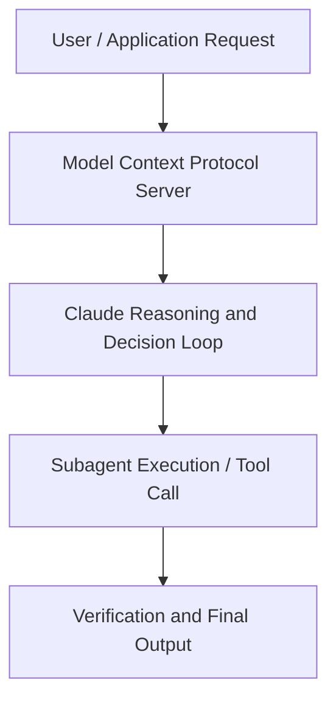

# Running an AI-native engineering org

**Speaker(s):** Fiona Fung · **Channel:** Claude · **Date:** 2026-05-22
**Watch:** https://youtu.be/IA5LWIGqnyM · **Format:** Talk · **Level:** Intermediate
**Topics:** AI Coding Tools, Web Development

## TL;DR
This session explores running an ai-native engineering org, highlighting core architecture, runtime workflows, and practical deployment patterns across AI Coding Tools, Web Development. Speakers analyze technical implementations and share operational best practices for building robust systems with Anthropic, Claude.

## Contents
- [Architecture and Core Concepts in Running an AI-native engineering org](#architecture-and-core-concepts-in-running-an-ai-native-engineering-org)
- [Technical Mechanics, Implementation Patterns, and Tooling](#technical-mechanics-implementation-patterns-and-tooling)
- [Operational Workflows, Evaluation, and Production Scaling](#operational-workflows-evaluation-and-production-scaling)
- [Strategic Implications, Governance, and Key Takeaways](#strategic-implications-governance-and-key-takeaways)

## Architecture and Core Concepts in Running an AI-native engineering org

Well, thank you so much for joining me
today. I'm excited to speak with all of
you about, you know, some lessons I've
learned as I've been leading uh cla code
and co-work. So, actually, first I
should do an intro. So, yeah, my name is
Fiona Fun and I lead engineering and
product for cloud code and co-work. Before Enthropic, I had also built and
led teams at Meta and Microsoft. So, with that, let's dive into some
lessons I'm excited to share with all of
you. Hopefully, maybe you'll find a
couple of tidbits that may be helpful to
you. There are five topics I really want
to cover today.

**Further reading:** Official documentation for Anthropic and Anthropic platform guides.

## Technical Mechanics, Implementation Patterns, and Tooling

But very often we
forget to audit to go wait are those
processes still required or is it still
serving its purpose? For example,
what were some of the things that we had
to change? Planning norms when coding is
no longer you know the the the
bottleneck and and not like and you have
like much more coding bandwidth how did
we rethink through planning uh code
ownership is also another interesting
question almost all the claude code
commits now are also you know
co-authored by claude I don't think I've
in the last few months ever saw a commit
that wasn't a code review is a good one
like that's a lot of questions I get a
lot as well also team makeup roles are
blurring and what are the skill sets
that we're thinking, hey, you know what? These are actually skill sets we're kind
of like doubling down into also
knowledge sharing. What happens when
maybe documentation is no longer your
source of truth? Given some of those
shifts, these are some of the team norms
that we had to rewrite. We talked about code review uh and
actually cat this morning in the talk
really talked about clot code review as
well. That was a really like that's how
an amazing tool for us to make sure
we're all still doing the right thing.

**Further reading:** Official documentation for Anthropic and Anthropic platform guides.

## Operational Workflows, Evaluation, and Production Scaling

You you
you create you turn Claude into Mr. Peanut's an
American brand." in in in the US we had
this jar of peanuts and you know their
their mascot is this little peanut
character and I was like holy crap
that's totally right. I I thought he was
a nomad, but you're right. So that's where like humans
also like with that product sense, it's
really important to keep that expertise
in the loop as well. Now, what should my team makeup be? Because roles are blurring and clog is
augmenting. So when it comes to
engineering, these are the two profiles
that I now really like focus on. One is
creative builders with product sense.

**Further reading:** Official documentation for Anthropic and Anthropic platform guides.

## Strategic Implications, Governance, and Key Takeaways

Again,
it's the e even our team principles and
even processes that we put on even after
a few months when we notice, hey, is
this really serving its intended
purpose, we really always give ourselves
permission to always critique and make
sure to always revisit and but bottoms
up there's a lot of freedom for you know
like you know team or pods to adapt. For example, how cloud shows up in team
triage or any teams like planning
rituals or standups or which workflows
get cloudified first that is a lot of
bottoms up. I found that this balance
of make sure you align with the team in
terms of like what's important in terms
of team culture and also update those as
you go but then leave some room for each
pod to adapt. If I zoom out what were the three
things that I prioritized for cloud code
and co-work that I think has worked
really well. Number one it was you
know like keeping the org agile and as
flat as possible having managers also
you know like support pots of work but
like also really get into the codebase
and be directly responsible for parts of
the product as well. Number two
that's quadify so if cla can do it
claude should. That's always a
question we're asking and and maybe
that's the other interesting too like um
you know this morning you heard the
talks about the models the models are
improving at an amazing pace. Sometimes we might find even if cla
wasn't good at doing something two or
three months ago now with like a model
update it's actually gone really good.

**Further reading:** Official documentation for Anthropic and Anthropic platform guides.

## Source
Full cleaned transcript: `DATA/videos/running-an-ai-native-engineering-org-2026.json`
Canonical recording: https://youtu.be/IA5LWIGqnyM