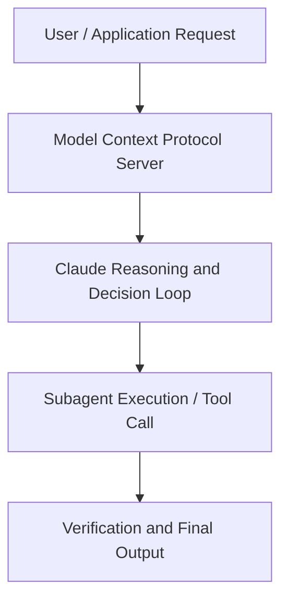

# Teaching agents to learn from your team

**Speaker(s):** Claude Engineering Team · **Channel:** Claude · **Date:** 2026-05-22
**Watch:** https://youtu.be/uGroRwlC9y4 · **Format:** Talk · **Level:** Intermediate
**Topics:** AI Agents

## TL;DR
This session explores teaching agents to learn from your team, highlighting core architecture, runtime workflows, and practical deployment patterns across AI Agents. Speakers analyze technical implementations and share operational best practices for building robust systems with Claude.

## Contents
- [Architectural Overview and System Objectives in Teaching agents to learn from your team](#architectural-overview-and-system-objectives-in-teaching-agents-to-learn-from-your-team)
- [Technical Capabilities, Tooling Integration, and Protocols](#technical-capabilities-tooling-integration-and-protocols)
- [Production Deployment, Verification, and Best Practices](#production-deployment-verification-and-best-practices)
- [Organizational Impact, Scalability, and Industry Outlook](#organizational-impact-scalability-and-industry-outlook)

## Architectural Overview and System Objectives in Teaching agents to learn from your team

Agent that improves itself daily by treating instructions as code: edited, reviewed, merged like any PR. Writing skills that teach agents how to think (not what to do). Closing feedback loop so team judgment flows back automatically. The session details foundational design principles, execution patterns, and operational integration requirements within the AI Agents domain.

**Further reading:** Official documentation for Claude and Anthropic platform guides.

## Technical Capabilities, Tooling Integration, and Protocols

Speakers analyze technical capabilities across Claude. The architecture highlights reliable agent tool use, context window optimization, protocol standards, and seamless workflow interoperability.

**Further reading:** Official documentation for Claude and Anthropic platform guides.

## Production Deployment, Verification, and Best Practices

Production readiness demands robust evaluation harnesses, state validation, and error-handling loops. Teams implement systematic monitoring and guardrails to ensure reliability across repeated executions.

**Further reading:** Official documentation for Claude and Anthropic platform guides.

## Organizational Impact, Scalability, and Industry Outlook

Deploying agentic systems transforms developer and team workflows by automating high-friction tasks. Organizations scale safely by pairing automated tool orchestration with structured human review.

**Further reading:** Official documentation for Claude and Anthropic platform guides.

## Source
Full cleaned transcript: `DATA/videos/teaching-agents-to-learn-from-your-2026.json`
Canonical recording: https://youtu.be/uGroRwlC9y4