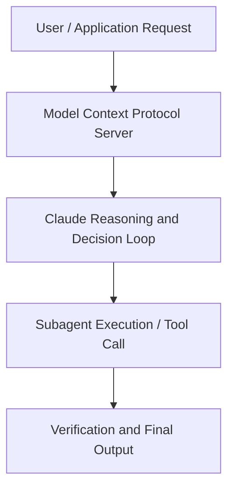

# The expanding toolkit

**Speaker(s):** Claude Engineering Team · **Channel:** Claude · **Date:** 2026-05-09
**Watch:** https://youtu.be/KLCuxMDZSDg · **Format:** Demo · **Level:** Intermediate
**Topics:** AI Agents, Web Development

## TL;DR
This session explores the expanding toolkit, highlighting core architecture, runtime workflows, and practical deployment patterns across AI Agents, Web Development. Speakers analyze technical implementations and share operational best practices for building robust systems with Artifacts, Box.

## Contents
- [Architecture and Core Concepts in The expanding toolkit](#architecture-and-core-concepts-in-the-expanding-toolkit)
- [Technical Mechanics, Implementation Patterns, and Tooling](#technical-mechanics-implementation-patterns-and-tooling)
- [Operational Workflows, Evaluation, and Production Scaling](#operational-workflows-evaluation-and-production-scaling)
- [Strategic Implications, Governance, and Key Takeaways](#strategic-implications-governance-and-key-takeaways)

## Architecture and Core Concepts in The expanding toolkit

I'm a research PM here at
Enthropic. Today I'll be talking
about the expanding toolkit. But first
of all, I want to say thank you
everybody for joining us at our Code
with Claude conference. We're very
grateful you're here and we love
speaking directly to our users. What am I going to talk about
today? The overarching theme of today's
talk is that the scaffolding that you
had to build last year actually ships
with the model today. I want you all
to think of the model no longer as just
an input output LLM box but rather as a
series of tools around that model that
expands its capabilities and leads to
better performance. In other words we
see the model itself as an expanding
toolkit.

**Further reading:** Official documentation for Artifacts and Anthropic platform guides.

## Technical Mechanics, Implementation Patterns, and Tooling

You might tell Claude, you
know, here are the parameters you need
in order to call this tool and to use
this function. But actually what you can
do is give Claude a description of the
output schema as well. So you can
see in the example I have here in the
description I actually outlined, you
know, this search docs tool will search
the docs and it'll return the ID, title,
snippet, and score. So by doing this um you can actually
let Claude know what to expect from this
tool call. For example, if Claude
wanted to rank the outputs of this tool,
it already knows that a score will be
returned by this tool, effectively
saving it a round trip from the harness. So by doing this, you get more
efficient and more intelligent outputs
from Claude when using this tool. Now for a cloud code quick tip. This
is another one that I like to use
frequently, you can actually use pre and
post tool use hooks defined in your
cloud settings.

**Further reading:** Official documentation for Artifacts and Anthropic platform guides.

## Operational Workflows, Evaluation, and Production Scaling

So now we actually offer a
code execution tool which automatically
gives Claude a hosted sandbox on the
server side. This means that that
entire loop that I just described
effectively happens inside a single API
turn. No more harness round trips
between Claude and whatever VM you're
using. Claude can just in the back end
on the API side tap into that separate
computer that's being used just for
Claude's scratchpad and work. Now this one is maybe a little less
of a tip and more so a mental model as
to how to think about code execution and
verse your local bash. When we give
Claude the code execution tool, it
basically gets its own computer to do
stuff on. Think about this in a way
of like giving Claude a little
calculator or something except it's an
entire computer that it can actually
use. So this means that Claude can
use this computer for things like
stateless compute, data analysis.

**Further reading:** Official documentation for Artifacts and Anthropic platform guides.

## Strategic Implications, Governance, and Key Takeaways

I'll show a short
pre-recorded demo of an agentic coding
loop with cloud code. You'll see
computer use in action while with the
cloud in Chrome extension. So, basically we what we'll have
what we have here is a uh cloud code
session and we've been working on a
project management dashboard, but it has
a couple bugs. The first bug is that the
new button isn't actually adding a card. The new button should be adding a
card. We ask Cloud to open it in
Chrome and try it itself. So we'll see this dashboard load as
soon as Claude decides to open the
browser. You can see Cloud is
connected through Cloud and Chrome here.

**Further reading:** Official documentation for Artifacts and Anthropic platform guides.

## Source
Full cleaned transcript: `DATA/videos/the-expanding-toolkit-2026.json`
Canonical recording: https://youtu.be/KLCuxMDZSDg