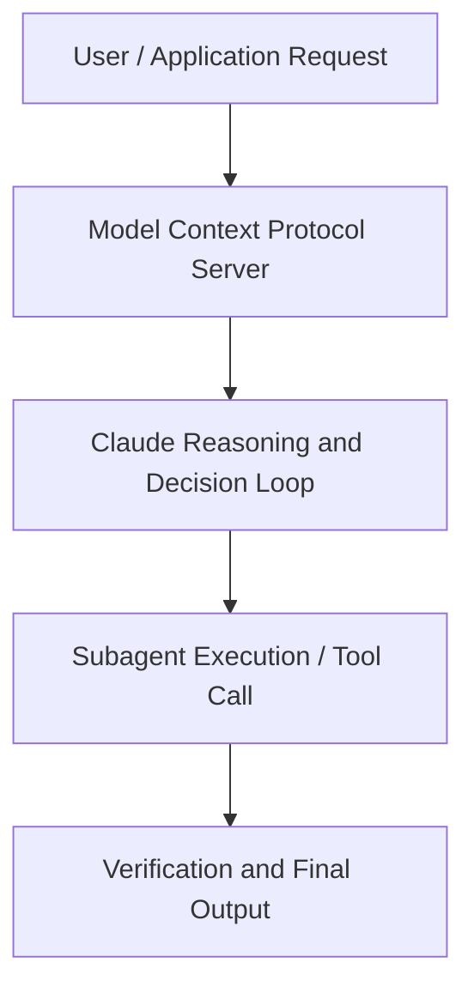

# The prompting playbook

**Speaker(s):** Claude Engineering Team · **Channel:** Claude · **Date:** 2026-05-22
**Watch:** https://youtu.be/G2B0YWuJUgI · **Format:** Talk · **Level:** Intermediate
**Topics:** Prompt Engineering, Web Development

## TL;DR
This session explores the prompting playbook, highlighting core architecture, runtime workflows, and practical deployment patterns across Prompt Engineering, Web Development. Speakers analyze technical implementations and share operational best practices for building robust systems with Anthropic, Claude.

## Contents
- [Architecture and Core Concepts in The prompting playbook](#architecture-and-core-concepts-in-the-prompting-playbook)
- [Technical Mechanics, Implementation Patterns, and Tooling](#technical-mechanics-implementation-patterns-and-tooling)
- [Operational Workflows, Evaluation, and Production Scaling](#operational-workflows-evaluation-and-production-scaling)
- [Strategic Implications, Governance, and Key Takeaways](#strategic-implications-governance-and-key-takeaways)

## Architecture and Core Concepts in The prompting playbook

Um, thank you so much for joining me this afternoon in the breakout room. The last session today of
code with Claude. I hope you've all had a fantastic day so far. I am an applied AI
engineer at Anthropic here in London. This afternoon, we're going to be talking about the prompting playbook. Prompting is arguably one of the first skills, if not the first skill
that we had to learn as engineers when we first started to work with LLMs. Even now it continues to be one of the most critical um skills to building
effective AI systems. Today we're going to discuss some best practices
um in the context of two practical scenarios that you're probably encountering at work.

**Further reading:** Official documentation for Anthropic and Anthropic platform guides.

## Technical Mechanics, Implementation Patterns, and Tooling

Let's have a look at how our
first pass the evals did. We can see as we expect our control case all of our
test cases have passed. This is what we expect for this unambiguous test case. But it's performing pretty poorly in these other areas. Now, before we zoom
in on those specific failure modes here, let's do some general cleanup of our
prompt. So, as we mentioned, when we look through this prompt, there's a couple oddities here already. So, for example,
first one is we're telling the bot that it's um a human, which just isn't true,
right? We can see as we scroll down there's clearly some information here that has been copied directly from a
website.

**Further reading:** Official documentation for Anthropic and Anthropic platform guides.

## Operational Workflows, Evaluation, and Production Scaling

So, what we're going to tell the model instead is give this balanced view uh um
where it says, you know, customers on grandfather's plan have different allowances, but it's captured in the
customer information that's given and that is the accurate source of truth. Running the eval here we should hopefully be addressing uh um all of the test cases for the hotspot case. Now I
am running this live so there could be some variability here but we see here that now clearly all of our test cases
are are passing. What did we learn from this? Well, we
worry a lot about hallucinations or the invention of facts and numbers, but
actually the opposite can also happen. The model can withhold information that
it actually has access to. Now, we saw here that this is likely a result of a patch that we introduced for a previous
model. A best practice that we could follow here is actually using version
control where wherever we are making defensive changes in the prompt, we are
tracking the reason why we've introduced these.

**Further reading:** Official documentation for Anthropic and Anthropic platform guides.

## Strategic Implications, Governance, and Key Takeaways

Um, so here is our baseline prompt. We've already applied some of
that general hygiene and those best practices that we saw earlier on using XML tags to structure the prompt. We've
given it an output format as well. Now that we're giving a schedule, uh we're asking it to
output a JSON which if we don't give that output structure might lead to
passing errors uh downstream. When we run the simple model on a first iteration of the
evals, all cases fail. Now, just what we're looking at here is in our test
set, we're essentially repeating uh um we're doing five trials here. And
these numbers are showing how many violations were made in each trial. In the outputs, we can see that it's made a decent attempt at reasoning
through the problem, but it's burning a lot of tokens.

**Further reading:** Official documentation for Anthropic and Anthropic platform guides.

## Source
Full cleaned transcript: `DATA/videos/the-prompting-playbook-2026.json`
Canonical recording: https://youtu.be/G2B0YWuJUgI