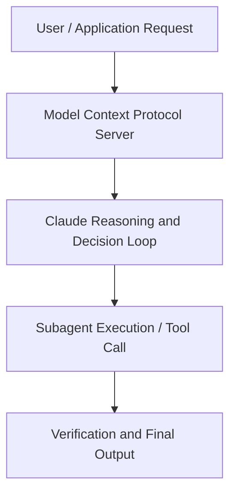

# The thinking lever

**Speaker(s):** Matt Bleifer · **Channel:** Claude · **Date:** 2026-05-09
**Watch:** https://youtu.be/OXJO4LldSnc · **Format:** Talk · **Level:** Intermediate
**Topics:** LLM Fundamentals, AI Agents

## TL;DR
This session explores the thinking lever, highlighting core architecture, runtime workflows, and practical deployment patterns across LLM Fundamentals, AI Agents. Speakers analyze technical implementations and share operational best practices for building robust systems with Anthropic, Claude.

## Contents
- [Architecture and Core Concepts in The thinking lever](#architecture-and-core-concepts-in-the-thinking-lever)
- [Technical Mechanics, Implementation Patterns, and Tooling](#technical-mechanics-implementation-patterns-and-tooling)
- [Operational Workflows, Evaluation, and Production Scaling](#operational-workflows-evaluation-and-production-scaling)
- [Strategic Implications, Governance, and Key Takeaways](#strategic-implications-governance-and-key-takeaways)

## Architecture and Core Concepts in The thinking lever

I am a product manager on anthropics research team and today I will be sharing a
little bit how uh Claude leverages compute at inference time otherwise known as test time compute in order to
break down and solve some of your hardest software engineering challenges. Along the way I'll share a little bit about what levers you have at your disposal uh in order to influence how Claude spends tokens. I will also
share some best practices to help you be able to get the most out of it. So, one of the key developments in large language models over the last couple of years has been the scaling of test time compute, creating something that we've all come to know as reasoning models. Similar to how we can scale compute at training time by training bigger models over longer time horizons using more
data, we can also scale compute at test time by allowing those models to spend more time working on a problem. If
you look at this graph on the left, you can see that when we move from haiku to sonnet to opus, as the model gets more
intelligent, it's able to get a better score on our agentic coding evaluation. Then similarly in the graph on the right, as that same model, opus actually just spends more time working on a
problem, it's able to correspondingly get better and better scores. This is what we mean by scaling test time compute.

**Further reading:** Official documentation for Anthropic and Anthropic platform guides.

## Technical Mechanics, Implementation Patterns, and Tooling

Tool calling is Claude's
s, 31 secondsway of interfacing with the rest of the world. Whether it's using tool calls to execute a search in this example, giving
s, 40 secondsme more information about the code with Claude conference uh or reading and writing files in order to build out
s, 47 secondssoftware engineering projects. There's really millions of different tools that Claude can call, but in all of these scenarios, tool calling tokens are
s, 55 secondsClaude's way of interfacing with its environment. S, 2 secondsThe last type of tokens that Claude can spend is text. This is Claude's way of interacting with you. Whether it needs to give you updates as it's
s, 11 secondsworking on a really really tough problem and let you know how it's progressing, give you a summary at the end to explain all of the things that it did in
s, 19 secondsresponse to the tough task that you gave it. Or simply just responding to a simple question that you have. Text tokens are Claude's way of communicating with an end user.

**Further reading:** Official documentation for Anthropic and Anthropic platform guides.

## Operational Workflows, Evaluation, and Production Scaling

The difference between your thinking on low effort and high effort there could be quite dramatic. S, 26 secondsNow, adaptive thinking is not a model router and it's not an automated thinking toggle. So, it's not taking your query, classifying it based off of
s, 35 secondsdifficulty, and figuring out whether it should use a thinking version of the model or a non-thinking version of the model. S, 42 secondsRather, it's the difference between telling Claude, "You must spend at least one thinking token at the start of this response and telling Claude," you can
s, 51 secondsspend thinking tokens whenever and however needed in order to solve this problem. It's really about Claude having
s, 58 secondsthe option to think at every single step of the process. S, 3 secondsWe run all of our benchmarks on adaptive thinking uh since Opus 4.6, And it's really our intelligence maximizing setting uh that shows performance
s, 12 secondspriority or better with interle thinking while delivering a better user experience. S, 20 secondsSo I want to dig a little bit more into effort and contrast it to the ways in which we've used thinking in the past. S, 26 secondsHistorically users have used thinking toggles a lot like an effort dial.

**Further reading:** Official documentation for Anthropic and Anthropic platform guides.

## Strategic Implications, Governance, and Key Takeaways

It could be the case that a level
s, 36 secondsdown is going to give you roughly equivalent performance at a real fraction of the cost. S, 43 secondsExtra high effort is a new setting that we introduced with Claude Opus 4.7 and we found this to be the best setting for
s, 50 secondsmost coding and agentic use cases. This is currently our default in cloud code and cloud.ai for opus 4.7. Like I
s, 58 secondssaid, it really does a good job maximizing intelligence without kind of going overboard. S, 4 secondsHigh effort is a great setting if you're trying to balance token usage and intelligence. This is probably the value that I would recommend for any
s, 11 secondsintelligence sensitive use case. High is a good place to start and test up from there. S, 17 secondsMedium is good for costsensitive use cases where you're willing to trade a little bit of intelligence.

**Further reading:** Official documentation for Anthropic and Anthropic platform guides.

## Source
Full cleaned transcript: `DATA/videos/the-thinking-lever-2026-2.json`
Canonical recording: https://youtu.be/OXJO4LldSnc