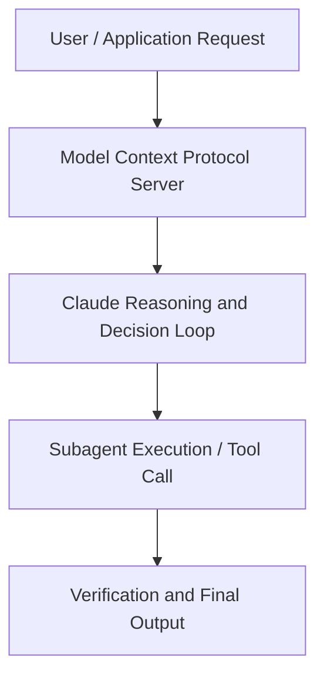

# The thinking lever

**Speaker(s):** Claude Engineering Team · **Channel:** Claude · **Date:** 2026-05-21
**Watch:** https://youtu.be/T7KqH7kYnE4 · **Format:** Talk · **Level:** Intermediate
**Topics:** LLM Fundamentals, AI Coding Tools

## TL;DR
This session explores the thinking lever, highlighting core architecture, runtime workflows, and practical deployment patterns across LLM Fundamentals, AI Coding Tools. Speakers analyze technical implementations and share operational best practices for building robust systems with Anthropic, Claude.

## Contents
- [Architecture and Core Concepts in The thinking lever](#architecture-and-core-concepts-in-the-thinking-lever)
- [Technical Mechanics, Implementation Patterns, and Tooling](#technical-mechanics-implementation-patterns-and-tooling)
- [Operational Workflows, Evaluation, and Production Scaling](#operational-workflows-evaluation-and-production-scaling)
- [Strategic Implications, Governance, and Key Takeaways](#strategic-implications-governance-and-key-takeaways)

## Architecture and Core Concepts in The thinking lever

Good to see you all today. I'm happy to have so many clawed lovers in one room. My name is Alexander Bricken and I'm on the Applied AI research team here
at Enthropic. Today we're going to be talking about the thinking lever. Specifically, we're going to talk about how Claude leverages compute at runtime, at inference time, typically called test
time compute to make more effective use of tokens in solving some of the hardest problems that Claude has in front of it. I'm going to share some of the best practices when it comes to using different levers and using different tokens to essentially try to solve those
problems better. Hopefully you'll learn something as well. Looking back a couple years, one of the key developments in large language models has been this idea of reasoning
models, which is using test time compute to spend more tokens for a model to become more efficient at answering a
question.

**Further reading:** Official documentation for Anthropic and Anthropic platform guides.

## Technical Mechanics, Implementation Patterns, and Tooling

Um, and the cars also reflect this more intelligent motion of vehicles. S, 38 secondsSo, what does this mean? Well, arguably the more tokens it spends, the more time it takes. So over time we might see
s, 46 secondsClaude eventually go from seconds, minutes or hours of work to even days, weeks or months of work. So this is
s, 55 secondsthe meter benchmark. We're showing that over generations of models and this is a combination of both train time compute,
s, 3 secondsso larger models, as well as better test time compute, so spending more tokens on our higher reasoning models. We see that
s, 10 secondsClaude is able to work more autonomously to cover human level tasks to a higher degree of of hours. So mythos uh
s, 20 secondswhich is one of our latest models works to an extent of roughly 16 hours of human work to a 50% uh level of
s, 28 secondsaccuracy.

**Further reading:** Official documentation for Anthropic and Anthropic platform guides.

## Operational Workflows, Evaluation, and Production Scaling

I'm not thinking in that instance. If I'm doing an academic problem set, though, I am probably thinking at every step of the process. S, 45 secondsNow, Claw can actually choose to not think at all if it doesn't want to. In this example, we could have no thinking block. Um, and that really just
s, 54 secondsrelates to the question you ask of it, right? Even with humans, if I asked you, what is 10 + 10? You'd immediately spawn
s, 1 secondrespond with 20. Whereas, if I asked you, you know, work through this really difficult PhD level problem set, you'd
s, 9 secondsprobably think a lot, but different members of the audience here might think for more or less less time.

**Further reading:** Official documentation for Anthropic and Anthropic platform guides.

## Strategic Implications, Governance, and Key Takeaways

S, 47 secondsAnd this was really interesting because when you put it on low effort, Claude actually came up with this unique solution to navigate the game and almost
s, 55 secondscomplete it faster than it otherwise would. There are some benefits to doing loweffort because you're explicitly constraining how much the
s, 3 secondsmodel is thinking through the problem set and maybe it does end up in really unique attractor states. Now while evals are always ideal, I understand they're
s, 12 secondsquite hard. I speak to customers a lot and often they don't have the perfect eval. So I want to give you a quick, you know, rules of thumbs that you can
s, 20 secondsuse when you think about the different effort levels that you use. We're going to start on the right looking at max. As I mentioned, max effort can typically
s, 29 secondsdeliver gains on the hardest tasks, but they might show diminishing marginal returns. So, I wouldn't recommend starting here unless you absolutely know
s, 38 secondsthat the intelligence of your use case is necessary.

**Further reading:** Official documentation for Anthropic and Anthropic platform guides.

## Source
Full cleaned transcript: `DATA/videos/the-thinking-lever-2026.json`
Canonical recording: https://youtu.be/T7KqH7kYnE4