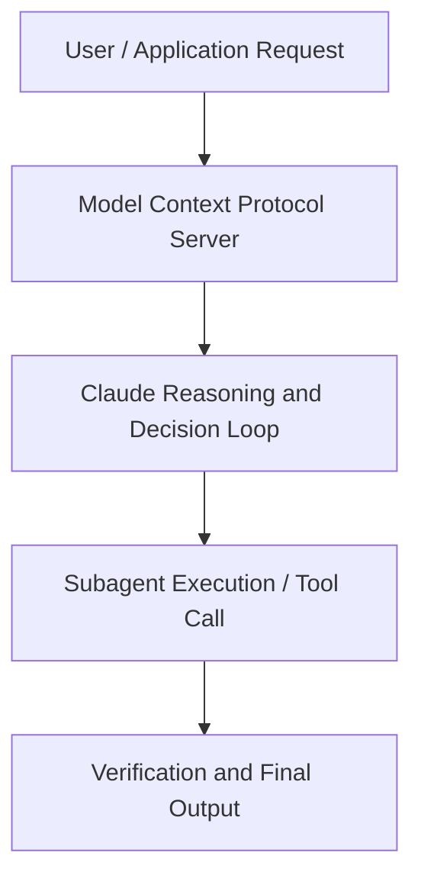

# Tool, skill, or subagent? Decomposing an agent that outgrew its prompt

**Speaker(s):** Claude Engineering Team · **Channel:** Claude · **Date:** 2026-05-23
**Watch:** https://youtu.be/mWvtOHlZM-I · **Format:** Talk · **Level:** Intermediate
**Topics:** AI Agents, Prompt Engineering

## TL;DR
This session explores tool, skill, or subagent? decomposing an agent that outgrew its prompt, highlighting core architecture, runtime workflows, and practical deployment patterns across AI Agents, Prompt Engineering. Speakers analyze technical implementations and share operational best practices for building robust systems with Claude, Claude Managed Agents.

## Contents
- [Architectural Overview and System Objectives in Tool, skill, or subagent? Decomposing an agen](#architectural-overview-and-system-objectives-in-tool-skill-or-subagent-decomposing-an-agen)
- [Technical Capabilities, Tooling Integration, and Protocols](#technical-capabilities-tooling-integration-and-protocols)
- [Production Deployment, Verification, and Best Practices](#production-deployment-verification-and-best-practices)
- [Organizational Impact, Scalability, and Industry Outlook](#organizational-impact-scalability-and-industry-outlook)

## Architectural Overview and System Objectives in Tool, skill, or subagent? Decomposing an agen

When does logic belong in a tool, a skill, or a subagent? You'll learn the decision framework by doing: inherit a 402-line inventory agent, decompose it live on Claude Managed Agents, and run evals after every change to see what flips. The session details foundational design principles, execution patterns, and operational integration requirements within the AI Agents, Prompt Engineering domain.

**Further reading:** Official documentation for Claude and Anthropic platform guides.

## Technical Capabilities, Tooling Integration, and Protocols

Speakers analyze technical capabilities across Claude, Claude Managed Agents. The architecture highlights reliable agent tool use, context window optimization, protocol standards, and seamless workflow interoperability.

**Further reading:** Official documentation for Claude and Anthropic platform guides.

## Production Deployment, Verification, and Best Practices

Production readiness demands robust evaluation harnesses, state validation, and error-handling loops. Teams implement systematic monitoring and guardrails to ensure reliability across repeated executions.

**Further reading:** Official documentation for Claude and Anthropic platform guides.

## Organizational Impact, Scalability, and Industry Outlook

Deploying agentic systems transforms developer and team workflows by automating high-friction tasks. Organizations scale safely by pairing automated tool orchestration with structured human review.

**Further reading:** Official documentation for Claude and Anthropic platform guides.

## Source
Full cleaned transcript: `DATA/videos/tool-skill-or-subagent-decomposing-an-2026.json`
Canonical recording: https://youtu.be/mWvtOHlZM-I