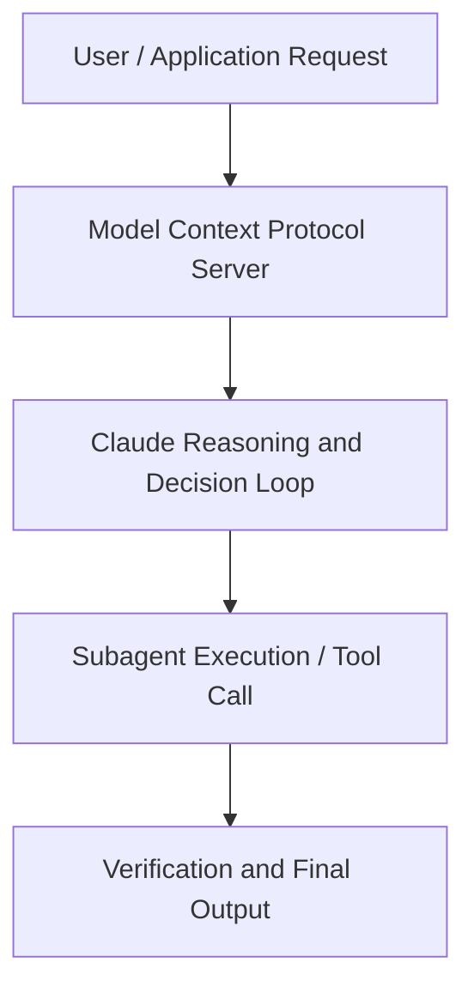

# What does AI mean for education?

**Speaker(s):** Claude Engineering Team · **Channel:** Claude · **Date:** 2025-12-17
**Watch:** https://youtu.be/Uh98_aGhAuY · **Format:** Talk · **Level:** Beginner
**Topics:** Career/Advice, AI Coding Tools

## TL;DR
This session explores what does ai mean for education?, highlighting core architecture, runtime workflows, and practical deployment patterns across Career/Advice, AI Coding Tools. Speakers analyze technical implementations and share operational best practices for building robust systems with Anthropic, Claude.

## Contents
- [Architecture and Core Concepts in What does AI mean for education?](#architecture-and-core-concepts-in-what-does-ai-mean-for-education)
- [Technical Mechanics, Implementation Patterns, and Tooling](#technical-mechanics-implementation-patterns-and-tooling)
- [Operational Workflows, Evaluation, and Production Scaling](#operational-workflows-evaluation-and-production-scaling)
- [Strategic Implications, Governance, and Key Takeaways](#strategic-implications-governance-and-key-takeaways)

## Architecture and Core Concepts in What does AI mean for education?

- I would hate to see a future where teachers outsource to AI the parts that I think really make good education,
which is the connection pieces, when you really understand your students and can spend time with them, and AI can be used in so many ways that allow teachers
to have more time to do that kind of work. I'm excited for us to talk with institutions and discuss with them ways where we can amplify
that knowledge they already have. We're here to talk about my favorite topic,
which is AI and education. I lead our work here in education on beneficial deployments. Formerly was a high school math teacher. I worked in education nonprofits
and would definitely consider myself a lifelong learner. I'm joined here by my wonderful colleagues who work in education across the
organization. I'm on our education team here at Anthropic
and I support all of our non-technical audiences, including educating teachers and students about both our products and AI in general.

**Further reading:** Official documentation for Anthropic and Anthropic platform guides.

## Technical Mechanics, Implementation Patterns, and Tooling

I think today we have classes maybe segregated
by students that are in the top or you know, you take a like an AP class if you are, you know, in that certain group or not. But with AI every student could have their own journey. Those that are able to advance could advance very quickly
and those that need help can get that personalized help. - You know, this reminds me of a really interesting use case that I talked to a teacher about where, you know, you kind
of always wanna meet students where they're most interested, right? That's like a very Montessori type of approach where it's like what is your favorite topic
and then we'll kind of match all the subjects to that. That's really hard to scale, right? But there's a teacher I talked to that's just like,
I ask my students what their favorite things are, they tell me a little story and then now every single handout that you have, like the same math concepts,
maybe even same problems, but it's like each handout is made for each student and it's like exactly according to their interests. It's got a story that's engaging to them, problems they actually care about.

**Further reading:** Official documentation for Anthropic and Anthropic platform guides.

## Operational Workflows, Evaluation, and Production Scaling

- They get outdated so fast. So the idea here is we wanna give people a tool
that they can use to understand the interactions that they're having with AI and work towards interactions that are efficient,
effective, ethical, and safe. We have this core course that I think is pretty great
and then we've also created spinoff courses for educators and for students as well as a longer course for educators
who are interested in teaching AI fluency. So the idea is that anyone who goes through one of these courses is kind of better equipped
to assess their own AI interactions. I talked about like learning with your students earlier and the power of reflecting on your AI interactions. At its core that's really what this course is about. It's just reminding everyone, teachers, students, parents,
that they have autonomy in their AI interactions. That's one thing I'm excited about.

**Further reading:** Official documentation for Anthropic and Anthropic platform guides.

## Strategic Implications, Governance, and Key Takeaways

There are elements of the data privacy that is new
and hard to understand. So I'm really interested to see how that landscape evolves. Whether we need to really ramp up our education
around data privacy so people can better assess the landscape or whether we start to like, you know, see clear winners in this space. I'll just be really interested to see what happens there. - I think in addition to that, I mean the technology is really changing rapidly. One of the concerns I'm not sure how it sort of will play out over time is how will institutions adapt? They're generally slow moving and intentionally built that way. The technology pace of change has been very rapid.

**Further reading:** Official documentation for Anthropic and Anthropic platform guides.

## Source
Full cleaned transcript: `DATA/videos/what-does-ai-mean-for-education-2025.json`
Canonical recording: https://youtu.be/Uh98_aGhAuY