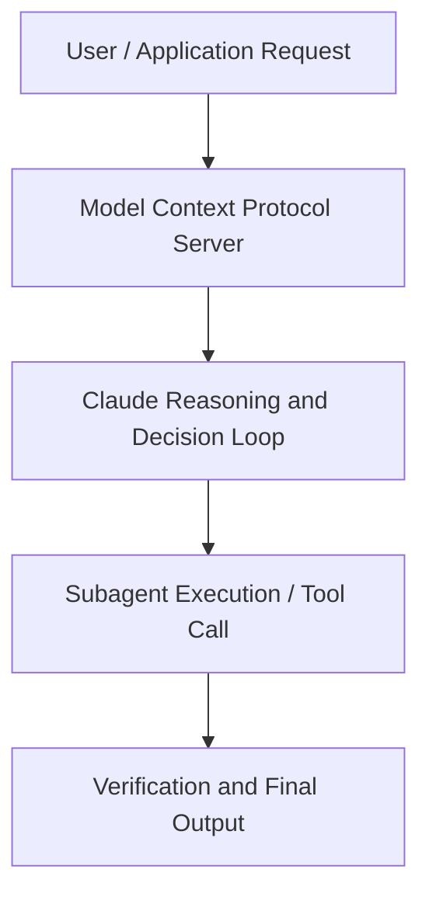

# Where code meets court: AI at the legal-technical frontier

**Speaker(s):** Claude Engineering Team · **Channel:** Claude · **Date:** 2026-05-22
**Watch:** https://youtu.be/T8N0MED3IJo · **Format:** Talk · **Level:** Intermediate
**Topics:** Research/Papers, Product/Startup

## TL;DR
This session explores where code meets court: ai at the legal-technical frontier, highlighting core architecture, runtime workflows, and practical deployment patterns across Research/Papers, Product/Startup. Speakers analyze technical implementations and share operational best practices for building robust systems with Claude.

## Contents
- [Architectural Overview and System Objectives in Where code meets court: AI at the legal-techn](#architectural-overview-and-system-objectives-in-where-code-meets-court-ai-at-the-legal-techn)
- [Technical Capabilities, Tooling Integration, and Protocols](#technical-capabilities-tooling-integration-and-protocols)
- [Production Deployment, Verification, and Best Practices](#production-deployment-verification-and-best-practices)
- [Organizational Impact, Scalability, and Industry Outlook](#organizational-impact-scalability-and-industry-outlook)

## Architectural Overview and System Objectives in Where code meets court: AI at the legal-techn

AI saves lawyers countless hours on research; AI helps developers reason through complex technical systems. Patent law is unique in demanding both simultaneously, researching across millions of documents while comprehending the technical intricacies of novel inventions. The result: a profession undergoing more radical change than any other, and a wealth engineering problems at the frontier of what’s possible with LLMs The session details foundational design principles, execution patterns, and operational integration requirements within the Research/Papers, Product/Startup domain.

**Further reading:** Official documentation for Claude and Anthropic platform guides.

## Technical Capabilities, Tooling Integration, and Protocols

Speakers analyze technical capabilities across Claude. The architecture highlights reliable agent tool use, context window optimization, protocol standards, and seamless workflow interoperability.

**Further reading:** Official documentation for Claude and Anthropic platform guides.

## Production Deployment, Verification, and Best Practices

Production readiness demands robust evaluation harnesses, state validation, and error-handling loops. Teams implement systematic monitoring and guardrails to ensure reliability across repeated executions.

**Further reading:** Official documentation for Claude and Anthropic platform guides.

## Organizational Impact, Scalability, and Industry Outlook

Deploying agentic systems transforms developer and team workflows by automating high-friction tasks. Organizations scale safely by pairing automated tool orchestration with structured human review.

**Further reading:** Official documentation for Claude and Anthropic platform guides.

## Source
Full cleaned transcript: `DATA/videos/where-code-meets-court-ai-at-2026.json`
Canonical recording: https://youtu.be/T8N0MED3IJo