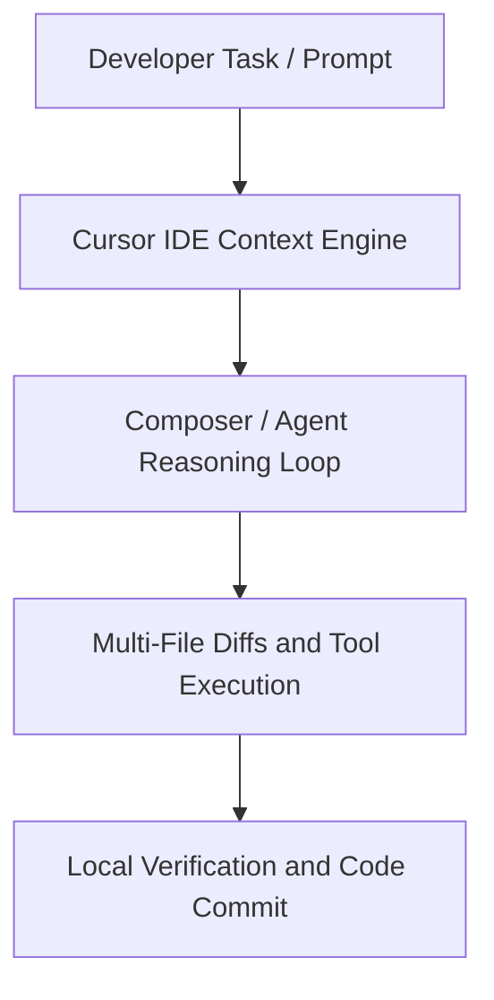

# Startups: Landing your First Customer with Cursor

**Speaker(s):** Cursor Technical Team · **Channel:** Cursor · **Date:** 2026-08-04
**Watch:** https://youtu.be/PPW4fi-I6Wg · **Format:** Workshop · **Level:** Beginner
**Topics:** Product/Startup, AI Coding Tools, AI Agents

## TL;DR
This session explores startups: landing your first customer with cursor, highlighting core architecture, runtime workflows, and practical deployment patterns across Product/Startup, AI Coding Tools, AI Agents. Speakers analyze technical implementations and share operational best practices for building robust systems with Cursor, Slack.

## Contents
- [Core Concepts and Architectural Foundations of Startups: Landing your First Customer with Cursor](#core-concepts-and-architectural-foundations-of-startups-landing-your-first-customer-with-cursor)
- [Technical Implementation, Tooling, and Workflow Patterns](#technical-implementation-tooling-and-workflow-patterns)
- [Evaluation, Best Practices, and Future Directions](#evaluation-best-practices-and-future-directions)

## Core Concepts and Architectural Foundations of Startups: Landing your First Customer with Cursor

In this session on Startups: Landing your First Customer with Cursor, the focus centers on understanding the practical design patterns and developer workflows enabled by modern AI-assisted engineering. As development teams adopt agentic systems, the boundaries between manual code authorship and automated synthesis begin to blur. The speakers emphasize that establishing reliable context is paramount: providing the right repository structure, explicit project rules, and scoped documentation allows the underlying models to generate precise, syntactically correct implementations. By anchoring the discussion in real-world scenarios, the talk demonstrates how engineering productivity accelerates when tools operate directly within the IDE, reducing friction and eliminating disruptive context switching across disjointed external interfaces.

**Further reading:** Official documentation for Cursor and platform developer guides.

## Technical Implementation, Tooling, and Workflow Patterns

Diving deeper into operational mechanics, the presentation details how specific platform capabilities interact to execute complex programming tasks. Key components such as Cursor, Slack, Cursor Agent work in concert to maintain project state and navigate intricate dependency graphs. The session highlights the importance of deterministic tool calling, background agent execution, and structured feedback loops. Developers are guided through concrete demonstrations showing how natural language prompts are parsed into multi-file diffs, verified against local unit tests, and iteratively refined before final commit. This pattern ensures high reliability across both legacy refactoring and greenfield service development.

**Further reading:** Official documentation for Cursor and platform developer guides.

## Evaluation, Best Practices, and Future Directions

The concluding segment addresses best practices for scaling agent-driven development across larger teams. Speakers discuss token efficiency, model selection economics, and safety guardrails required when granting agents access to internal APIs and production repositories. Teams must establish clear evaluation benchmarks to verify that automated contributions maintain rigorous security and code quality standards. By combining automated linting, continuous integration checks, and human-in-the-loop review, organizations can safely harness autonomous agents to resolve routine maintenance tasks, documentation updates, and cross-repository migrations while preserving engineering velocity.

**Further reading:** Official documentation for Cursor and platform developer guides.

## Source
Full cleaned transcript: `DATA/videos/startups-landing-your-first-customer-with-cursor-2026.json`
Canonical recording: https://youtu.be/PPW4fi-I6Wg