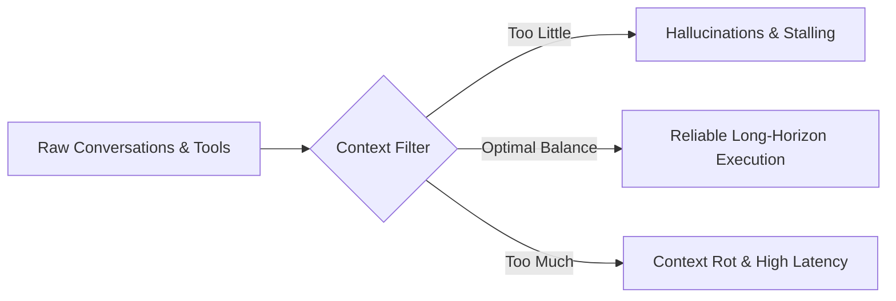
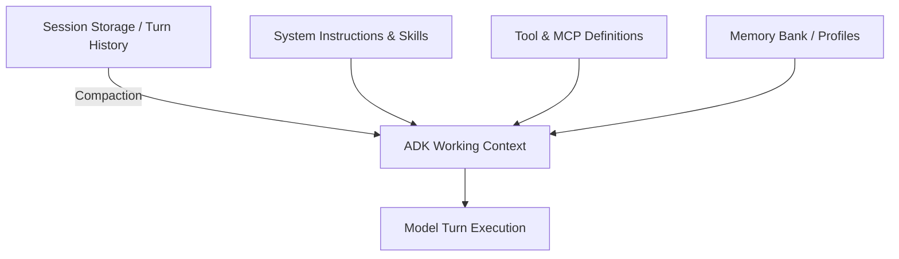

# Agent Context Engineering for Production

**Speaker(s):** George Lee, Kimberly Milam, Jeff Dixon, Preethi Prabhakar · **Channel:** Google Cloud Tech · **Date:** 2026-06-25
**Watch:** https://youtu.be/YKLkHvzjFDk?si=p0SkhaQVKF_wo1T1 · **Format:** Talk · **Level:** Intermediate
**Topics:** AI Agents, Backend/Infra, LLM Fundamentals

## TL;DR

Every LLM turn in a production agent is a compiled view across conversation history, session state, long-term memory, tool responses, and instructions. This session explores context engineering best practices to avoid context rot and context poisoning, introduces the Vertex AI Memory Bank and Session Service with Pydantic memory profiles, and showcases an AT&T case study on multi-channel, multi-session agent memory.

## Contents

- [From models to agents: why context engineering matters](#from-models-to-agents-why-context-engineering-matters)
- [Context poisoning, the Goldilocks zone, and compounding errors](#context-poisoning-the-goldilocks-zone-and-compounding-errors)
- [Three strategies to dynamically manage the context window: tools, skills, session compaction](#three-strategies-to-dynamically-manage-the-context-window-tools-skills-session-compaction)
- [ADK working context: how the context window is assembled](#adk-working-context-how-the-context-window-is-assembled)
- [Memory Bank: agentic long-term memory as a managed service](#memory-bank-agentic-long-term-memory-as-a-managed-service)
- [Memory profiles: structured schemas for precomputed context](#memory-profiles-structured-schemas-for-precomputed-context)
- [AT&T case study: multi-channel, multi-session customer sales agent](#att-case-study-multi-channel-multi-session-customer-sales-agent)

---

## From models to agents: why context engineering matters

Large language models are inherently stateless engines. They excel at text generation but cannot access real-time information, read private databases, or execute multi-step plans without external scaffolding. Every agentic technique exists to overcome these core limitations.

While modern models boast massive context windows, relying on raw context capacity leads to **context rot**, a phenomenon where model reasoning and retrieval accuracy degrade as token count increases. Giving a model a harness and managing its context intelligently is more effective than dumping raw data into a large window.

---

## Context poisoning, the Goldilocks zone, and compounding errors

Managing context is about finding the optimal balance:

- **Too little context**: Causes hallucinations, fragmented reasoning based on outdated information, and repetitive clarifying questions.
- **Too much context**: Creates distraction, triggers context rot, inflates token costs, and increases latency.
- **Context poisoning**: Occurs when corrupt, conflicting, or maliciously injected data enters the context window and overrides agent instructions.



In long-horizon multi-step tasks, error rates compound. An agent with a 95% single-step accuracy drops to roughly 85.7% accuracy over three sequential dependent actions (0.95 cubed). Clean context engineering prevents early errors from snowballing into catastrophic failures.

---

## Three strategies to dynamically manage the context window: tools, skills, session compaction

Three primary techniques dynamically control the context window:

1. **Tools**: Executable functions that pull external context on demand. Verbose tool schemas can consume significant token budgets in tool-heavy agents.
2. **Skills**: Modular capability definitions that utilize **progressive disclosure**. The agent context is initially populated only with Level 1 metadata (title and trigger description). When invoked, full instructions are dynamically loaded, preserving token budgets.
3. **Session Compaction**: Pruning stale conversation turns from active memory while preserving core facts through LLM-driven summaries or memory extraction.

---

## ADK working context: how the context window is assembled

In the Agent Development Kit (ADK), the **working context** is an ephemeral runtime compilation built just-in-time for each model invocation:



Once the turn completes, the working context is discarded, maintaining stateless model purity while preserving durable state in back-end stores.

---

## Memory Bank: agentic long-term memory as a managed service

**Memory Bank** is a managed service within the Vertex AI Agent Platform that handles cross-session long-term memory. It decouples memory ingestion from extraction:

- The active agent writes conversation events to an event buffer.
- In the background, a memory extraction LLM identifies salient facts and preferences.
- A consolidation step reconciles new facts with existing memories under a specific scope (user ID, session ID, or department ID), preventing redundant duplicates.

---

## Memory profiles: structured schemas for precomputed context

**Memory profiles** allow developers to define structured Pydantic schemas for persistent agent memory. Rather than storing arbitrary freeform notes, Memory Bank extracts values matching the schema:

```python
from pydantic import BaseModel, Field

class UserTravelProfile(BaseModel):
    preferred_style: str = Field(description="Travel style, e.g., succinct, detailed")
    crowd_preference: str = Field(description="Tolerance for busy tourist areas")
    accommodation_type: str = Field(description="Preferences like ryokan, boutique, luxury")
```

Profiles can be injected as **always-on context** at the start of a conversation or retrieved **just-in-time** when specific domain tools are called.

---

## AT&T case study: multi-channel, multi-session customer sales agent

AT&T demonstrated how they utilize Memory Bank and Vertex AI Session Service for customer device upgrades and service discovery:

- **Complex Catalog**: Hundreds of device variants, plans, and add-ons managed across human sales teams with high turnover.
- **Cross-Channel Continuity**: A customer may start researching an upgrade on the web, continue via phone/IVR, and visit a retail store days later.
- **Architecture**: An orchestrator routes intents to specialized skill agents. The business logic is decoupled from presentation formatters for web and mobile apps. Sensitive data is protected via Data Loss Prevention (DLP) before reaching the LLM.

**Related:** [Build a multi-agent system: A2A and Agent Registry](./multi-agent-a2a-agent-registry-2026.md)

---

## Source

Full cleaned transcript: `DATA/videos/agent-context-engineering-2026.json`
Raw transcript: `RAW/videos/agent-context-engineering-2026.md`
