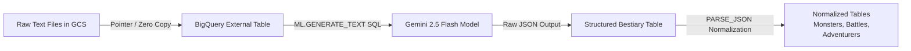

# Build an AI Agent Knowledge Base Using SQL (BigQuery + Gemini)

**Speaker(s):** Annie Wang, Ayo Adedeji · **Channel:** Google Cloud Tech · **Date:** 2026-03-28
**Watch:** https://youtu.be/zvmtHZSt8es?si=EAmXpMAEmxwRKSl6 · **Format:** Codelab / Tutorial · **Level:** Beginner
**Topics:** AI Agents, Backend/Infra, LLM Fundamentals

## TL;DR

A step-by-step hands-on tutorial demonstrating how to build an analytical AI agent knowledge base directly inside Google BigQuery. Learn how to query unstructured text files in Cloud Storage via BigQuery external tables without copying data, prompt Gemini 2.5 Flash from SQL using BQML `ML.GENERATE_TEXT`, and parse nested JSON model outputs into clean, normalized relational tables.

## Contents

- [Hands-on project overview: unstructured to structured ELT pipeline](#hands-on-project-overview-unstructured-to-structured-elt-pipeline)
- [Environment setup and BigQuery external tables](#environment-setup-and-bigquery-external-tables)
- [Invoking Gemini via BQML ML.GENERATE_TEXT](#invoking-gemini-via-bqml-mlgenerate_text)
- [JSON parsing, cleansing, and table normalization](#json-parsing-cleansing-and-table-normalization)

---

## Hands-on project overview: unstructured to structured ELT pipeline

Enterprises often store vast quantities of unstructured information (battle reports, incident logs, PDF documents, transcribed notes) in object storage. Making this data accessible to downstream AI agents traditionally required complex Python extraction scripts and external vector indexing pipelines.

This codelab introduces an in-database **ELT (Extract, Load, Transform)** workflow:
1. Raw unstructured text files are read from Google Cloud Storage (GCS).
2. BigQuery calls Gemini 2.5 Flash directly via SQL functions to extract entities into structured JSON.
3. BigQuery parses and normalizes the JSON into queryable relational tables.



---

## Environment setup and BigQuery external tables

Rather than duplicating data into BigQuery, **BigQuery External Tables** create virtual pointers to files in Cloud Storage:

- **Zero-Copy Governance**: Data remains in a single GCS bucket while remaining fully queryable via standard SQL.
- **Dynamic Updates**: If new files are uploaded to the GCS bucket, subsequent SQL queries against the external table automatically reflect the new records.
- **BigQuery Connection**: A dedicated service account identity mediates secure access between BigQuery, GCS, and the AI Platform APIs.

```sql
CREATE OR REPLACE EXTERNAL TABLE bestiary_data.raw_intel_content_table (
  raw_text STRING
)
OPTIONS (
  format = 'CSV',
  uris = ['gs://agentverse-scholar-reports/*.txt']
);
```

---

## Invoking Gemini via BQML ML.GENERATE_TEXT

BigQuery Machine Learning (BQML) enables calling Gemini models across entire tables in parallel without writing custom batch inference harnesses:

```sql
CREATE OR REPLACE TABLE bestiary_data.structured_bestiary AS
SELECT *
FROM ML.GENERATE_TEXT(
  MODEL bestiary_data.gemini_flash_model,
  TABLE bestiary_data.raw_intel_content_table,
  STRUCT(
    0.2 AS temperature,
    1000 AS max_output_tokens,
    'From the following text, extract structured data into a single valid JSON object containing keys: monster, battle, adventurer.' AS prompt
  )
);
```

Each row is processed concurrently, converting freeform narrative logs into structured JSON payloads containing entities, hit points, and battle stats.

---

## JSON parsing, cleansing, and table normalization

The raw output of `ML.GENERATE_TEXT` includes both generated text and model metadata (token counts, log probabilities). BigQuery's native `PARSE_JSON` and `JSON_VALUE` functions extract and normalize individual entity attributes into clean relational tables:

```sql
CREATE OR REPLACE TABLE bestiary_data.monsters AS
SELECT
  JSON_VALUE(parsed_json, '$.monster.id') AS monster_id,
  JSON_VALUE(parsed_json, '$.monster.name') AS monster_name,
  CAST(JSON_VALUE(parsed_json, '$.monster.hp') AS INT64) AS hit_points
FROM (
  SELECT PARSE_JSON(ml_generate_text_result) AS parsed_json
  FROM bestiary_data.structured_bestiary
);
```

The resulting normalized tables form the clean knowledge base utilized by retrieval-augmented generation (RAG) agents.

**Related:** [Data agent kit: Your coding agent can now query your data](./data-agent-kit-coding-agent-2026.md)

---

## Source

Full cleaned transcript: `DATA/videos/agent-knowledge-base-bigquery-2026.json`
Raw transcript: `RAW/videos/agent-knowledge-base-bigquery-2026.md`
