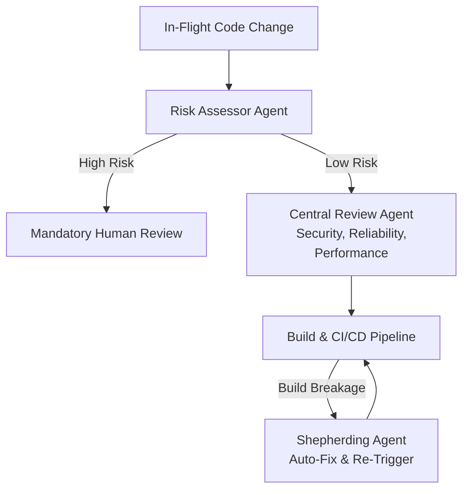

# Navigate the Agentic Shift in Software Development with Google

**Speaker(s):** Niranjan Tulpule, Madhura Joshi · **Channel:** Google Cloud Tech · **Date:** 2026-06-25
**Watch:** https://youtu.be/Z9Zz75pmOeg?si=SzxL-z7MQbcTe-t4 · **Format:** Talk · **Level:** Intermediate
**Topics:** AI Coding Tools, Backend/Infra, AI Agents

## TL;DR

Google acts as Customer Zero for its internal AI developer tools, deploying AI coding agents to over 100,000 engineers. This session details the real-world metrics (75% of new code is AI-assisted), early failures in automated code review, the shift toward spec-driven development, and deep agent trajectory observability.

## Contents

- [Scale of AI-written code at Google](#scale-of-ai-written-code-at-google)
- [Lessons from building AI code review at Google: three strategies, two failures](#lessons-from-building-ai-code-review-at-google-three-strategies-two-failures)
- [The tiered approach that works: central plus specialized plus shepherding](#the-tiered-approach-that-works-central-plus-specialized-plus-shepherding)
- [Spec-driven development and testing](#spec-driven-development-and-testing)
- [Agent observability: trajectories, path clustering, and token heat maps](#agent-observability-trajectories-path-clustering-and-token-heat-maps)
- [Scaling AI adoption at Google: AI champions, dashboards, and two agent categories](#scaling-ai-adoption-at-google-ai-champions-dashboards-and-two-agent-categories)

---

## Scale of AI-written code at Google

At Cloud Next 2026, Sundar Pichai noted that approximately 75% of all new code at Google is written with AI assistance. In the past 12 months, Google generated more code than in the preceding three years combined. Approximately one-third of all submitted changes are authored almost entirely by coding agents.

This creates the enterprise paradox: how to capture 10x coding velocity without introducing 10x architectural risk and code review bottlenecks.

---

## Lessons from building AI code review at Google: three strategies, two failures

Google iterated through three distinct architectures for AI-assisted code review:

1. **Attempt 1: Monolithic Central Review Agent**: A single AI reviewer tasked with catching everything. Failed because early models lacked precision across varied codebases, and engineers pushed back against intrusive comments disrupting their flow.
2. **Attempt 2: Hyper-Specialized Guideline Agents**: An automated Python readability agent enforcing style rules. While eval benchmarks were high, the deluge of minor comments overwhelmed developers, dropping active team productivity by 9% in one week.
3. **Attempt 3: Tiered Hybrid Architecture**: The current production model combining high-signal central checks with team-level customization.

---

## The tiered approach that works: central plus specialized plus shepherding

Google's successful code review strategy rests on three anchors:

- **Central Review Agent**: Focuses strictly on non-negotiable universals (security vulnerabilities, performance regressions, reliability risks).
- **Shepherding Agent**: Monitors in-flight pull requests, automatically patches build breakages, and navigates changes through CI/CD pipelines.
- **Risk Assessor Agent**: Classifies changes by risk score to route complex diffs to humans while enabling auto-approval workflows for low-risk changes.

---

## Spec-driven development and testing

Imprecise natural language prompts often trap engineers in an **AI doom loop**, spending 12% or more of their time babysitting agents through conversational rework.

**Spec-Driven Development** enforces an interactive contract phase before code generation:
1. The developer and agent collaborate on a formal markdown specification defining API contracts, pre/post-conditions, and edge cases.
2. The agent implements code and unit tests directly against the validated spec.
3. The spec updates automatically to display verified test coverage.

---

## Agent observability: trajectories, path clustering, and token heat maps

Observing agents differs fundamentally from observing deterministic software:

- **Individual Trajectories**: Traces step-by-step tool invocations, chain-of-thought reasoning, and latency profiles to detect stuck loops.
- **Aggregate Path Clustering**: Analyzes thousands of agent sessions to find recurring dead ends, optimize tool registries, and identify where unnecessary tools inflate token costs.
- **Token Heat Maps**: Pinpoints expensive reasoning steps across complex multi-turn workflows.

---

## Scaling AI adoption at Google: AI champions, dashboards, and two agent categories

Google categorizes production agents into two tiers:
- **Personal Agents**: Desktop/CLI-based tools (Gemini CLI, Antigravity IDE) running in personal developer sandboxes.
- **Team Agents**: Autonomous virtual teammates encoding repository-specific tribal knowledge, deployment practices, and architectural standards.

The internal **AI Champions** network coaches engineering cohorts, establishing feedback loops between product teams and Google DeepMind researchers.

**Related:** [Intent-driven development with Claude Code and Fable 5](./intent-driven-development-2026.md)

---

## Source

Full cleaned transcript: `DATA/videos/agentic-shift-software-development-2026.json`
Raw transcript: `RAW/videos/agentic-shift-software-development-2026.md`
