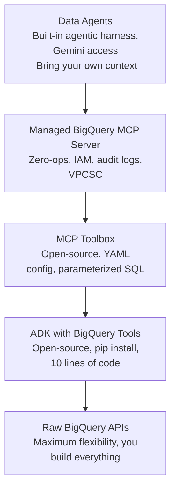
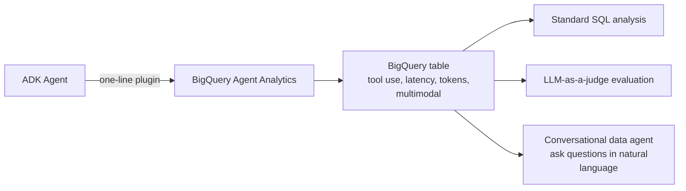
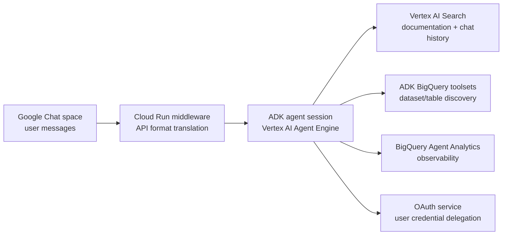

# Agent Development and AgentOps with BigQuery, ADK, and MCP

**Speaker(s):** Sandeep Karmarkar, Jiaxun Wu, Guillaume Blaquiere · **Channel:** Google Cloud Tech · **Date:** 2026-06-25
**Watch:** https://youtu.be/tQGalTBL1Ek?si=3S4gCmuNRLWXPrN- · **Format:** Talk · **Level:** Intermediate
**Topics:** AI Agents, Backend/Infra, LLM Fundamentals

## TL;DR

A Cloud Next session covering BigQuery's full agent connectivity stack: from the open-source **ADK** with first-party BigQuery tools, to the open-source **MCP Toolbox**, to Google's fully managed **BigQuery MCP server**, and up to first-party **data agents**. The session also introduces **Agent Analytics**: a one-line-of-code plugin that pipes all agent events into BigQuery for LLM-powered observability. Includes a live demo and a production case study from Carrefour.

## Contents

- [Agentic Data Cloud stack: from open-source to managed data agents](#agentic-data-cloud-stack-from-open-source-to-managed-data-agents)
- [ADK with BigQuery tools: a data agent in under 10 lines](#adk-with-bigquery-tools-a-data-agent-in-under-10-lines)
- [MCP Toolbox: open-source server with parameterized SQL tools](#mcp-toolbox-open-source-server-with-parameterized-sql-tools)
- [Managed BigQuery MCP server: zero-ops with IAM governance](#managed-bigquery-mcp-server-zero-ops-with-iam-governance)
- [Agent Analytics: one-line observability piped into BigQuery](#agent-analytics-one-line-observability-piped-into-bigquery)
- [Demo: bakery-location business consultant agent](#demo-bakery-location-business-consultant-agent)
- [Carrefour case study: data platform support agent with ADK and OAuth](#carrefour-case-study-data-platform-support-agent-with-adk-and-oauth)
- [Production takeaways: use case selection, proximity, and integration cost](#production-takeaways-use-case-selection-proximity-and-integration-cost)

---

## Agentic Data Cloud stack: from open-source to managed data agents

BigQuery's agent connectivity offerings are organized as a stack. Moving from bottom to top, each level trades flexibility for built-in value:



At the bottom: raw BigQuery APIs for maximum control. At the top: first-party data agents where Google provides the agentic harness, reasoning, and Gemini access, and the developer contributes domain context and data.

**Related:** [Power intelligent agents with AI-native databases](./ai-native-databases-agents-2026.md)

---

## ADK with BigQuery tools: a data agent in under 10 lines

A `pip install` of the **Agent Development Kit (ADK)** now bundles first-party BigQuery function tools in three tiers:

| Tier | Example tools |
|---|---|
| Foundational | Find tables, get schema and dataset info, query tables in multiple modes |
| Advanced | Forecasting, contribution analysis (statistical data exploration) |
| Data agent as tool | Wrap an existing BigQuery data agent as a callable tool inside a larger ADK agent |

Additionally, **BigQuery skills** (domain-specific instruction files) are included in ADK to steer agents toward correct query patterns and avoid hallucinated table names.

Minimal code to get a working data agent:

```python
from google.adk.agents import DataAgent
from google.adk.tools.bigquery import BigQueryToolset

agent = DataAgent(
    tools=BigQueryToolset(write_mode="block"),  # read-only
    credentials="application_default"
)
agent.run("What are my top 10 customers by revenue this month?")
```

`write_mode="block"` prevents any DML or DDL, making the agent safe for exploratory use. Both ADK BigQuery tools and skills are in stable (GA) release.

---

## MCP Toolbox: open-source server with parameterized SQL tools

**MCP Toolbox** is an open-source **Model Context Protocol (MCP)** server with pre-built connectors to multiple data sources including BigQuery. It is configured via YAML and runs locally or remotely.

Setup:
1. Download a pre-built binary or build from source.
2. Define tools in a `toolbox.yaml` file.
3. Start the MCP server (`./toolbox serve`).
4. Connect an ADK agent (or any MCP-compatible agent) to the local/remote server endpoint.

The standout feature is **parameterized SQL tools**: instead of letting the agent write arbitrary SQL, you define SQL templates with named parameters in YAML. The agent passes a parameter value; the server executes the pre-approved SQL. This dramatically reduces the risk of SQL injection via prompt manipulation and makes agent behavior more deterministic.

```yaml
tools:
  find_hotels_by_name:
    source: bigquery
    query: |
      SELECT * FROM hotels WHERE LOWER(name) = LOWER(@name)
    parameters:
      - name: name
        type: string
```

MCP Toolbox and its BigQuery tools are in stable release.

**Further reading:** [MCP Toolbox GitHub](https://github.com/googleapis/mcp-toolbox)

---

## Managed BigQuery MCP server: zero-ops with IAM governance

Google's managed MCP server for BigQuery is available at:

```
https://bigquery.googleapis.com/mcp
```

An agent connects by pointing its MCP client at this endpoint. The server exposes two tool sets:

| Tool set | Behavior |
|---|---|
| Read-only tools | Blocks all DML (INSERT, UPDATE, DELETE) and DDL (CREATE, DROP, ALTER). Safe for exploration. |
| Read-write tools | Full SQL surface including Execute SQL. Subject to IAM deny policies. |

**IAM governance layer**: Data administrators can apply IAM deny policies to block all read-write tools at the project level, regardless of what the agent developer has configured in code. Data ownership stays with the platform team, not with the application team.

Additional governance: full IAM integration, audit logs with MCP-specific cost labels, and VPC Service Controls (VPCSC) support.

Known production adopters: Anthropic uses the BigQuery MCP server internally for employees to query business metrics. Glean uses it to give BigQuery customers natural-language data access. The server is pre-populated in the Cloud AI registry.

**Further reading:** [BigQuery MCP server docs](https://cloud.google.com/bigquery/docs/mcp)

---

## Agent Analytics: one-line observability piped into BigQuery

Traditional observability tools (logs, traces, metrics) are designed for deterministic systems. Agent observability is different in three ways:

1. **Logs are as important as code**: You often cannot know what the agent did without examining the full execution trace, including intermediate reasoning steps.
2. **Logs enable evaluation**: Comparing agent responses against a golden dataset (LLM-as-a-judge) requires the full input-output log for each conversation, not just error events.
3. **Logs are multimodal**: Agent inputs and outputs can include images, video, and audio, not just text.

**BigQuery Agent Analytics** is an ADK plugin (and a LangGraph callback handler) that streams all agent events to a BigQuery table with a single line of code:

```python
from google.adk.plugins.bigquery import AgentAnalyticsPlugin

agent = MyAgent(
    plugins=[AgentAnalyticsPlugin(table="my-project.my-dataset.agent_events")]
)
```

Data streamed includes: tool name, tool input, tool output, latency per step, input tokens, output tokens, and multimodal content (via BigQuery object references for images/video/audio). Data is available in near-real time via BigQuery streaming write.

Once in BigQuery:
- Standard SQL: error rates, latency percentiles, token consumption trends.
- AI functions: run LLM-as-a-judge evaluations or conversation categorization at scale in batch mode.
- Data agent on top: ask natural-language questions about production agent behavior ("what are the most common failure modes this week?").

Known users: Qiddiya (built an agentic data platform), Bloomberg Media (powers internal natural-language Q&A).



---

## Demo: bakery-location business consultant agent

Jiaxun Wu demonstrated a multi-tool business consultant agent for opening a bakery in Los Angeles.

Architecture:
- ADK agent with two managed MCP tools: BigQuery (for internal sales data and traffic data) and Google Maps (for real-time competitor location data).
- Agent Analytics plugin logging all events in real time.

Workflow of questions and tool routing:

| User question | Tool used | Why |
|---|---|---|
| "Which zip code has the most morning traffic?" | BigQuery | Needs internal traffic dataset query |
| "List operating bakeries in that zip code" | Google Maps | Needs real-time location data |
| "Top-three best-selling bakery items in LA?" | BigQuery | Needs internal sales history |

After the demo, a BigQuery Conversational Analytics agent was used to analyze the agent logs. Surprising finding: the Google Maps `search_places` tool was slower than the BigQuery `run_query` tool, likely because the test dataset was small and BigQuery returned results quickly.

---

## Carrefour case study: data platform support agent with ADK and OAuth

**Carrefour** (one of the world's largest retailers, comparable to Walmart in scale) built a support agent for their internal data platform, **Phenix Darwin**.

The problem: the data platform serves 150 ingestion pipelines and 600+ data consumers. New team members repeatedly asked the same questions in the internal Google Chat space, consuming platform team time for recurring answers.

Solution architecture:



Key implementation details:

- **Chat history as training data**: The agent ingests both documentation and the full history of the Google Chat space. When platform team members add clarifications in chat, the agent automatically incorporates them on subsequent runs.
- **ADK BigQuery toolsets replaced hundreds of lines of Python**: The original implementation wrote custom Python code to list datasets, list tables, and get column details. Switching to ADK BigQuery toolsets eliminated all of that boilerplate.
- **OAuth for per-user query execution**: To run SQL against BigQuery with the caller's own identity (ensuring they can only see their authorized data), Carrefour implemented a three-legged OAuth flow. Google Chat cannot handle the OAuth redirect natively, so a separate Cloud Run service manages the OAuth flow, captures the token, and returns it to the ADK agent. OAuth interactions are restricted to direct messages (not group chat spaces) to prevent credential reuse.
- **Observability via Agent Analytics**: ~200 sessions per week are monitored. Dashboards show error rates, most-used tools (documentation retrieval is most common), latency, and token counts. Currently running on Gemini 2.5 Pro; planning to move to Gemini 3.1 Flash (when available in Europe) for lower latency.

---

## Production takeaways: use case selection, proximity, and integration cost

Guillaume Blaquiere's three closing lessons from the Carrefour deployment:

1. **Choose the right use case**: Not every workflow benefits from AI. Pick the ones where the combination of automation and language understanding delivers clear, measurable value. Carrefour's support chatbot is a strong fit because the problem is well-defined (answering repetitive documentation questions) and the success metric is clear (platform team hours saved).

2. **Bring agents to users**: Do not ask users to adopt a new interface to access agents. Integrate the agent into the tools users already use daily. For Carrefour, deploying into Google Chat (where team members already communicated) produced immediate, high adoption. A standalone portal would have had friction.

3. **Never underestimate integration cost**: Connecting agents to legacy systems (especially mainframe applications without APIs) is substantially harder than connecting to modern services. Budget and timeline accordingly. The OAuth work for Google Chat alone required building an additional Cloud Run service.

---

## Source

Full cleaned transcript: `DATA/videos/agentops-bigquery-adk-mcp-2026.json`
Raw transcript: `RAW/videos/agentops-bigquery-adk-mcp-2026.md`
