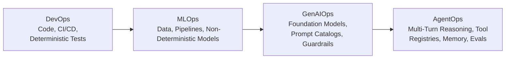
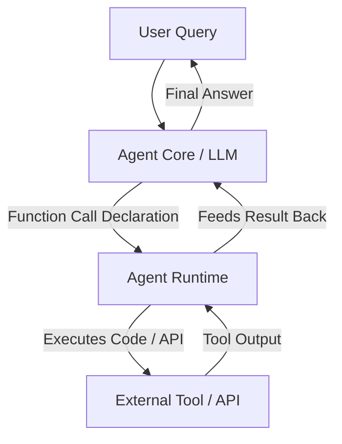

# AgentOps: Operationalize AI Agents

**Speaker(s):** Sita Lakshmi Sangameswaran, Sokratis Kartakis · **Channel:** Google Cloud Tech · **Date:** 2025-06-12
**Watch:** https://youtu.be/kJRgj58ujEk?si=GxGlzxwuOcqRhDeg · **Format:** Talk / Masterclass · **Level:** Advanced
**Topics:** AI Agents, Backend/Infra, LLM Fundamentals

## TL;DR

A foundational masterclass on **AgentOps**: the discipline of transitioning generative AI agents from experimental prototypes to robust, enterprise-grade production systems. Explores the lineage from DevOps and MLOps to GenAIOps, establishes multi-environment platform architectures, details prompt and tool catalog management, and walks through evaluation frameworks for autonomous agent loops.

## Contents

- [Evolution from DevOps and MLOps to GenAIOps and AgentOps](#evolution-from-devops-and-mlops-to-genaiops-and-agentops)
- [Multi-environment enterprise architecture for AI systems](#multi-environment-enterprise-architecture-for-ai-systems)
- [GenAIOps workflows: prompt catalog, model selection, and guardrails](#genaiops-workflows-prompt-catalog-model-selection-and-guardrails)
- [Agent core mechanics: function calling and runtime loops](#agent-core-mechanics-function-calling-and-runtime-loops)
- [AgentOps evaluation, tool registries, and repository standardization](#agentops-evaluation-tool-registries-and-repository-standardization)

---

## Evolution from DevOps and MLOps to GenAIOps and AgentOps

Operational disciplines evolve as computing paradigms shift:

- **DevOps**: Focuses on deterministic source code, continuous integration, and infrastructure automation.
- **MLOps**: Extends DevOps to handle the non-deterministic nature of model training, feature engineering, and model registries.
- **GenAIOps**: Manages application consumption of foundation models, covering prompt engineering, RAG pipelines, and model evaluation.
- **AgentOps**: Manages autonomous multi-step reasoning agents that dynamically select tools, execute API actions, and persist state.

---

## Multi-environment enterprise architecture for AI systems

An enterprise AgentOps architecture divides responsibilities across four segregated project layers:

1. **Infrastructure & Security**: Manages VPCs, IAM policies, and Terraform modules.
2. **Data Lake / Mesh**: Stores business data, vector embeddings, and the central Prompt Catalog.
3. **Compute Lifecycles**:
   - **Sandbox**: Isolated playground for data scientists and researchers.
   - **Development**: Building ADK agent code and tool definitions.
   - **Staging**: Automated integration tests, stress tests, and prompt tester evaluations.
   - **Production**: Live user traffic running on Cloud Run or Agent Runtime.
4. **Governance**: Unified Model Registry, artifact repositories, evaluation logs, and audit trails for compliance.

---

## GenAIOps workflows: prompt catalog, model selection, and guardrails

Building production Gen AI applications involves three core operations:

- **Model Selection**: Filtering thousands of candidates down to top contenders, balancing precision against cost and latency (e.g., choosing Gemini Flash for high-speed agent loops over Gemini Pro).
- **Prompt Catalog**: A centralized, version-controlled repository (using Git, BigQuery, or Firestore) tracking system prompts, instructions, and test datasets.
- **Runtime Guardrails**: Utilizing **Model Armor** to scan incoming prompts for prompt injection attacks and sanitize outgoing model responses for sensitive PII.

---

## Agent core mechanics: function calling and runtime loops

An autonomous agent core consists of three pillars:
1. **Foundation Model**: The reasoning engine (e.g., Gemini 2.0 Flash).
2. **System Instructions**: Task objectives, constraints, and decision rules.
3. **Declared Tools**: Schema definitions detailing tool names, descriptions, and parameter types.

---

## AgentOps evaluation, tool registries, and repository standardization

Unlike static ML evaluation, AgentOps evaluates dynamic decision trajectories:

- **Tool Selection Accuracy**: Did the agent invoke the correct tool for the given intent?
- **Parameter Validity**: Were extracted function parameters syntactically and semantically correct?
- **Groundedness & Latency**: Is the final answer grounded in retrieved tool outputs, and does it meet operational SLAs?

**Tool Registries** (built using Apigee API Hub and metadata stores) catalog data tools, code tools, and API tools, providing centralized governance and authentication so tools are built once and reused across organizational agents. Standardized repository layouts organize modular tools, prompts, eval harnesses, and deployment scripts into repeatable CI/CD delivery pipelines.

**Related:** [Agent development and AgentOps with BigQuery, ADK, and MCP](./agentops-bigquery-adk-mcp-2026.md)

---

## Source

Full cleaned transcript: `DATA/videos/agentops-operationalize-agents-2025.json`
Raw transcript: `RAW/videos/agentops-operationalize-agents-2025.md`
