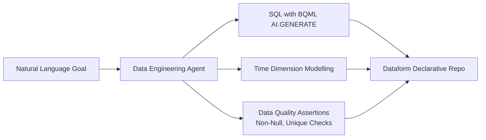

# AI Agents for Data Engineering and Data Science | The Agent Factory Podcast

**Speaker(s):** Smitha Kolan, Lucia Subatin · **Channel:** Google Cloud Tech · **Date:** 2025-10-16
**Watch:** https://youtu.be/ATgIU47V1yI?si=yr9gqDI27nInkl2k · **Format:** Podcast / Demo · **Level:** Intermediate
**Topics:** AI Agents, Backend/Infra, AI Coding Tools

## TL;DR

An episode of The Agent Factory Podcast exploring AI agents across data engineering and data science. Covers recent industry breakthroughs (Gemini Computer Use model and CodeMender), live demos of the BigQuery Data Engineering Agent and Data Science Agent in Colab Enterprise, and an ADK multi-agent application traversing a Cloud Spanner knowledge graph to generate educational comic strips.

## Contents

- [Industry update: Gemini Computer Use model and CodeMender](#industry-update-gemini-computer-use-model-and-codemender)
- [Data Science Agent in Colab Enterprise: anomaly detection](#data-science-agent-in-colab-enterprise-anomaly-detection)
- [BigQuery Data Engineering Agent: Dataform pipelines and quality assertions](#bigquery-data-engineering-agent-dataform-pipelines-and-quality-assertions)
- [Demo: ADK multi-agent app with Spanner Graph and comic generation](#demo-adk-multi-agent-app-with-spanner-graph-and-comic-generation)

---

## Industry update: Gemini Computer Use model and CodeMender

Two major agentic capabilities highlight the industry overview:

1. **Gemini Computer Use Model**: Enables agents to visually inspect desktop screens, reason over UI elements, and execute local mouse and keyboard actions (clicks, typing, scrolling, form navigation) via Playwright with built-in human confirmation gates for sensitive actions.
2. **CodeMender**: An autonomous security agent operating in reactive mode (patching live zero-day vulnerabilities discovered by fuzzing engines) and proactive mode (refactoring entire codebase vulnerability classes). CodeMender has upstreamed over 72 verified patches to open-source projects.

---

## Data Science Agent in Colab Enterprise: anomaly detection

The **Data Science Agent** automates exploratory data analysis within Google Cloud Colab Enterprise:
- Ingests BigQuery tables without manual boilerplate setup.
- Scans schemas and builds preprocessing pipelines.
- Trains an **Isolation Forest** unsupervised algorithm to isolate anomalous data points (such as skewed customer complaint patterns) and plots visual clusters with narrative explanations.

---

## BigQuery Data Engineering Agent: Dataform pipelines and quality assertions

The **BigQuery Data Engineering Agent** generates and maintains declarative data transformation pipelines using **Dataform**:

- **AI Functions in SQL**: Uses `AI.GENERATE` to call Gemini 2.5 Flash directly in SQL definitions to categorize regions from country strings.
- **Time Dimensions**: Pre-computes calendar attributes (year, quarter, month name) to optimize natural-language-to-SQL query performance.
- **Data Quality Assertions**: Generates automated data integrity tests (e.g., ensuring primary keys are non-null and unique) across staging and production tables.

---

## Demo: ADK multi-agent app with Spanner Graph and comic generation

A multi-agent application built with the Agent Development Kit (ADK) illustrates multi-modal knowledge synthesis:

1. **Spanner Graph Traversal**: A research agent queries a Cloud Spanner knowledge graph using GQL and `spanner_qa_chain` to retrieve architectural concepts (such as Spanner regional and multi-region replication).
2. **Scripting Agent**: Formats the technical explanation into a 6-panel educational comic strip narrative featuring characters Ada and a robot assistant.
3. **Image Generation & Checker Loop**: Prompts the Nano Banana image model to generate visual panels, running a multi-turn evaluation loop with scoring sub-agents to verify text clarity and visual quality before finalizing output.

**Related:** [Boost AI context with hybrid search in Spanner](./spanner-hybrid-search-context-2026.md)

---

## Source

Full cleaned transcript: `DATA/videos/agents-for-data-engineering-2025.json`
Raw transcript: `RAW/videos/agents-for-data-engineering-2025.md`
