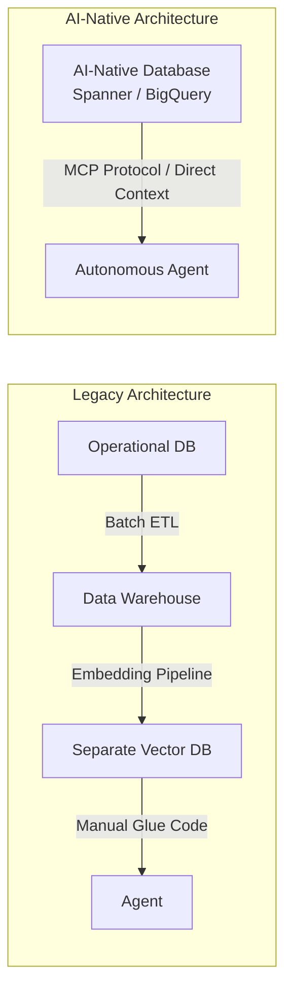

# Power Intelligent Agents with AI-Native Databases

**Speaker(s):** Amit Ganesh, Yannis Papakonstantinou, David Soria Parra · **Channel:** Google Cloud Tech · **Date:** 2026-06-25
**Watch:** https://youtu.be/quzn4hOXQmI?si=6zwj5VpOhl03CF45 · **Format:** Talk · **Level:** Intermediate
**Topics:** AI Agents, Backend/Infra, LLM Fundamentals

## TL;DR

A deep dive into how AI-native databases power intelligent enterprise agents by unifying operational data, vector search, graph retrieval, and in-database reasoning. Explores how legacy data silos hinder agentic architectures, examines multimodal and Graph RAG capabilities, and features Anthropic's David Soria Parra discussing the standardized Model Context Protocol (MCP).

## Contents

- [The inflection point: AI-native databases vs. legacy data silos](#the-inflection-point-ai-native-databases-vs-legacy-data-silos)
- [Superpowers of AI-native databases: search, graph RAG, and multimodal context](#superpowers-of-ai-native-databases-search-graph-rag-and-multimodal-context)
- [Fireside chat with David Soria Parra on Model Context Protocol (MCP)](#fireside-chat-with-david-soria-parra-on-model-context-protocol-mcp)
- [Google Cloud pre-built data agents and enterprise adoption](#google-cloud-pre-built-data-agents-and-enterprise-adoption)

---

## The inflection point: AI-native databases vs. legacy data silos

For over five decades, database architectures evolved around deterministic tabular lookups and segregated analytical warehouses. When building autonomous agents, this fragmented architecture introduces severe latency, inconsistent context, and complex synchronization pipelines.

**AI-native databases** unify operational transaction processing, vector search, knowledge graphs, and LLM inference into a single engine:

---

## Superpowers of AI-native databases: search, graph RAG, and multimodal context

AI-native databases provide four key context capabilities:

1. **Hybrid Search**: Combines keyword filtering (BM25) with dense vector embeddings to ensure precise, grounded retrieval across vast enterprise stores.
2. **Natural Language Interfaces**: Converts conversational intent into verified, parameterized SQL and GQL queries.
3. **Multimodal Context**: Stores and searches vector embeddings across images, videos, audio recordings, and tabular records simultaneously.
4. **Graph RAG**: Leverages native graph traversal (such as Spanner Graph) to retrieve multi-hop relationships across enterprise entities.

---

## Fireside chat with David Soria Parra on Model Context Protocol (MCP)

Anthropic's David Soria Parra explains why the **Model Context Protocol (MCP)** has become an industry standard:

- **Point-to-Point Problem**: Without a standard, connecting $N$ agents to $M$ data tools requires $N \times M$ custom integrations.
- **Unified Protocol**: MCP establishes an open, bi-directional JSON-RPC protocol allowing LLMs and agent runtimes to discover schemas, call tools, and stream structured context safely.
- **Enterprise Security**: MCP servers enforce granular IAM and audit boundaries without leaking raw database credentials to external models.

---

## Google Cloud pre-built data agents and enterprise adoption

Google Cloud provides pre-built data agents that run natively on top of BigQuery and operational stores:
- **Optimization Agents**: Continually monitor query patterns, partition keys, and cache hit ratios.
- **Quality & Governance Agents**: Detect data schema drift and anomalous metric distributions.
- **Business Intelligence Agents**: Allow non-technical domain stakeholders to query multi-dimensional datasets using natural language with verifiable citations.

**Related:** [Build an AI Agent knowledge base using SQL](./agent-knowledge-base-bigquery-2026.md)

---

## Source

Full cleaned transcript: `DATA/videos/ai-native-databases-agents-2026-2.json`
Raw transcript: `RAW/videos/ai-native-databases-agents-2026-2.md`
