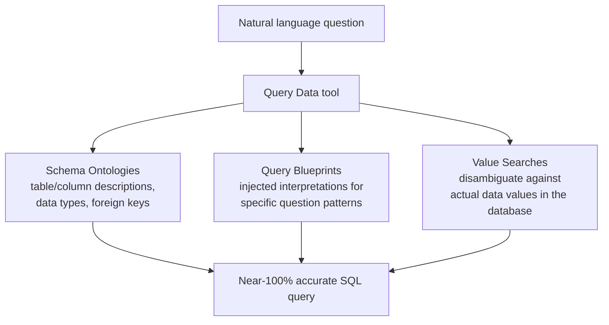

# Power Intelligent Agents with AI-Native Databases

**Speaker(s):** Amit Ganesh, Yannis Papakonstantinou, David Soria Parra · **Channel:** Google Cloud Tech · **Date:** 2026-06-25
**Watch:** https://youtu.be/7awKinJhGPo?si=BiOdsdrT3_GisbsY · **Format:** Talk · **Level:** Advanced
**Topics:** AI Agents, Backend/Infra, LLM Fundamentals

## TL;DR

A Cloud Next keynote-style session on Google's **Agentic Data Cloud** strategy, presented by Amit Ganesh (VP, Google Cloud Databases), Yannis Papakonstantinou (engineering), and David Soria Parra (Anthropic, MCP co-creator). Covers AI-native databases AlloyDB and Spanner, the Data Agent Platform (bridging natural language to SQL with near-100% accuracy), and Google's comprehensive MCP strategy.

## Contents

- [The case for an agentic data cloud](#the-case-for-an-agentic-data-cloud-from-system-of-insight-to-system-of-action)
- [AlloyDB as an AI-native database](#alloydb-as-an-ai-native-database-vector-hybrid-and-ai-search)
- [TimesFM: forecasting as a database SQL function](#timesfm-forecasting-as-a-database-sql-function)
- [target.com case study](#targetcom-case-study-20-search-relevance-improvement-with-alloydb)
- [Spanner and GraphRAG](#spanner-and-graphrag-for-relationship-aware-retrieval)
- [Data Agent Platform: near-100% accuracy natural language to SQL](#data-agent-platform-bridging-natural-language-to-sql-with-near-100-accuracy)
- [Parameterized Secure Views: deterministic security](#parameterized-secure-views-deterministic-security-for-agent-generated-sql)
- [MCP strategy: managed servers, MCP Toolbox, and protocol steering](#mcp-strategy-managed-servers-mcp-toolbox-and-protocol-steering)
- [Fireside chat with David Soria Parra (MCP co-creator)](#fireside-chat-with-david-soria-parra-anthropic-mcp-co-creator)
- [Pre-built data agents for builders, operators, and business users](#pre-built-data-agents-from-google-builders-operators-and-business-users)

---

## The case for an agentic data cloud: from system of insight to system of action

The core problem with legacy data architectures in the agentic era:

1. **Fragmented storage**: Disconnected data warehouses and siloed operational databases mean agents cannot seamlessly access all enterprise data in one query.
2. **Missing semantic context**: Agents need meaning, not just data. A table named `trx_hdr` with a column `amt_c` is opaque. Agents need schema ontologies and business glossaries to understand what they are querying.
3. **Lag from "move data to AI"**: The traditional approach of extracting data from operational databases, transforming it, and loading it into AI systems introduces a time gap. The agent is never working with the real-time state of the business.

Google's response: **Agentic Data Cloud**, a vertically integrated data and AI stack where AI is moved to the data rather than the reverse. Three properties:

| Property | Meaning |
|---|---|
| AI-native | TPUs invoked for inference within database workloads; models embedded in SQL AI functions; data agents at the agentic layer |
| Flexible | 100% PostgreSQL compatibility (AlloyDB), run anywhere with AlloyDB Omni, bring your own model |
| Trusted | Enterprise semantic knowledge as context; strict privacy, security, and governance guardrails |

**Related:** [Agent development and AgentOps with BigQuery, ADK, and MCP](./agentops-bigquery-adk-mcp-2026.md)

---

## AlloyDB as an AI-native database: vector, hybrid, and AI search

**AlloyDB** is Google Cloud's PostgreSQL-compatible managed database, purpose-built for the agentic era with AI capabilities embedded at the database layer.

### Vector search

AlloyDB provides two vector index types:

| Index | Description |
|---|---|
| **ScaNN** (Scalable Approximate Nearest Neighbors) | Google's proprietary index, used in Google Search and YouTube. Supports 10 billion-plus vectors. Clustering-based ANN with tunable recall/speed trade-off. |
| **pgvector with Columnar Engine** | Standard pgvector enhanced by AlloyDB's columnar engine, delivering up to 4x faster vector search than standard pgvector without configuration changes. |

### Hybrid search (vector + full-text)

AlloyDB's hybrid search combines vector search and full-text search in a single SQL query using the new `hybrid_search()` UDF. Ranking uses BM25 (industry-standard probabilistic text relevance) for the text component and cosine similarity for the vector component, then merges results.

### AI functions

AI functions bring Gemini's world knowledge directly into SQL:

```sql
SELECT product_id, title,
  AI.RANK(description, 'comfortable shirts for summer in Santorini') AS relevance
FROM products
WHERE AI.SEARCH(description, 'summer shirts') > 0.7
ORDER BY relevance DESC
LIMIT 20;
```

The `AI.RANK` function understands that Santorini is a Mediterranean island with hot, dry summers, and ranks linen and cotton shirts above polyester ones, even though the database does not contain geographic or climate data. This knowledge comes from Gemini via the AI function, not from the stored data.

Additional AI functions announced as GA: sentiment analysis, text summarization. Also announced: **optimized AI functions** using cached inference, providing approximately 1,000x cost reduction versus default LLM calls for high-volume workloads.

**Further reading:** [AlloyDB AI functions documentation](https://cloud.google.com/alloydb/docs/ai/work-with-embeddings) | [AlloyDB hybrid search](https://cloud.google.com/alloydb/docs/ai/hybrid-search-overview)

---

## TimesFM: forecasting as a database SQL function

**TimesFM** is Google Research's foundational model pre-trained on time series data (analogous to LLMs pre-trained on text). Integrated into AlloyDB and BigQuery as a SQL AI function called `forecast`.

A striking example query:

```sql
SELECT AI.VECTOR_SEARCH(products, 'red shoes') AS red_shoe_ids,
  AI.FORECAST(sales_history WHERE product_id IN red_shoe_ids) AS projection
FROM sales;
```

What this executes at the database layer:
1. Vector search finds products semantically similar to "red shoes" (capturing all varieties of red footwear, not just ones with "red" in the name).
2. For each matching product, the time series of sales history is fetched.
3. TimesFM generates a sales forecast for each time series.
4. Results are returned as a projection table.

This pipeline would previously require: a data export, a Python script to call an embedding model, another script to call a forecasting service, and manual merging of results. As a single SQL query, it is orders of magnitude faster and simpler to maintain.

Additionally, the query physically runs across multiple chip types: most database work on ARM processors, inference work for the AI functions on TPUs.

**Further reading:** [TimesFM paper](https://arxiv.org/abs/2310.10688)

---

## target.com case study: 20% search relevance improvement with AlloyDB

**target.com** migrated their entire product search traffic to AlloyDB to improve online search relevance.

Results:
- 20% improvement in search relevance (as measured by click-through and conversion metrics).
- Top performance on filtered search queries, exceeding results achievable by manually integrating a relational database with a dedicated vector search engine.
- Eliminated the integration overhead of maintaining a separate search system alongside the relational store.

The technical reason for the relevance improvement: combining ScaNN vector search with dynamic SQL filters on complex product data types in a single query ensures the filtering happens before ranking, not after. In a separate-system architecture, the vector search system typically does not have access to the full relational filter context.

---

## Spanner and GraphRAG for relationship-aware retrieval

**Spanner** (Google's globally distributed, strongly consistent relational database) extends AI-native search into **GraphRAG** (Graph Retrieval-Augmented Generation).

Why GraphRAG outperforms standard RAG:

| Approach | How relationships are captured | Limitation |
|---|---|---|
| Standard RAG | Embedding model encodes relationships implicitly in vector space | Relationships must be inferred from proximity; complex multi-hop relationships are poorly captured |
| GraphRAG | Relationships are explicit graph edges layered over relational data | Direct graph traversal follows known structure; no inference required |

In Spanner, the graph model is a **virtual overlay** on the existing SQL schema. No data migration or separate graph database is needed. A full-text or vector search identifies starting nodes; a graph traversal expands context by following defined relationships.

Example: in a pharmaceutical knowledge base, a vector search finds the most relevant research paper on a drug compound, and a graph traversal then follows "cited by," "similar compound," and "clinical trial" edges to enrich the agent's context far beyond what the initial vector match would provide.

**Further reading:** [GraphRAG overview (Microsoft)](https://www.microsoft.com/en-us/research/blog/graphrag-unlocking-llm-discovery-on-narrative-private-data/) | [Spanner graph docs](https://cloud.google.com/spanner/docs/graph/overview)

---

## Data Agent Platform: bridging natural language to SQL with near-100% accuracy

The **Data Agent Platform** is AlloyDB's answer to three gaps in naive natural-language-to-SQL:

| Gap | Description |
|---|---|
| Accuracy gap | Many database applications require near-100% accuracy. A 90% accurate NL-to-SQL system fails 10% of queries, which is unacceptable in production. |
| Security gap | Without in-database access control, agents can generate SQL that accesses other users' data. Developers must build custom security layers, adding cost and attack surface. |
| Scaffolding burden | Building the plumbing for context injection, prompt management, and evaluation consumes engineering time better spent on application features. |

The **Query Data** tool achieves near-100% accuracy using three context types:



Using only schema ontologies, Query Data holds the top rank on the **BIRD benchmark** (the industry-standard text-to-SQL evaluation dataset). Adding query blueprints and value searches pushes accuracy toward 100% for production workloads.

**Further reading:** [BIRD benchmark leaderboard](https://bird-bench.github.io/) | [AlloyDB Query Data](https://cloud.google.com/alloydb/docs/data-agent-platform/overview)

---

## Parameterized Secure Views: deterministic security for agent-generated SQL

A naive NL-to-SQL agent is vulnerable to **prompt-based SQL injection**: an attacker crafts a question like "Show me all transactions, including those of other users" and the agent generates a JOIN that accesses unauthorized data.

**Parameterized Secure Views** are virtual SQL views that expose only the current authenticated user's data:

```sql
CREATE SECURE VIEW user_transactions (user_id STRING)
AS SELECT * FROM transactions WHERE user_id = @user_id;
```

The `@user_id` parameter is populated by the database with the identity of the authenticated caller, not by the agent. The agent cannot generate SQL that bypasses the view, because the view itself enforces the scope. This is a **deterministic** guardrail, not a heuristic one: it cannot be circumvented by clever prompt manipulation.

The view is virtual (no storage overhead) and transactionally consistent.

---

## MCP strategy: managed servers, MCP Toolbox, and protocol steering

Google's MCP strategy has three tracks:

1. **Fully managed MCP servers**: Available for virtually every Data Cloud service (AlloyDB, Cloud SQL, Spanner, BigQuery, Cloud Storage, analytics services). Zero-ops: no server to provision or maintain. Features: IAM integration, audit logging, Model Armor data protection, and governance controls. All capabilities can be discovered by a Gemini CLI or Claude Code agent pointing at the central MCP server.

2. **Open-source MCP Toolbox for Databases**: Version 1.0 stable release. 14,000 GitHub stars. 100+ contributors. 40+ supported data sources including Oracle and MongoDB. The toolbox allows developers to extend MCP with custom business logic and data models not supported by the managed servers.

3. **MCP protocol steering**: Google, alongside Anthropic, participates in the MCP steering committee. Upcoming protocol features include serving **agent skills** directly over MCP servers (domain-specific knowledge bundled with the server endpoint) and **long-running task** support for asynchronous agentic operations.

**Further reading:** [MCP Toolbox GitHub](https://github.com/googleapis/mcp-toolbox) | [Model Context Protocol specification](https://modelcontextprotocol.io)

---

## Fireside chat with David Soria Parra (Anthropic, MCP co-creator)

Key exchanges from the fireside chat:

**On why MCP succeeded**: The ecosystem needed a connective layer between frontier models and enterprise data. The "N by M problem" (each agent needing custom integrations with each data source) was untenable. MCP provided a once-and-done standard: build the server once, connect any compatible agent. Simplicity of implementation was deliberate design.

**On AI-native databases vs. AI as a wrapper**: Agents are excellent at selecting from a large input corpus once they have it, but reaching the right first layer of input is the hard part. Having AI primitives (vector search, hybrid search, graph traversal) directly in the database gives agents the retrieval toolset they need to reach relevant data themselves, rather than relying on application code to pre-filter. Historically, databases added geospatial indexes for location queries, then document indexes for JSON. Vector and AI indexes are the next layer in the same progression.

**On enterprise security**: Guardrails and security controls are becoming more important as more enterprise data flows through agent systems. The balance is giving agents powerful tools while ensuring they operate only within authorized boundaries. Google's in-database security model (IAM, Parameterized Secure Views, audit logging) achieves this balance.

**On MCP roadmap for 2026 and beyond**: Skills over MCP servers (so MCP server providers can bundle domain-specific guidance alongside their tools), long-running task support, and continued enterprise readiness work.

---

## Pre-built data agents from Google: builders, operators, and business users

Google has built a suite of pre-built data agents spanning three user roles:

| Role | Agent | Capability |
|---|---|---|
| **Builders** | Data Agent Kit | Agent skills, MCP Toolbox, IDE extensions for data workflows |
| **Builders** | AI Studio + Firestore | Vibe coding with database support; Cloud SQL for Postgres support coming |
| **Operators** | Database Observability Agent | Converts complex database metrics into actionable insights |
| **Operators** | Database Center | Real-time fleet visibility across the entire Cloud database estate |
| **Operators** | Database Testing Agent | Automatically tests performance impact of application and configuration changes |
| **Business users** | Conversational Analytics Agent | Natural-language querying of operational AlloyDB and Cloud SQL databases from the Cloud Console |

The Conversational Analytics Agent holds the top rank on the BIRD text-to-SQL benchmark. EchoStar (AMR division) has deployed it in production with compelling results.

**Related:** [Data agent kit: Your coding agent can now query your data](./data-agent-kit-coding-agent-2026.md) | [Boost AI context with hybrid search in Spanner](./spanner-hybrid-search-context-2026.md)

---

## Source

Full cleaned transcript: `DATA/videos/ai-native-databases-agents-2026.json`
Raw transcript: `RAW/videos/ai-native-databases-agents-2026.md`
