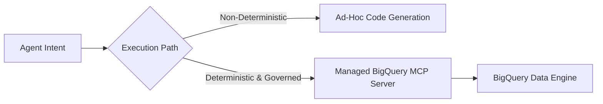

# Enable Autonomous Data Agents with BigQuery and Cloud Run

**Speaker(s):** Vlad Kolesnikov · **Channel:** Google Cloud Tech · **Date:** 2026-06-25
**Watch:** https://youtu.be/nfCTJN42LyE?si=pg1g2BVTdz9F-XV_ · **Format:** Demo · **Level:** Intermediate
**Topics:** AI Agents, Backend/Infra

## TL;DR

A practical demonstration of building autonomous data agents using the managed BigQuery Model Context Protocol (MCP) server, Google Cloud Run execution environments, and an open Gemma 4 (31B) model running on private GPU infrastructure. Explores deterministic tool calling, Cloud Run execution models, and automated business analytics on public datasets.

## Contents

- [Why MCP and why now: skills vs. tools, determinism, governance](#why-mcp-and-why-now-skills-vs-tools-determinism-governance)
- [Cloud Run execution types for autonomous agents](#cloud-run-execution-types-for-autonomous-agents)
- [ADK autonomous agent support via Eventarc and Pub/Sub](#adk-autonomous-agent-support-via-eventarc-and-pubsub)
- [Demo: Gemma 4 data agent querying NYC Citi Bike on BigQuery MCP](#demo-gemma-4-data-agent-querying-nyc-citi-bike-on-bigquery-mcp)

---

## Why MCP and why now: skills vs. tools, determinism, governance

The AI ecosystem has seen various claims that a single paradigm is "all you need" (models, evals, MCP, skills). In practice, robust production systems require all of them.

Skills guide agent behavior through instructions, but executable tools are needed to act on systems. While LLMs can generate raw code or CLI scripts, calling pre-built **Model Context Protocol (MCP)** tools provides determinism, standard authentication, and centralized Cloud IAM security boundaries.

---

## Cloud Run execution types for autonomous agents

Google Cloud Run provides flexible compute patterns for running agent workloads:

| Execution Type | Trigger / Lifecycle | Agent Use Case |
|---|---|---|
| **Services** | HTTPS Request / Response | Interactive web chat interfaces and real-time APIs |
| **Jobs** | Run-to-completion batch execution | Fine-tuning jobs, batch evals, scheduled data analysis |
| **Worker Pools** | Event-driven continuous listeners | Processing background Pub/Sub event queues |
| **Instances** | Fast startup, long duration | Autonomous long-running agents and multi-step tasks |
| **Sandboxes** | Isolated execution environments | Safe execution of untrusted generated code |

---

## ADK autonomous agent support via Eventarc and Pub/Sub

The Agent Development Kit (ADK) API server includes native endpoints for asynchronous execution. Rather than requiring continuous human prompting, an ADK agent can be triggered by **Pub/Sub** topics or **Eventarc** events (such as a new file upload or a webhook) to run multi-step analytical pipelines autonomously on Cloud Run.

---

## Demo: Gemma 4 data agent querying NYC Citi Bike on BigQuery MCP

The demo showcases a locally hosted **Gemma 4 (31B)** open weights model running on Cloud Run with RTX 6000 Pro GPUs, connected to the BigQuery MCP server:

1. **Authentication Interruption**: When querying the public NYC Citi Bike dataset, the agent detects missing permissions and triggers an OAuth sign-in flow on the client front end.
2. **Schema Discovery**: The agent inspects station and trip tables.
3. **Self-Correction**: An initial attempt to join tables on `station_id` fails due to schema type discrepancies. The agent autonomously analyzes the failure and rewrites the query to join on string station names.
4. **Business Insight**: Identifies high-utilization stations (e.g., Broadway & 36th St with 5,000 trips per dock) and suggests specific capacity rebalancing recommendations.

**Related:** [Data agent kit: Your coding agent can now query your data](./data-agent-kit-coding-agent-2026.md)

---

## Source

Full cleaned transcript: `DATA/videos/autonomous-data-agents-bigquery-2026.json`
Raw transcript: `RAW/videos/autonomous-data-agents-bigquery-2026.md`
