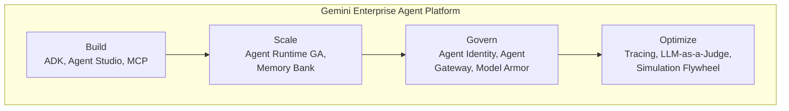

# Build AI Agents at Scale with Google Cloud

**Speaker(s):** Brian Delahunty, Addy Osmani, Andrew McNamara, Michael Gerstenhaber, Sara Liao-Troth · **Channel:** Google Cloud Tech · **Date:** 2026-04-27
**Watch:** https://youtu.be/ZRs1PHngOIA?si=Po_aMr6QKeth5VB0 · **Format:** Keynote / Spotlight · **Level:** Intermediate
**Topics:** AI Agents, Backend/Infra, Product/Startup

## TL;DR

Cloud Next 2026 spotlight session detailing the architectural and operational foundations for deploying enterprise AI agents at global scale. Explores the transition from instructions to high-level goals, covers the enhanced Agent Runtime (GA), Agent Studio, Agent Identity, Agent Gateway, and Memory Bank. Features an interactive live swag ordering demo and enterprise deployments at Shopify and HCA Healthcare.

## Contents

- [The paradigm shift: moving from instructions to goals](#the-paradigm-shift-moving-from-instructions-to-goals)
- [Build and Scale: ADK enhancements, Agent Studio, and Agent Runtime GA](#build-and-scale-adk-enhancements-agent-studio-and-agent-runtime-ga)
- [Live demo: autonomous swag order agent with runtime tool discovery](#live-demo-autonomous-swag-order-agent-with-runtime-tool-discovery)
- [Enterprise case studies: Shopify Sidekick and HCA Healthcare nurse handoff](#enterprise-case-studies-shopify-sidekick-and-hca-healthcare-nurse-handoff)

---

## The paradigm shift: moving from instructions to goals

Brian Delahunty emphasizes that enterprise scaling requires a fundamental management shift: moving away from micromanaging step-by-step instructions toward delegating high-level goals within defined scopes of trust.

The **Gemini Enterprise Agent Platform** organizes capabilities across four operational pillars:
1. **Build**: Low-code visual authoring (Agent Studio) and open-source code frameworks (ADK).
2. **Scale**: Serverless execution (Agent Runtime GA) and persistent long-term memory (Agent Memory Bank).
3. **Govern**: Granular security (Agent Identity, Agent Registry, Agent Gateway, Model Armor).
4. **Optimize**: Forensic tracing, LLM-as-a-Judge evaluations, and synthetic multi-turn simulation.

---

## Build and Scale: ADK enhancements, Agent Studio, and Agent Runtime GA

Key capabilities launched for production workloads:
- **ADK Graph Engine**: Allows developers to adjust the slider between dynamic LLM reasoning and strict deterministic state machine logic.
- **Checkpointing & Resumability**: Pauses long-running multi-day workflows for human-in-the-loop approvals without losing state.
- **Agent Runtime GA**: Purpose-built managed execution engine offering subsecond cold starts, 7-day long-running tasks, and enterprise compliance (CMEK, HIPAA, VPC Service Controls).
- **Agent Memory Bank**: Long-term state persistence linking conversation sessions to enterprise customer IDs.

---

## Live demo: autonomous swag order agent with runtime tool discovery

Addy Osmani builds and deploys a live multi-agent system on stage:
- **Intake Agent**: Uses Gemini vision to parse attendee conference badges from raw photos under adverse lighting.
- **Stockroom Agent**: Queries BigQuery inventory and autonomously delegates restock tasks to supplier sub-agents.
- **Fulfillment Agent**: Discovers backend tools dynamically at runtime via the **Agent Registry** without hardcoded URLs.
- **Production Defense**: Model Armor successfully intercepts and neutralizes live prompt injection and bulk claim attacks in the conference hall.

---

## Enterprise case studies: Shopify Sidekick and HCA Healthcare nurse handoff

### Shopify Sidekick (Andrew McNamara)
- Acts as a digital co-founder for millions of global entrepreneurs.
- Replaced hundreds of ad-hoc tools with low-level foundational primitives operated by an autonomous orchestration loop.
- Utilizes an LLM-as-a-Judge evaluation rubric passing narrow Turing tests for product consistency.

### HCA Healthcare Nurse Handoff (Sara Liao-Troth)
- Coordinates 80,000 daily shift transitions across 190 hospitals.
- Employs a modular hierarchy of sequential and parallel clinical agents to summarize complex charts.
- Embeds dedicated citation agents that verify every statement against source medical records, drastically reducing cognitive overload and handoff communication errors.

**Related:** [Agent development and AgentOps with BigQuery, ADK, and MCP](./agentops-bigquery-adk-mcp-2026.md)

---

## Source

Full cleaned transcript: `DATA/videos/build-ai-agents-at-scale-2026.json`
Raw transcript: `RAW/videos/build-ai-agents-at-scale-2026.md`
