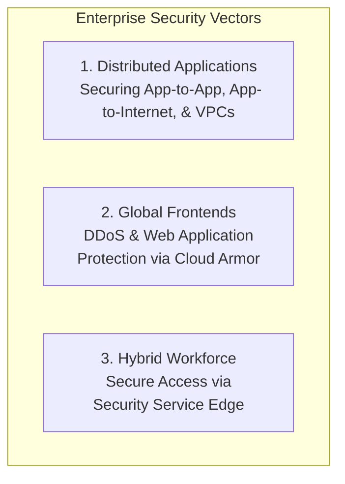

# Simplified Google Cloud Network Security: Zero-Trust and Beyond

**Speaker(s):** S. Shiraj, Toby, Olivier, Ashok · **Channel:** Google Cloud Tech · **Date:** 2024-07-01
**Watch:** https://youtu.be/pQyhpIR6HPU?si=PwB5RR0_rcvk4cPw · **Format:** Talk / Demo · **Level:** Intermediate
**Topics:** Backend/Infra

## TL;DR

A comprehensive architectural overview of Google Cloud's ML-powered zero-trust network security suite. Examines how modern enterprises protect distributed applications across multi-cloud and hybrid environments using Cloud Next-Generation Firewall (NGFW), Cloud Secure Web Proxy with inline Symantec DLP, and Cloud Armor edge defense.

## Contents

- [The modern threat landscape: securing multi-cloud and distributed applications](#the-modern-threat-landscape-securing-multi-cloud-and-distributed-applications)
- [Cloud Secure Web Proxy and inline DLP integration](#cloud-secure-web-proxy-and-inline-dlp-integration)
- [Cloud Next-Generation Firewall (NGFW) and intrusion prevention](#cloud-next-generation-firewall-ngfw-and-intrusion-prevention)
- [Customer spotlight: Symphony's zero-trust cloud migration](#customer-spotlight-symphonys-zero-trust-cloud-migration)

---

## The modern threat landscape: securing multi-cloud and distributed applications

Over 88% of enterprises report significant hurdles securing cloud infrastructure as applications spread across regions, clouds, and internet-facing perimeters. With organizations facing tens of thousands of automated attacks yearly, security must protect three critical domains:

---

## Cloud Secure Web Proxy and inline DLP integration

**Cloud Secure Web Proxy** is a fully managed, scalable egress proxy service:
- **No VM Fleet Overhead**: Eliminates the operational burden of deploying and scaling legacy Squid proxy instances.
- **Granular Egress Policies**: Restricts outbound workload connections to explicitly authorized domain names and URLs.
- **Inline Broadcom Symantec DLP**: Deeply integrates Symantec Data Loss Prevention directly into proxy and load-balancer paths, inspecting outbound encrypted TLS payloads to prevent sensitive data leakage.

---

## Cloud Next-Generation Firewall (NGFW) and intrusion prevention

Traditional firewalls require complex routing topologies and virtual appliance chokepoints. 

**Cloud NGFW** embeds security directly into Google Cloud's software-defined networking fabric (Andromeda):
- **Layer 7 Inspection**: Identifies applications and protocols regardless of port numbers.
- **Intrusion Prevention System (IPS)**: Leverages Palo Alto Networks threat intelligence to block CVE exploits and lateral attack movements automatically.
- **Hierarchical Firewall Policies**: Enables central security teams to enforce immutable baseline rules across all organizational projects and folders.

---

## Customer spotlight: Symphony's zero-trust cloud migration

Olivier from financial collaboration platform **Symphony** details their security architecture on Google Cloud:
- Meets stringent Tier-1 banking regulations and data isolation mandates.
- Implements micro-segmentation and zero-trust verification across real-time cryptographic messaging infrastructure.
- Uses native Cloud Armor rules and audit logging for automated incident detection and response.

---

## Source

Full cleaned transcript: `DATA/videos/cloud-network-security-zero-trust-2024.json`
Raw transcript: `RAW/videos/cloud-network-security-zero-trust-2024.md`
