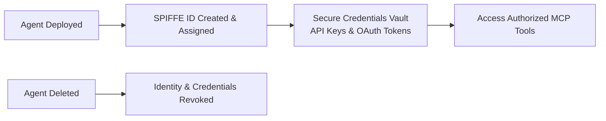

# Build Connected AI: Orchestrate Tools and Agents with Registries and ADK

**Speaker(s):** Michael Vakoc, Mak Ahmad, Min Zu · **Channel:** Google Cloud Tech · **Date:** 2026-06-25
**Watch:** https://youtu.be/bjaXpSz4ao0?si=_wre7_yF3XkPMHTL · **Format:** Talk · **Level:** Intermediate
**Topics:** AI Agents, Backend/Infra

## TL;DR

As enterprise adoption accelerates, the primary challenge transitions from building single agents to governing hundreds of them. This session introduces **Agent Registry** as the single source of truth, **Agent Identity** with SPIFFE-based per-agent credentials, and **SpecBoost** for turning legacy API logs into rich agent-ready OpenAPI specs and MCP servers. Includes a case study from travel platform Klook.

## Contents

- [The challenge has shifted: from building agents to governing hundreds](#the-challenge-has-shifted-from-building-agents-to-governing-hundreds)
- [Agent Registry: single source of truth for agents, MCPs, and models](#agent-registry-single-source-of-truth-for-agents-mcps-and-models)
- [Agent Identity: SPIFFE-based per-agent credentials and secure vault](#agent-identity-spiffe-based-per-agent-credentials-and-secure-vault)
- [SpecBoost: from no API specs to enriched, agent-ready MCP servers](#specboost-from-no-api-specs-to-enriched-agent-ready-mcp-servers)
- [Klook case study: supply research multi-agent system](#klook-case-study-supply-research-multi-agent-system)

---

## The challenge has shifted: from building agents to governing hundreds

While early generative AI projects focused on basic proof-of-concepts, enterprise organizations now face agent sprawl:
- Multiple teams unknowingly building redundant tools and agents.
- Fragmented authentication models with shared service accounts.
- Undocumented enterprise APIs that cause LLMs to hallucinate parameters.

Managing this at scale requires centralized discovery, granular identity lifecycles, and automated API enrichment.

---

## Agent Registry: single source of truth for agents, MCPs, and models

**Agent Registry** (within Vertex AI Agent Platform) acts as the unified enterprise catalog:
- Lists registered agents, MCP servers, and models across projects and regions.
- Enables discovery via web UI, REST API, or Python SDK.
- Provides generated ADK integration code snippets for connecting agents directly to registry assets.

---

## Agent Identity: SPIFFE-based per-agent credentials and secure vault

Rather than sharing broad project service accounts across all agents, **Agent Identity** implements SPIFFE standards:

- Each agent receives a unique SPIFFE ID tied directly to its lifecycle.
- Credentials and OAuth configurations are managed inside a dedicated vault.
- When an agent is deleted, its permissions are automatically cleaned up to prevent orphaned access.

---

## SpecBoost: from no API specs to enriched, agent-ready MCP servers

Many legacy backend APIs lack modern, detailed OpenAPI specifications. **SpecBoost** (integrated into API Hub) bridges this gap using Google DeepMind models:

1. **Spec Generation**: Ingests API logs from Apigee gateways or Cloud Storage buckets to deduce schemas, parameter types, and response shapes.
2. **Spec Boosting**: Enriches existing documentation with clear natural-language descriptions, constraints, and error examples optimized for LLM comprehension.
3. **Drift Detection**: Diffs live traffic schemas against documentation to flag undocumented API changes.
4. **MCP Publishing**: Converts enriched specs into registered MCP services with a single click.

---

## Klook case study: supply research multi-agent system

**Klook** (the largest travel experiences platform in APAC) built a multi-agent supply research platform to identify emerging travel trends:

- **Orchestrator Sub-Agent Pattern**: A lead agent coordinates specialized sub-agents that analyze distinct social media and review platforms in parallel.
- **Agent Registry Reusability**: Platform scrapers and analysis agents are registered as reusable assets, allowing other teams (such as customer voice analytics) to discover and call them.
- **API Transition**: Internal booking and catalog APIs were progressively converted into MCP servers registered in Agent Registry.

Workflows that previously required days of manual business development research now execute in hours.

**Related:** [Build a multi-agent system: A2A and Agent Registry](./multi-agent-a2a-agent-registry-2026.md)

---

## Source

Full cleaned transcript: `DATA/videos/connected-ai-tool-registries-2026.json`
Raw transcript: `RAW/videos/connected-ai-tool-registries-2026.md`
