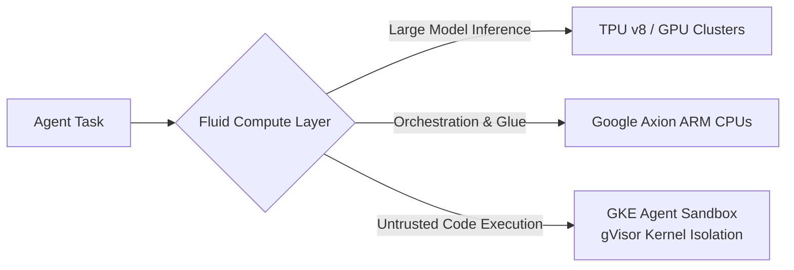

# Cross-Cloud Infrastructure for the Agentic Enterprise

**Speaker(s):** Drew Bradstock, Muninder Sambi, James Duncan, Fiona Tan · **Channel:** Google Cloud Tech · **Date:** 2026-04-28
**Watch:** https://youtu.be/gY95kEL-JGI?si=SE5Zt-KUcR6kY9F5 · **Format:** Talk / Keynote · **Level:** Intermediate
**Topics:** AI Agents, Backend/Infra

## TL;DR

An in-depth exploration of infrastructure architecture designed for the agentic enterprise. Covers how the shift toward inference-heavy AI workloads stresses legacy compute and networking, introduces **Fluid Compute** (TPU v8, Google Axion ARM CPUs, GKE Agent Sandbox with gVisor isolation), high-bandwidth C4 network VMs, and highlights multi-cloud deployments at Lovable, Walmart, and CSSF Luxembourg.

## Contents

- [The infrastructure renaissance: inference dominance and agent demand](#the-infrastructure-renaissance-inference-dominance-and-agent-demand)
- [Fluid compute: TPU v8, Google Axion ARM CPUs, and GKE Agent Sandbox](#fluid-compute-tpu-v8-google-axion-arm-cpus-and-gke-agent-sandbox)
- [Network performance and storage throughput for enterprise workloads](#network-performance-and-storage-throughput-for-enterprise-workloads)
- [Unified data layer and digital sovereignty in multi-cloud operations](#unified-data-layer-and-digital-sovereignty-in-multi-cloud-operations)

---

## The infrastructure renaissance: inference dominance and agent demand

AI inference has officially surpassed training, accounting for nearly half of all cloud AI computing demand. Autonomous agents interact at machine speed, generating bursts of tool invocations, database scans, and inter-agent coordination messages that overwhelm traditional static architectures.

Google Cloud introduces four foundational pillars for agentic systems:
1. **Fluid Compute**: Dynamically matching reasoning, orchestration, and code execution to optimal silicon.
2. **Secure Connectivity**: High-throughput, cross-cloud networking with microsecond latency.
3. **Unified Data Layer**: Mitigating data gravity across multi-region operational and analytical stores.
4. **Digital Sovereignty**: Enforcing jurisdictional compliance and cryptographic isolation.

---

## Fluid compute: TPU v8, Google Axion ARM CPUs, and GKE Agent Sandbox

- **TPU v8**: Custom silicon engineered for massive concurrent inference throughput and low token latency.
- **Google Axion ARM CPUs**: Deliver up to 2x better price-performance for CPU-bound data preprocessing and agent orchestration, preventing accelerator starvation.
- **GKE Agent Sandbox**: Leverages open-source **gVisor** kernel isolation to securely execute agent-generated code:
  - Cold starts in under 1 second.
  - Scales up to 300 sandboxes per second per cluster.
  - Integrated snapshotting enables instantaneous suspend/resume, billing only for active execution cycles.

---

## Network performance and storage throughput for enterprise workloads

- **Network-Optimized C4 VMs**: Deliver 95 million packets per second and 400 Gbps VM-to-VM bandwidth (a 4x increase per vCPU).
- **In-Memory Systems (SAP HANA, Oracle on M4)**: Coupled with **Hyperdisk Extreme** to achieve 1,000,000 IOPS and 25 GB/s throughput, lowering total cost of ownership by over 20%.

---

## Unified data layer and digital sovereignty in multi-cloud operations

- **Lovable**: Runs over 200,000 daily AI-generated web applications securely inside GKE Agent Sandboxes.
- **Walmart**: Unifies global inventory and retail telemetry to overcome data gravity across distributed distribution centers.
- **CSSF (Luxembourg)**: Deploys automated AI agents for systematic financial risk monitoring while strictly maintaining European digital sovereignty and regulatory compliance.

**Related:** [Build AI agents at scale with Google Cloud](./build-ai-agents-at-scale-2026.md)

---

## Source

Full cleaned transcript: `DATA/videos/cross-cloud-agentic-enterprise-2026.json`
Raw transcript: `RAW/videos/cross-cloud-agentic-enterprise-2026.md`
