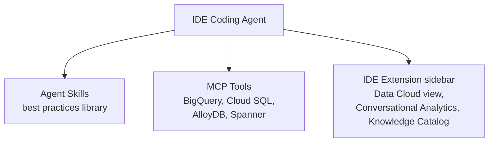

# Data Agent Kit: Your Coding Agent Can Now Query Your Data

**Speaker(s):** Annie Wang, Jeff Planner · **Channel:** Google Cloud Tech · **Date:** 2026-08-15
**Watch:** https://youtu.be/Vs2_Palg1QY?si=79aHKCKjJ1VDGndz · **Format:** Demo · **Level:** Intermediate
**Topics:** AI Agents, Backend/Infra, AI Coding Tools

## TL;DR

The **Data Agent Kit** is a Google-built package that gives AI coding agents (like those in VS Code forks, Gemini CLI, or Claude Code) first-class access to Google Cloud's data services via agent skills, MCP tools, and IDE extensions. This demo walks through installing the extension, enabling one-click MCP servers for BigQuery and Cloud SQL, and using conversational analytics, all without leaving the IDE.

## Contents

- [What the Data Agent Kit is and what it provides](#what-the-data-agent-kit-is-and-what-it-provides)
- [Setting up the extension in Antigravity IDE](#setting-up-the-extension-in-antigravity-ide)
- [One-click MCP server setup for BigQuery and Cloud SQL](#one-click-mcp-server-setup-for-bigquery-and-cloud-sql)
- [Conversational analytics and Knowledge Catalog integration](#conversational-analytics-and-knowledge-catalog-integration)
- [Agent skills for steering coding agents on data tasks](#agent-skills-for-steering-coding-agents-on-data-tasks)
- [Who benefits: data personas and software engineers](#who-benefits-data-personas-and-software-engineers)

---

## What the Data Agent Kit is and what it provides

The **Data Agent Kit** is a Google-assembled, unified distribution for data engineering, data analytics, and data science. It bundles three components:

1. **Agent Skills** - a curated library of best practices for data engineering, data science, and analytics workflows. These are instruction files that steer AI coding agents in how to use Data Cloud products correctly (for example, how to write a BigQuery SQL query that avoids full table scans, or how to choose between Cloud SQL and Spanner for a given workload).

2. **MCP Tools** - **Model Context Protocol (MCP)** connectors that securely connect the IDE coding agent to live Google Cloud Data services. Supported: BigQuery, Cloud SQL, AlloyDB, and Spanner. MCP standardizes how AI agents call external tools, similar to how HTTP standardized how browsers call servers.

3. **IDE Extensions** - VS Code extensions (compatible with any VS Code fork: Cloud Code, Codex, Antigravity IDE, etc.) that surface a unified Data Cloud view inside the IDE sidebar.

**Further reading:** [Data Agent Kit announcement](https://cloud.google.com/blog)

---

## Setting up the extension in Antigravity IDE

The Data Agent Kit extension is available in the VS Code extension marketplace. After installation:

- A Data Agent Kit icon appears in the IDE sidebar.
- A setup and configuration pane appears with fields for: Google Cloud **Project ID**, **Region**, and **Billing Project**.
- One-click API enablement for each supported service.
- One-click **MCP server provisioning** buttons for BigQuery, Cloud SQL, Spanner, AlloyDB, and Knowledge Catalog.

Internally, each "one-click" button configures the MCP server connection in the IDE's MCP settings file so the coding agent can call those tools without manual configuration.

---

## One-click MCP server setup for BigQuery and Cloud SQL

Once a BigQuery MCP server is enabled from the extension, the IDE surfaces a new side panel bringing the entire Data Cloud estate into a single view:

- **BigQuery tables** can be browsed (projects, datasets, tables) without switching to the Cloud Console.
- **Conversational Analytics** is available inline to query data in natural language.
- **Knowledge Catalog** integration allows searching across all data assets.

The same flow applies to **Cloud SQL**: select the Cloud SQL MCP server in the configuration pane, set the region, and the coding agent immediately has access to query Cloud SQL instances and tables.

The key advantage over manual MCP configuration: no editing of JSON config files, no credential wiring, no endpoint lookup. The extension handles all of it.

---

## Conversational analytics and Knowledge Catalog integration

**Conversational Analytics** (a BigQuery capability) lets users ask questions about BigQuery data in natural language and receive SQL-backed answers without writing queries manually. Inside the Data Agent Kit extension panel, this is surfaced as a chat-style interface directly alongside the table browser.

**Knowledge Catalog** (part of Google Cloud's data governance layer) provides a unified metadata search across all data assets in a project. From the same extension panel, users can search for tables, columns, or datasets by name or description, rather than navigating through the Cloud Console hierarchy.

Both integrations reduce the "tab sprawl" problem: data professionals previously needed to switch between the IDE, Cloud Console, BigQuery Studio, and Knowledge Catalog. The kit collapses these into one sidebar.

**Related:** [Boost AI context with hybrid search in Spanner](./spanner-hybrid-search-context-2026.md)

---

## Agent skills for steering coding agents on data tasks

When a coding agent (for example, Claude Code or Gemini CLI with Agent Mode) attempts a data task without guidance, it may generate arbitrary SQL, guess table names, or use deprecated APIs. **Agent skills** solve this by providing domain-specific instruction sets that are automatically injected into the agent's context when data-related tasks are detected.

Examples of what a data agent skill might contain:
- Preferred patterns for querying BigQuery (for example, use `LIMIT` in exploratory queries, avoid `SELECT *` on large tables).
- Which MCP tool to call for schema discovery versus query execution.
- How to handle authentication when writing to Cloud SQL.

This is analogous to how a senior data engineer would pair-program with a junior engineer, providing guardrails rather than letting them guess.

> [!NOTE]
> The "skills" here are distinct from the A2A agent card "skills" discussed in multi-agent architecture. Here, skills are Markdown instruction files read by the IDE coding agent. In the A2A context, skills are metadata fields in an agent card JSON.

---

## Who benefits: data personas and software engineers

The demo explicitly targets two audiences:

**Data professionals** (data engineers, data analysts, data scientists): The kit consolidates tools spread across many browser tabs (BigQuery Studio, Cloud Console, Knowledge Catalog, Cloud SQL admin) into a single IDE panel, reducing context switching.

**Software engineers without deep data expertise**: The conversational interface and agent skills allow querying and modifying data assets without knowing SQL or the schema in detail. A full-stack engineer who does not work with BigQuery daily can ask natural-language questions and get valid SQL-backed answers without manual query writing.

---

## Source

Full cleaned transcript: `DATA/videos/data-agent-kit-coding-agent-2026.json`
Raw transcript: `RAW/videos/data-agent-kit-coding-agent-2026.md`
