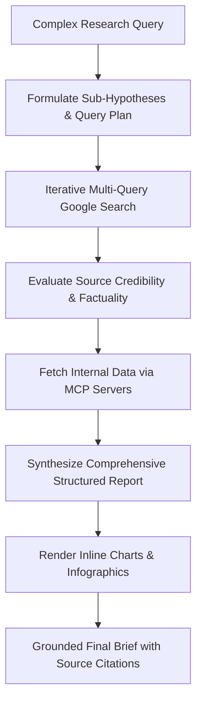

# Implementing DeepMind Innovation: Deep Research API

**Speaker(s):** Advait Bopardikar, Philipp Schmid, Patrick Starling · **Channel:** Google Cloud Tech · **Date:** 2026-06-25
**Watch:** https://youtu.be/05043f3GseE?si=upFs_lzz0NXh8q0V · **Format:** Talk / Demo · **Level:** Intermediate
**Topics:** AI Agents, LLM Fundamentals, Product/Startup

## TL;DR

A technical breakdown of Google DeepMind's **Deep Research API**, newly released across Google AI Studio and Gemini Enterprise Agent Platform. Explains how Gemini uses post-training reasoning loops to decompose complex queries, perform iterative multi-source web searches, connect to private enterprise data via MCP, render inline infographics, and highlights FactSet's financial research deployment.

## Contents

- [DeepMind innovation strategy: bringing research directly to APIs](#deepmind-innovation-strategy-bringing-research-directly-to-apis)
- [How the Deep Research agent works: iterative search and post-training](#how-the-deep-research-agent-works-iterative-search-and-post-training)
- [Hands-on developer walkthrough and API parameters](#hands-on-developer-walkthrough-and-api-parameters)
- [Customer case study: FactSet automated financial research](#customer-case-study-factset-automated-financial-research)

---

## DeepMind innovation strategy: bringing research directly to APIs

Google's vertically integrated stack (custom silicon, foundation models, and enterprise platforms) enables rapid commercialization of DeepMind research breakthroughs.

The **Deep Research API** allows developers to embed autonomous multi-turn research agents directly into enterprise software, turning research processes that typically take days of manual effort into minutes of compute.

---

## How the Deep Research agent works: iterative search and post-training

Unlike basic one-shot search grounding, Deep Research runs a full hypothesis-testing reasoning loop:

- **Post-Trained Reasoning Core**: Optimized to formulate search queries, analyze search result snippets, and refine search vectors based on missing evidence.
- **Multimodal Visuals**: Generates Python charting scripts and infographics to illustrate quantitative trends visually.

---

## Hands-on developer walkthrough and API parameters

Philipp Schmid demonstrates building with the Deep Research API via Google AI Studio and Python SDKs:
- **Search Depth & Breadth**: Configure reasoning budgets and iteration limits.
- **Domain Filtering**: Prioritize trusted institutional domains or restrict queries to enterprise intranets.
- **Model Context Protocol (MCP)**: Attach proprietary corporate data stores (Cloud SQL, BigQuery) alongside live Google search grounding.

---

## Customer case study: FactSet automated financial research

Patrick Starling from **FactSet** demonstrates integrating Deep Research into institutional equity analysis:
- Pulls proprietary real-time financial fundamentals and combines them with Deep Research web intelligence.
- Generates exhaustive equity briefs, ESG compliance audits, and earnings call syntheses.
- Accelerates analyst productivity while maintaining audit trails back to original financial filings.

**Related:** [Darren Aronofsky and Demis Hassabis on storytelling in the age of AI](../google-for-developers/aronofsky-hassabis-ai-storytelling-2025.md)

---

## Source

Full cleaned transcript: `DATA/videos/deep-research-api-2026.json`
Raw transcript: `RAW/videos/deep-research-api-2026.md`
