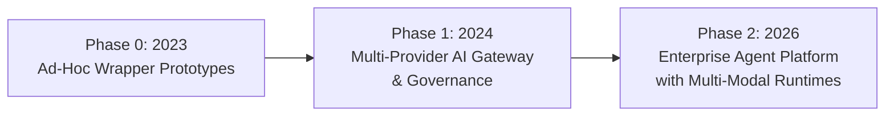

# From Prototype to Production: 45 Minutes to a Reliable Gemini Enterprise Agent Platform Agent

**Speaker(s):** Alibek Datbayev, Maria-Irène Călinoiu, Naz Bayrak, Manasa Kandula · **Channel:** Google Cloud Tech · **Date:** 2026-06-25
**Watch:** https://youtu.be/fkCTifAqVGg?si=ze-G7eeT6wwwB4U0 · **Format:** Masterclass / Demo · **Level:** Intermediate
**Topics:** AI Agents, Backend/Infra, LLM Fundamentals

## TL;DR

A production-first architectural masterclass on building robust AI agents using the Gemini Enterprise Agent Platform. Booking.com shares their journey from simple LLM wrappers to a governed multi-provider platform, followed by Google engineers outlining the 4-step production methodology: Connect (MCP servers), Protect (Agent Identity and Model Armor), Inspect (Observability and Tracing), and Perfect (Trajectory Evaluations).

## Contents

- [Booking.com case study: journey from wrappers to governed agent platform](#bookingcom-case-study-journey-from-wrappers-to-governed-agent-platform)
- [Step 1: Connect via Model Context Protocol (MCP)](#step-1-connect-via-model-context-protocol-mcp)
- [Step 2: Protect with Agent Identity and Model Armor](#step-2-protect-with-agent-identity-and-model-armor)
- [Step 3 and 4: Inspect via Observability and Perfect via Trajectory Evaluations](#step-3-and-4-inspect-via-observability-and-perfect-via-trajectory-evaluations)

---

## Booking.com case study: journey from wrappers to governed agent platform

Booking.com serves 500,000 requests per second across 175,000 global destinations. Platform leaders Alibek Datbayev and Maria-Irène Călinoiu outline their AI architecture evolution:

- **Know Before You Go**: An agentic travel concierge leveraging Google Maps grounding to plan door-to-door transit itineraries.
- **BigBot**: An internal data discovery agent allowing engineers to query internal data mesh schemas with natural language.
- **Reels to Reality**: Ingests short-form travel video URLs directly into Gemini to extract location metadata and create actionable booking itineraries.

---

## Step 1: Connect via Model Context Protocol (MCP)

To eliminate brittle custom API scripts, enterprise agents utilize **MCP servers**:
- In the London Travel Concierge demo, the orchestrator agent communicates with a Weather MCP server and a private London Attractions MCP server backed by Cloud SQL.
- MCP abstracts database queries into governed tool schemas that agents dynamically discover and invoke.

---

## Step 2: Protect with Agent Identity and Model Armor

Production systems enforce zero-trust security across the agent layer:
- **Agent Identity**: Assigns unique cryptographic service identities and least-privilege IAM roles to individual agents rather than sharing generic accounts.
- **Model Armor**: An edge security gateway that intercepts prompts to block jailbreaks and filters outgoing tool responses to prevent accidental PII leakage.

---

## Step 3 and 4: Inspect via Observability and Perfect via Trajectory Evaluations

Deploying reliable agents requires rigorous telemetry and evaluation:
- **Observability**: Cloud Tracing captures full execution paths, identifying slow tool calls and token bottlenecks.
- **Response vs. Trajectory Evaluation**:
  - **Response Evaluation**: Assesses final text factuality, tone, and formatting.
  - **Trajectory Evaluation**: Evaluates intermediate reasoning steps, ensuring the agent invoked appropriate tools with valid arguments in the correct order against golden evaluation datasets via automated LLM-as-a-Judge pipelines.

**Related:** [Build AI agents at scale with Google Cloud](./build-ai-agents-at-scale-2026.md)

---

## Source

Full cleaned transcript: `DATA/videos/gemini-enterprise-prototype-to-production-2026.json`
Raw transcript: `RAW/videos/gemini-enterprise-prototype-to-production-2026.md`
