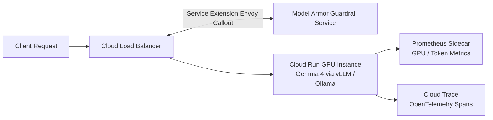

# Gemma 4 Production Stack: Model Armor, ADK Agents, Tracing

**Speaker(s):** Ayo Adedeji, Annie Wang · **Channel:** Google Cloud Tech · **Date:** 2026-04-19
**Watch:** https://youtu.be/7wENq-LMHgQ?si=u6WZXqoRDuJYxzeW · **Format:** Codelab / Tutorial · **Level:** Intermediate
**Topics:** AI Agents, Backend/Infra, LLM Fundamentals

## TL;DR

A step-by-step hands-on tutorial on operationalizing open-weights Gemma 4 models in production on Google Cloud. Learn how to serve Gemma 4 with vLLM and Ollama on Cloud Run, secure the inference path with **Model Armor** via Cloud Load Balancing Service Extensions (blocking prompt injections and PII exfiltration), scrape GPU hardware metrics with Prometheus, and trace multi-turn agent logic with OpenTelemetry and Cloud Trace.

## Contents

- [Architecture overview: securing and observing Gemma 4](#architecture-overview-securing-and-observing-gemma-4)
- [Model security: Model Armor via Load Balancer Service Extensions](#model-security-model-armor-via-load-balancer-service-extensions)
- [ADK Agent orchestration on Cloud Run](#adk-agent-orchestration-on-cloud-run)
- [Observability: Prometheus metrics and end-to-end Cloud Trace](#observability-prometheus-metrics-and-end-to-end-cloud-trace)

---

## Architecture overview: securing and observing Gemma 4

Deploying open-weights foundation models requires more than running raw inference containers. Production architectures enforce traffic routing, perimeter security, and full execution observability:

---

## Model security: Model Armor via Load Balancer Service Extensions

**Model Armor** acts as an inline AI firewall:
- **Zero-Latency In-Path Inspection**: Configured as an Envoy HTTP filter (Service Extension) on the Google Cloud Load Balancer.
- **Edge Sanitization**: Scans incoming prompts for jailbreak attempts, adversarial injection patterns, and toxic content before requests reach GPU workers.
- **Data Loss Prevention**: Scans outgoing generation streams to mask sensitive corporate secrets or customer PII.

---

## ADK Agent orchestration on Cloud Run

The **Agent Development Kit (ADK)** wraps the deployed Gemma 4 vLLM endpoint into an autonomous reasoning agent:
- Implements tool-calling schemas and system instructions.
- Connects to backend databases and external APIs.
- Packaged as a lightweight container and deployed to Cloud Run using automated Cloud Build CI/CD triggers.

---

## Observability: Prometheus metrics and end-to-end Cloud Trace

Production monitoring covers both hardware and cognitive dimensions:
- **Prometheus Sidecar**: Scrapes vLLM Prometheus metrics every 15 seconds (KV cache memory allocation, prefill latency, tokens generated per second).
- **Cloud Trace & OpenTelemetry**: Instruments distributed traces across each agent decision, capturing prompt tokens, tool execution latencies, and downstream API calls for forensic debugging.

**Related:** [Build a multi-agent system: A2A and Agent Registry](./multi-agent-a2a-agent-registry-2026.md)

---

## Source

Full cleaned transcript: `DATA/videos/gemma4-production-stack-2026.json`
Raw transcript: `RAW/videos/gemma4-production-stack-2026.md`
