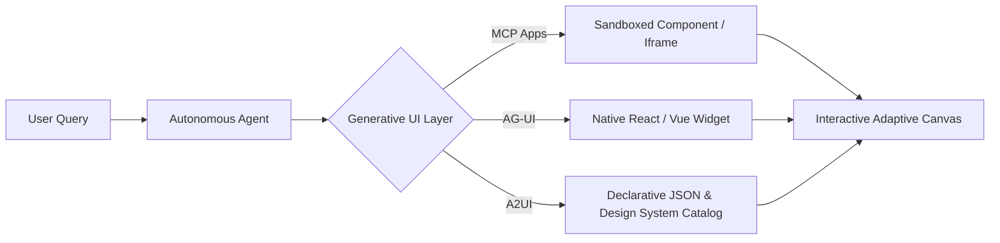

# Generative UI for Any Agent, Anywhere: A2UI, AG-UI, MCP Apps, and More

**Speaker(s):** Alan Blount, Atai Barkai, Ido Salomon, Nicolas Le Pallec · **Channel:** Google Cloud Tech · **Date:** 2026-06-25
**Watch:** https://youtu.be/UsMDkEsR-ok?si=VmlK6p7cd0lNmEf4 · **Format:** Talk / Panel · **Level:** Intermediate
**Topics:** AI Agents, Frontend/UI, Product/Startup

## TL;DR

An industry panel breaking beyond the "chat wall" with **Generative UI**. Explores how agents dynamically render brand-consistent, interactive graphical interfaces instead of walls of text. Compares three leading standards: **MCP Apps** (interactive UI extensions over Model Context Protocol), **AG-UI** from CopilotKit (universal frontend-to-agent bridge), and **A2UI** (declarative data-driven UI treating design systems as secure trust catalogs).

## Contents

- [Breaking the chat wall: the evolution from text to adaptive interfaces](#breaking-the-chat-wall-the-evolution-from-text-to-adaptive-interfaces)
- [MCP Apps: interactive frontend extensions over Model Context Protocol](#mcp-apps-interactive-frontend-extensions-over-model-context-protocol)
- [AG-UI by CopilotKit: universal agent-to-frontend bridge](#ag-ui-by-copilotkit-universal-agent-to-frontend-bridge)
- [A2UI: declarative data-driven UI and design system trust catalogs](#a2ui-declarative-data-driven-ui-and-design-system-trust-catalogs)

---

## Breaking the chat wall: the evolution from text to adaptive interfaces

Conversational text interfaces struggle to convey multi-variable datasets (conversion funnels, calendar bookings, flight comparisons). Users spend excessive time parsing paragraphs when a single interactive table, graph, or form would convey the information instantly.

**Generative UI** transforms the interface from static text into an adaptive canvas:

---

## MCP Apps: interactive frontend extensions over Model Context Protocol

Ido Salomon explains **MCP Apps**, extending the Model Context Protocol from data tools into user interfaces:
- Tool providers (such as PostHog or Salesforce) return both raw data and an interactive frontend component bundle.
- The hosting client (Claude, Gemini, or custom web portal) renders the component securely within an isolated web component or iframe.
- Users filter charts and adjust parameters directly in the stream without round-trip re-prompting.

---

## AG-UI by CopilotKit: universal agent-to-frontend bridge

Atai Barkai introduces **AG-UI**, an open-source standard connecting application frontends with autonomous agent frameworks (LangGraph, CrewAI, ADK):
- **Bidirectional State Sync**: Agents inspect the live DOM tree, active user selections, and application state variables.
- **Native Component Injection**: Rather than rendering isolated iframes, AG-UI injects generated widgets into native React or Vue components styled with existing application stylesheets.

---

## A2UI: declarative data-driven UI and design system trust catalogs

Nicolas Le Pallec and Alan Blount present Google's **A2UI (Agent-to-UI)** standard:
- **Security by Design**: Avoids generating raw, unvalidated HTML/JS strings that pose Cross-Site Scripting (XSS) risks.
- **Declarative JSON Payloads**: LLMs output structured JSON schema describing layout, properties, and data bindings.
- **Design System Trust Catalog**: The client application maps declarative JSON nodes to verified, accessible, brand-compliant UI components, guaranteeing consistent typography and flawless mobile responsiveness.

---

## Source

Full cleaned transcript: `DATA/videos/generative-ui-a2ui-agui-2026.json`
Raw transcript: `RAW/videos/generative-ui-a2ui-agui-2026.md`
