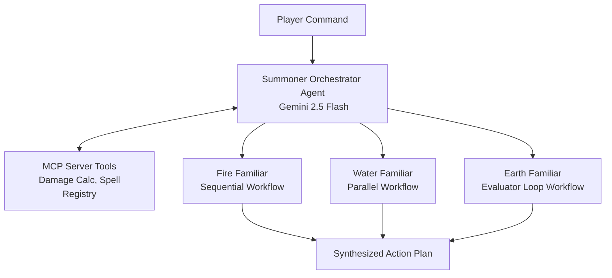

# Build a Multi-Agent System | Hands On AI (Part 1)

**Speaker(s):** Annie Wang, Ayo Adedeji · **Channel:** Google Cloud Tech · **Date:** 2026-03-21
**Watch:** https://youtu.be/rHtRWyxVQps?si=m5ka_Qjq-qtAbGaO · **Format:** Codelab / Tutorial · **Level:** Intermediate
**Topics:** AI Agents, Backend/Infra, LLM Fundamentals

## TL;DR

Part 1 of a hands-on multi-agent lab series using an RPG gaming theme. Learn how to build a custom **Model Context Protocol (MCP)** server to expose specialized tools, configure specialized workflow sub-agents using the **Agent Development Kit (ADK)** (Sequential Fire Familiar, Parallel Water Familiar, and Loop Earth Familiar), and orchestrate them via a central Summoner agent.

## Contents

- [Hands-on project overview and multi-agent RPG architecture](#hands-on-project-overview-and-multi-agent-rpg-architecture)
- [Building an MCP server for tool integration](#building-an-mcp-server-for-tool-integration)
- [Constructing specialized ADK workflow patterns](#constructing-specialized-adk-workflow-patterns)
- [Orchestrating agents with the Summoner agent core](#orchestrating-agents-with-the-summoner-agent-core)

---

## Hands-on project overview and multi-agent RPG architecture

This two-part tutorial demonstrates multi-agent composition by building an interactive fantasy role-playing game system:
- **Summoner Agent**: The central orchestration core powered by Gemini 2.5 Flash.
- **Fire Familiar (Sequential Agent)**: Executes deterministic linear spellcasting sequences.
- **Water Familiar (Parallel Agent)**: Simultaneously gathers battlefield and environmental intel.
- **Earth Familiar (Loop Agent)**: Runs iterative defense validation loops until quality criteria are met.

---

## Building an MCP server for tool integration

Developers create a standalone **MCP server** using Python and FastAPI:
- Declares standardized tool definitions for game logic: `calculate_damage()`, `lookup_spell_registry()`, and `check_mana_balance()`.
- Generates JSON Schema parameter specifications that LLMs can reliably parse and call.
- Decouples tool execution logic from specific agent implementations.

---

## Constructing specialized ADK workflow patterns

The lab implements three primary ADK agent design patterns:
1. **Sequential Agents**: Linear pipelines where each step's output forms the input to the next step (ideal for step-by-step casting rules).
2. **Parallel Agents**: Concurrently queries multiple data endpoints (retrieving monster weaknesses, weather modifiers, and party health) to minimize latency.
3. **Loop / Evaluator Agents**: Repeats reasoning cycles until an evaluation threshold is reached (e.g., verifying that defensive shielding exceeds incoming boss attack power).

---

## Orchestrating agents with the Summoner agent core

The **Summoner Agent** ties the components together:
- Evaluates user prompts against available tools and sub-agent capabilities.
- Dynamically routes sub-tasks to the appropriate familiar agents.
- Aggregates multi-agent intermediate responses into a final structured battle response.

**Related:** [Build multi-agent AI A2A + Cloud Run | Hands On AI (Part 2)](./hands-on-multi-agent-part2-2026.md)

---

## Source

Full cleaned transcript: `DATA/videos/hands-on-multi-agent-part1-2026.json`
Raw transcript: `RAW/videos/hands-on-multi-agent-part1-2026.md`
