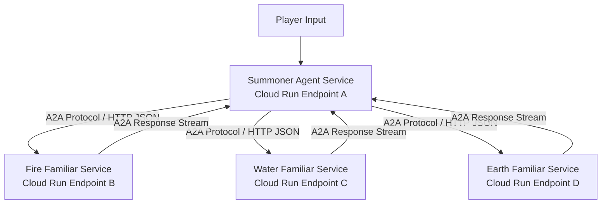

# Build Multi-Agent AI A2A + Cloud Run | Hands On AI (Part 2)

**Speaker(s):** Ayo Adedeji, Annie Wang · **Channel:** Google Cloud Tech · **Date:** 2026-03-22
**Watch:** https://youtu.be/pEAZ5iyKgWE?si=CDH2IkBK8GCOtfxH · **Format:** Codelab / Tutorial · **Level:** Intermediate
**Topics:** AI Agents, Backend/Infra, LLM Fundamentals

## TL;DR

Part 2 of the hands-on RPG multi-agent codelab series. Learn how to transition local workflow agents into a distributed production system using the **Agent-to-Agent (A2A) protocol** over HTTP, manage persistent memory and shared session state, implement ADK lifecycle callbacks for guardrails, containerize agents with Cloud Build, and deploy the entire multi-agent mesh to **Google Cloud Run** for the final boss battle.

## Contents

- [Distributed agent architecture and the Agent-to-Agent (A2A) protocol](#distributed-agent-architecture-and-the-agent-to-agent-a2a-protocol)
- [State management, memory persistence, and lifecycle callbacks](#state-management-memory-persistence-and-lifecycle-callbacks)
- [Containerization with Cloud Build and Artifact Registry](#containerization-with-cloud-build-and-artifact-registry)
- [Deploying to Cloud Run and the final boss fight demo](#deploying-to-cloud-run-and-the-final-boss-fight-demo)

---

## Distributed agent architecture and the Agent-to-Agent (A2A) protocol

While local agent workflows run in a single process, enterprise architectures separate agents into independently scalable microservices:

- **A2A Protocol**: Defines standardized JSON-over-HTTP interfaces for task delegation, contextual parameter passing, and streaming status updates between remote agent endpoints.
- **Independent Scaling**: Enables compute-heavy agents to scale up independently of lightweight orchestration nodes.

---

## State management, memory persistence, and lifecycle callbacks

- **Memory Bank & State Persistence**: Preserves player level, equipment stats, and multi-turn battle histories across independent HTTP requests.
- **ADK Lifecycle Callbacks**:
  - `before_tool_call`: Validates parameter ranges (e.g., verifying mana points before casting) to prevent hallucinated tool inputs.
  - `after_model_response`: Logs execution latency, token counts, and formats structured responses for client UIs.

---

## Containerization with Cloud Build and Artifact Registry

Each agent microservice is packaged into a lightweight, containerized Python service:
- Cloud Build compiles container images and stores them in Google Cloud **Artifact Registry**.
- Environment secrets (API keys, service endpoints, model parameters) are injected securely via Cloud Secret Manager.

---

## Deploying to Cloud Run and the final boss fight demo

The distributed multi-agent system is deployed to **Google Cloud Run**:
- Serverless execution with automatic scaling and subsecond cold starts.
- **Final Boss Fight Demo**: The Summoner coordinates real-time actions with remote Familiar microservices, executing multi-turn elemental combat simulations and defeating the boss live on stream.

**Related:** [Build a multi-agent system | Hands On AI (Part 1)](./hands-on-multi-agent-part1-2026.md)

---

## Source

Full cleaned transcript: `DATA/videos/hands-on-multi-agent-part2-2026.json`
Raw transcript: `RAW/videos/hands-on-multi-agent-part2-2026.md`
