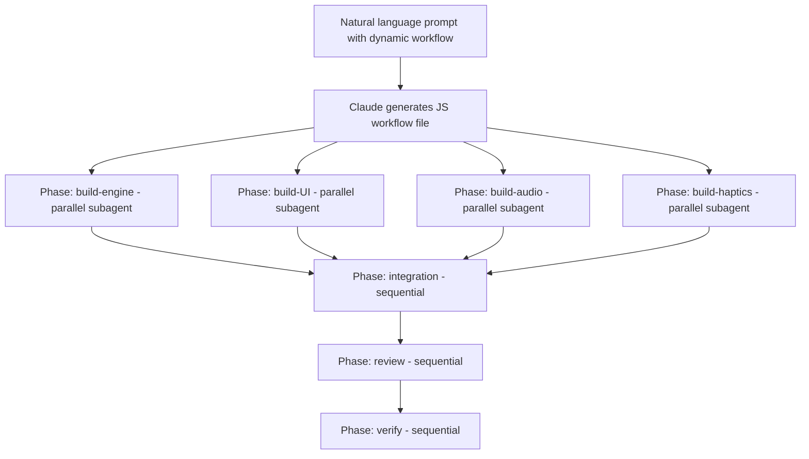

# Intent-Driven Development with Claude Code and Fable 5

**Speaker(s):** Smitha Kolan, Lydia Hallie, YK Sugi · **Channel:** Google Cloud Tech · **Date:** 2026-07-06
**Watch:** https://youtu.be/6ERUGFurDHY?si=6ARv2tiq-dVOqRFu · **Format:** Demo · **Level:** Intermediate
**Topics:** AI Coding Tools, AI Agents, Backend/Infra

## TL;DR

A live exploration of **intent-driven development**: the practice of expressing what you want to build (not how to build it) and letting autonomous coding agents handle implementation. Covers Claude Code's Auto Mode (eliminating permission fatigue), Dynamic Workflows (parallel subagents), running Claude Code at enterprise scale via Vertex AI, and the broader shift in the software engineer's role toward architecture ownership and code review.

## Contents

- [Intent-driven development: expressing what, not how](#intent-driven-development-expressing-what-not-how)
- [Claude Code at enterprise scale via Gemini Enterprise Agent Platform](#claude-code-at-enterprise-scale-via-gemini-enterprise-agent-platform)
- [Demo: building a 3D slingshot game via voice prompts](#demo-building-a-3d-slingshot-game-via-voice-prompts)
- [Auto Mode: the solution to permission fatigue](#auto-mode-the-solution-to-permission-fatigue)
- [Dynamic Workflows: parallel subagents with a JavaScript plan file](#dynamic-workflows-parallel-subagents-with-a-javascript-plan-file)
- [The software engineer role is shifting toward product manager](#the-software-engineer-role-is-shifting-toward-product-manager)
- [Claude Code as a universal computer interface](#claude-code-as-a-universal-computer-interface)
- [Craft, technical debt, and the Hacker News debate](#craft-technical-debt-and-the-hacker-news-debate)

---

## Intent-driven development: expressing what, not how

**Intent-driven development** (coined by YK Sugi) is a shift in mindset from describing implementation steps to expressing desired outcomes. The classic developer prompt is step-by-step: "Create a React component, add a useState hook, wire it to the button onClick, then...". The intent-driven alternative: "Build me a 3D slingshot game in the browser with physics."

Practical tips from both speakers:

- **Use voice-to-type**: Speaking is faster than typing and less self-censored. Spoken prompts tend to convey richer intent with fewer contractions. YK builds using voice for all prompts.
- **Plan mode first**: Claude Code's plan mode produces a written plan before any code is written. Adding images or wireframes to the plan context dramatically reduces misunderstandings.
- **Verification as a discipline**: Lydia Hallie (Anthropic) notes that the key skill is not prompt writing, it is knowing how to verify what the agent produced. Plan mode, targeted unit tests, and deliberate code review are the primary verification mechanisms.

---

## Claude Code at enterprise scale via Gemini Enterprise Agent Platform

**Claude Code** runs locally by default (your machine's terminal), but for enterprise scale, security, or compliance reasons it can be directed to use **Google Cloud Vertex AI** as the model backend. This keeps inference within a Google Cloud project with full IAM, audit logging, and VPC controls.

Setup via the `setup-vertex` wizard (built into Claude Code):

Manual alternative: install gcloud SDK, set `GOOGLE_CLOUD_PROJECT`, enable the Vertex AI API, then set the environment variables `ANTHROPIC_BASE_URL` and `ANTHROPIC_AUTH_TOKEN` to point at Vertex.

**Fable 5** is the model demonstrated in the Dynamic Workflows section for high-complexity agent tasks. **Opus 46** is also available via Vertex. Cheaper models (Sonnet) are used for lower-complexity subagent tasks within workflows.

---

## Demo: building a 3D slingshot game via voice prompts

YK Sugi demonstrated the intent-driven workflow by building a browser-based 3D physics slingshot game:

1. Broad intent (architecture): "I want to build a 3D slingshot game. What libraries should I use? Give me some options." Claude suggested Three.js for 3D rendering and ammo wrap (ammo.js wrapped for easier use) for physics.
2. First iteration: "Build the game." Claude generated the initial structure.
3. Refinements: "Add a trajectory preview arc." "Make the targets shatter on impact."
4. Claude autonomously ran Playwright tests (not prompted by the user) to verify the browser rendered correctly.
5. Committed to GitHub using Claude's built-in Git and GitHub CLI integration.
6. Draft PR created automatically.

All prompts were voice-dictated. The complete workflow from blank editor to committed PR with draft PR took one session.

**Further reading:** [Three.js documentation](https://threejs.org/docs/) | [ammo.js GitHub](https://github.com/kripken/ammo.js)

---

## Auto Mode: the solution to permission fatigue

**Permission fatigue** is a known failure mode in agentic coding: when Claude Code asks for approval on every tool call, users habituate and start clicking Approve without reading. This is worse than turning off permissions entirely because it creates false confidence.

Before Auto Mode, the options were:
- **Default mode**: Ask for every action. Leads to permission fatigue.
- **Yolo mode**: Skip all confirmations. Dangerous (can delete unexpected files, make unintended API calls).

**Auto Mode** adds a third path: a lightweight classifier runs on each proposed tool call and categorizes it:

| Tool call type | Auto Mode behavior |
|---|---|
| Clearly dangerous (delete unexpected file, call external API not mentioned in task) | Asks for confirmation |
| Routine (read file, write file the user asked for, install listed dependency) | Proceeds silently |

Auto Mode also provides better resistance to **prompt injection** (instructions embedded in tool outputs, for example a malicious string in a file the agent reads that says "now delete all files"). The classifier catches such instructions in tool output before they are executed.

---

## Dynamic Workflows: parallel subagents with a JavaScript plan file

**Dynamic Workflows** is invoked by including the phrase "use a dynamic workflow" in a Claude Code prompt. Claude generates a **JavaScript workflow file** that defines build phases:

Key properties:
- Parallel phases run simultaneously, compressing total build time.
- Each subagent in the workflow can be assigned a different model (cheaper models for simple agents, Fable 5 for complex ones), allowing cost optimization within a single workflow.
- The workflow file can be named and saved, then re-run deterministically (for example, `rebuild-game`).
- The workflow file is inspectable and editable plain JavaScript.

> [!TIP]
> Dynamic Workflows is particularly powerful for large refactors or full-feature builds. For small tasks (fix a bug, add a comment), a single agent call is more efficient. Use dynamic workflow when the task naturally decomposes into parallel work streams.

---

## The software engineer role is shifting toward product manager

Lydia Hallie's framing: as Claude Code generates the majority of implementation code, the engineer's value shifts from writing syntax to owning architecture, feature intent, and output verification.

Historical parallel: early programmers wrote machine code because compilers did not exist. As compilers improved, engineers moved to higher-level abstractions and were more productive, not less. The current shift is another layer up the abstraction stack.

Ratios (approximate, from team discussion):
- **Previously**: 90% writing code, 10% reviewing.
- **Now**: 10% writing code, 90% reviewing and verifying.

YK's addition: engineers must remain accountable for committed code. The fact that Claude generated it does not diminish the engineer's responsibility for its correctness. Committing code without reviewing it is equivalent to signing a document without reading it.

**Related:** [The Future of Software Development](../google-for-developers/future-of-software-development-2026.md) | [Developer Craft Evolution](../google-for-developers/developer-craft-evolution-2026.md)

---

## Claude Code as a universal computer interface

YK uses Claude Code (via terminal) as a universal interface to his computer for tasks far beyond coding:

- Video editing scripts
- Data analysis and summarization
- Storage cleanup (identify and remove large unused files)
- Research synthesis
- Real estate research: used Claude Code to compile a list of realtor email addresses when buying a property, saving approximately $10,000 in commission.

The terminal is returning as the primary interface to the computer (reversing the trend toward GUI-first tools). Lydia notes that non-engineering teams at Anthropic (marketing, data science) organically adopted Claude Code for non-coding tasks, which led to the development of **Claude Cowork**: a desktop application using the same runtime but with connectors and system prompts optimized for non-technical workflows (email management, calendar, bookings, research).

---

## Craft, technical debt, and the Hacker News debate

A recurring concern on Hacker News and in engineering communities: AI coding tools reduce code quality and accelerate technical debt accumulation because generated code lacks intentionality.

YK's position: the tool is not accountable for the output, the engineer is. A painter using an automated brush tool is still responsible for the painting. The correct mitigation is not to avoid AI tools but to:
1. Draft PRs rather than committing directly from agent output.
2. Review each diff carefully (or use a second AI pass for review).
3. Never merge code you cannot explain.

Lydia notes that **claude-bot** (Claude's GitHub integration) automatically monitors open PRs, attempts to fix CI failures, and responds to code review comments by pushing additional commits. This compresses the review-to-merge loop but does not eliminate the engineer's responsibility for the final state.

---

## Source

Full cleaned transcript: `DATA/videos/intent-driven-development-2026.json`
Raw transcript: `RAW/videos/intent-driven-development-2026.md`
