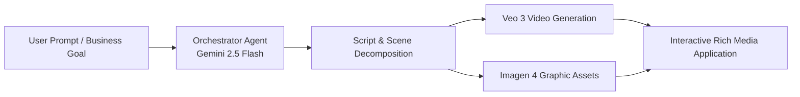

# The Impossible Computing with Keith Ballinger | The Agent Factory Podcast

**Speaker(s):** Keith Ballinger, Mollie Pettit, Vlad Kolesnikov · **Channel:** Google Cloud Tech · **Date:** 2025-09-04
**Watch:** https://youtu.be/I-xS4nw-HfU?si=5EYpQofB8w80Y7Y6 · **Format:** Podcast / Interview · **Level:** Intermediate
**Topics:** AI Agents, AI Coding Tools, Product/Startup

## TL;DR

An insightful episode of The Agent Factory Podcast featuring tech leader Keith Ballinger exploring **Impossible Computing** - the paradigm where AI foundation models and autonomous agents make previously cost-prohibitive or intractable software ideas viable to build in days. Examines the rise of vibe coding, Gemini CLI, multimodal synthesis pipelines (Veo 3, Imagen 4), and deploying production agents to Cloud Run.

## Contents

- [Impossible computing: rethinking software economics with AI](#impossible-computing-rethinking-software-economics-with-ai)
- [Developer empowerment and the shift to vibe coding](#developer-empowerment-and-the-shift-to-vibe-coding)
- [Multimodal media generation pipelines: Veo 3 and Imagen 4](#multimodal-media-generation-pipelines-veo-3-and-imagen-4)
- [Deploying production agents to Cloud Run](#deploying-production-agents-to-cloud-run)

---

## Impossible computing: rethinking software economics with AI

Traditional software development required strict cost-benefit justifications before embarking on complex heuristic engineering or niche tooling. 

**Impossible Computing** describes how generative models and autonomous agents flip this equation:
- A single developer can prototype and ship sophisticated multi-component systems (translation engines, automated video editors, analytical scrapers) in hours rather than months.
- The unit economics of software creation drop dramatically, enabling bespoke solutions tailored to narrow business workflows.

---

## Developer empowerment and the shift to vibe coding

Development workflows are shifting from low-level manual syntax manipulation to conversational orchestration (**vibe coding**):
- **Intent as Code**: Developers express high-level architectural goals to tools like **Gemini CLI** and agentic IDEs.
- **Iterative Feedback**: Agents modify files across directories, run local tests, parse error logs, and iterate toward working code without requiring developer micro-management.

---

## Multimodal media generation pipelines: Veo 3 and Imagen 4

Modern agents synthesize rich multi-modal media on demand:

---

## Deploying production agents to Cloud Run

Keith Ballinger shares architectural best practices for deploying agentic applications:
- **Serverless Elasticity**: Using **Google Cloud Run** allows developer agents to scale from zero to hundreds of concurrent requests automatically during traffic spikes.
- **Ephemeral Tooling**: Agents can spin up sandboxed micro-containers to execute untrusted code or run scheduled batch tasks with predictable per-second billing.

**Related:** [Beyond the hype: Orchestrating end-to-end developer workflows with agents](./orchestrating-developer-workflows-2026.md)

---

## Source

Full cleaned transcript: `DATA/videos/keith-ballinger-impossible-computing-2025.json`
Raw transcript: `RAW/videos/keith-ballinger-impossible-computing-2025.md`
