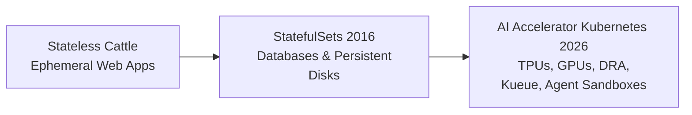

# Engineering the Future of Kubernetes for AI at Scale

**Speaker(s):** Kaslin Fields, Jago Macleod, Boaz Rant · **Channel:** Google Cloud Tech · **Date:** 2026-06-25
**Watch:** https://youtu.be/yVvLjWDmb0Y?si=DOYxe9PHHjIJQmi_ · **Format:** Talk · **Level:** Advanced
**Topics:** Backend/Infra, AI Agents

## TL;DR

A deep dive into the engineering evolution of Kubernetes and Google Kubernetes Engine (GKE) for enterprise AI and autonomous agent workloads. Traces the progression from stateless "cattle" containers to AI accelerator scheduling, **Dynamic Resource Allocation (DRA)**, **Kueue** multi-tenant batch queuing, GKE Agent Sandbox kernel isolation, and features Palo Alto Networks detailing their mission-critical AI inference deployment.

## Contents

- [Evolution of Kubernetes: from stateless cattle to AI accelerators](#evolution-of-kubernetes-from-stateless-cattle-to-ai-accelerators)
- [Dynamic Resource Allocation (DRA) and Kueue batch queuing](#dynamic-resource-allocation-dra-and-kueue-batch-queuing)
- [GKE Agent Sandbox and infrastructure fluidity for AI agents](#gke-agent-sandbox-and-infrastructure-fluidity-for-ai-agents)
- [Enterprise case study: Palo Alto Networks on GKE](#enterprise-case-study-palo-alto-networks-on-gke)

---

## Evolution of Kubernetes: from stateless cattle to AI accelerators

Kubernetes originally popularized the "cattle, not pets" philosophy for ephemeral, stateless microservices. Over the past decade, the ecosystem expanded:

---

## Dynamic Resource Allocation (DRA) and Kueue batch queuing

As enterprises run massive model training and multi-agent inference workloads, standard Kubernetes CPU/memory requests fall short:

- **Dynamic Resource Allocation (DRA)**: Standardizes how Kubernetes pods discover, claim, and configure physical accelerator properties (GPU memory slices, multi-node NVLink interconnects, and TPU topology fabrics).
- **Kueue**: An open-source Kubernetes-native job queueing system that manages multi-tenant quota allocation, prioritizes urgent batch inferences, and prevents cluster resource thrashing.

---

## GKE Agent Sandbox and infrastructure fluidity for AI agents

Autonomous agents generate and execute untrusted code in real time. **GKE Agent Sandbox** provides a hardened runtime environment:
- **gVisor Kernel Isolation**: Intercepts and sandboxes syscalls, preventing container escapes.
- **Subsecond Pod Spinups**: Launches agent execution sandboxes in under one second, scaling up to 300 sandboxes per second per cluster.
- **State Snapshotting**: Instantly suspends idle agents waiting for human-in-the-loop approvals, resuming execution without paying for idle compute cycles.

---

## Enterprise case study: Palo Alto Networks on GKE

Boaz Rant shares how **Palo Alto Networks** deploys cybersecurity AI models on GKE:
- Ingests petabytes of network telemetry daily across global clusters.
- Uses automated node provisioning and Kueue scheduling to run low-latency inference pipelines with 99.99% availability.
- Maximizes hardware utilization across heterogeneous GPU node pools.

**Related:** [Cross-cloud infrastructure for the agentic enterprise](./cross-cloud-agentic-enterprise-2026.md)

---

## Source

Full cleaned transcript: `DATA/videos/kubernetes-for-ai-at-scale-2026.json`
Raw transcript: `RAW/videos/kubernetes-for-ai-at-scale-2026.md`
