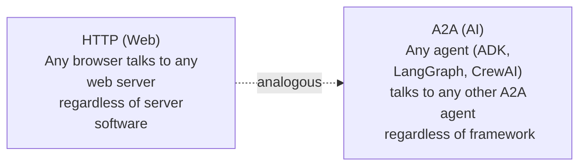
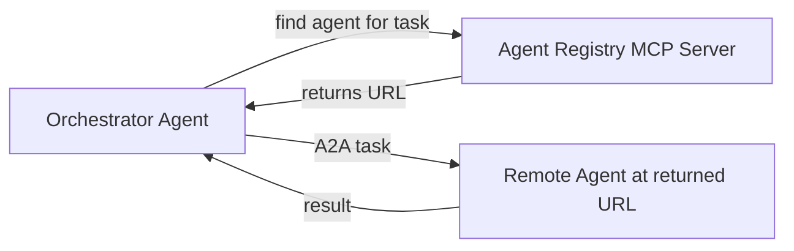

# Build a Multi-Agent System: A2A and Agent Registry

**Speaker(s):** Annie Wang, Sita Lakshmi · **Channel:** Google Cloud Tech · **Date:** 2026-06-27
**Watch:** https://youtu.be/-MME36Ft9Gc?si=sX4r_L4j8pdKh-m4 · **Format:** Tutorial / Demo · **Level:** Intermediate
**Topics:** AI Agents, Backend/Infra

## TL;DR

A step-by-step Hands On AI episode covering two complementary technologies for multi-agent systems: the **Agent2Agent (A2A) Protocol** (how agents discover and communicate with each other) and **Agent Registry** (how organizations manage, govern, and dynamically discover agents at scale). Demonstrates building a dog walker and trip planner agent, wiring them together via A2A, then using Agent Registry to eliminate hardcoded URLs and enable dynamic agent discovery.

## Contents

- [What is Agent2Agent (A2A): HTTP for AI agents](#what-is-agent2agent-a2a-http-for-ai-agents)
- [When to use A2A vs. local sub-agents](#when-to-use-a2a-vs-local-sub-agents)
- [Synchronous vs. asynchronous A2A communication](#synchronous-vs-asynchronous-a2a-communication)
- [Demo: wrapping an ADK agent as an A2A remote agent](#demo-wrapping-an-adk-agent-as-an-a2a-remote-agent)
- [Agent sprawl and why Agent Registry solves it](#agent-sprawl-and-why-agent-registry-solves-it)
- [Registering agents via gcloud and Cloud Console](#registering-agents-via-gcloud-and-cloud-console)
- [Connecting through Agent Registry instead of hardcoded URLs](#connecting-through-agent-registry-instead-of-hardcoded-urls)
- [Demo: orchestrator agent using Agent Registry](#demo-orchestrator-agent-using-agent-registry-dog-walker-plus-trip-planner)
- [Authentication in A2A and Agent Registry](#authentication-in-a2a-and-agent-registry)

---

## What is Agent2Agent (A2A): HTTP for AI agents

**Agent2Agent (A2A)** is Google's open protocol for inter-agent communication. Announced in 2025, it solves the same problem for AI agents that HTTP solved for web browsers: a standardized communication layer that lets any compliant participant communicate with any other, regardless of implementation.



The core mechanism is the **agent card**: a JSON file served at `/.well-known/agent-card.json` on any A2A-compliant agent's endpoint. The agent card describes:
- Agent name and description
- Capabilities (skills)
- Input/output formats accepted
- Endpoint URL to send tasks to

Think of an agent card as the agent's LinkedIn profile or business card.

**Further reading:** [A2A Protocol specification](https://google.github.io/A2A) | [A2A GitHub](https://github.com/google-a2a/A2A)

---

## When to use A2A vs. local sub-agents

ADK (Agent Development Kit) supports local sub-agents: workflow agents, sequential agents, and sub-agent hierarchies that run in the same process. When is A2A the right choice?

| Scenario | Best approach |
|---|---|
| All agents run together, simple composition | ADK local sub-agents |
| Agents run on different servers or are built by different teams | A2A |
| Agents use different frameworks (ADK + LangGraph mix) | A2A |
| Agents need independent deployment and update cycles | A2A |
| You want to reuse an existing remote agent without forking it | A2A |

Without A2A, connecting remote agents requires:
- Custom HTTP endpoints on each agent.
- Custom authentication on each connection.
- Hardcoded URLs in every caller.
- Tight coupling: updating one agent may require redeploying the entire system.

With A2A, all of this is standardized. Each agent can be deployed and updated independently.

---

## Synchronous vs. asynchronous A2A communication

A2A supports two communication modes, useful for different task durations:

| Mode | Mechanism | Best for | Analogy |
|---|---|---|---|
| Synchronous polling | Client repeatedly calls the agent and checks if a result is ready | Short-duration tasks | Standing in the shop repeatedly asking "is my order ready?" |
| Async streaming (SSE) | Client subscribes; agent pushes a Server-Sent Event when ready | Long-running tasks | Getting a push notification when the order is ready |

**Server-Sent Events (SSE)** is a lightweight HTTP-based push mechanism (uni-directional, unlike WebSockets). The A2A agent keeps the HTTP connection open and sends event objects as the task progresses.

Both modes are configurable in the A2A protocol via the streaming parameter on the task request.

---

## Demo: wrapping an ADK agent as an A2A remote agent

The **dog walker agent** is a standard ADK LLM agent using Gemini Flash with four tools:
1. `get_dog_profile` - fetches the dog's breed and energy level.
2. `get_local_weather` - checks weather conditions.
3. `find_park` - uses Google Maps API to find nearby dog parks.
4. `find_walk_route` - computes a walking route appropriate for the dog's size and energy.

To expose it as a remote A2A agent (callable by other agents over HTTP):

```python
from google.adk.a2a import to_a2a

app = to_a2a(dog_walker_agent, agent_card=AgentCard(
    name="Dog Walker Agent",
    description="Plans dog walking routes based on dog profile, weather, and local parks",
    skills=[AgentSkill(name="dog-walking", description="Plans walking routes for dogs")]
))
```

`to_a2a` wraps the ADK agent in an ASGI server that serves:
- `GET /.well-known/agent-card.json` - the agent card (auto-generated if no custom card is provided).
- `POST /tasks` - endpoint for receiving A2A task requests.

Once running, the agent card JSON is publicly readable and contains the URL for task submission. Any A2A-compatible agent can read this card and call the dog walker without any shared code or library dependency.

The **trip planner agent** connects to the dog walker by reading its agent card URL and calling it via the A2A client:

```python
from google.adk.a2a import A2AClient

dog_walker_client = A2AClient(agent_card_url="http://dog-walker:8080/.well-known/agent-card.json")
result = await dog_walker_client.send_task("Walk Bobby at 3pm near Mission District SF")
```

---

## Agent sprawl and why Agent Registry solves it

**Agent sprawl**: as an organization builds more agents (tens to hundreds), they become scattered across Cloud services, on-premises systems, multiple regions, and multiple teams. Problems:

1. **No inventory**: No central list of what agents exist, who built them, what they do, or who owns them.
2. **No standardized connectivity**: Each agent and each MCP server has its own connection method. Every caller must implement custom connection logic per resource.
3. **No governance**: No way to audit which agents are communicating with which, no cost attribution per agent, no compliance controls.

**Agent Registry** is Google Cloud's solution, available under the Vertex AI Agent Platform in the Cloud Console:

| Problem | Agent Registry solution |
|---|---|
| No inventory | Central registry showing all agents, MCP servers, and endpoints with IDs, protocols, and skills |
| No standardized connectivity | Single MCP server interface to discover and call any registered resource |
| No governance | Cloud audit logs, IAM-based access policies, cost monitoring, compliance tracking |

Agent Registry is framework-agnostic: LangGraph, CrewAI, and agents hosted outside Google Cloud can all be registered.

> [!NOTE]
> Agent Registry also contains Google Cloud's own first-party MCP servers, pre-populated and ready to use. Browse to the registry in the Cloud Console to see and enable them.

---

## Registering agents via gcloud and Cloud Console

**Method 1: gcloud CLI**

```bash
gcloud agent-registry services create \
  --agent-card-url="http://dog-walker:8080/.well-known/agent-card.json" \
  --display-name="Dog Walker Agent"
```

The command reads the agent card from the URL, extracts skills and metadata, and creates a registry entry. Can be run from a Python `subprocess` call for programmatic registration.

**Method 2: Cloud Console UI**

In the Agent Platform section of the Cloud Console, navigate to Agent Registry, click "Add Agent," select A2A as the protocol, choose a region, and paste the agent card JSON. After saving, the agent appears in the registry with its ID, protocol, and skills automatically parsed.

Both methods produce the same result: a registered entry with a stable Agent Registry ID that can be used for dynamic discovery.

> [!IMPORTANT]
> The "skills" field in an A2A agent card is distinct from ADK agent skills (Markdown instruction files). In the registry, skills are metadata fields used for discovery: when a client agent asks the registry to find an agent that can handle "dog walking," the registry matches on the skills description to return the right entry.

---

## Connecting through Agent Registry instead of hardcoded URLs

Two options for using registered agents:

**Option 1: Direct ID lookup** (simple but not scalable): After registration, use the stable Agent Registry ID directly in code. Better than hardcoding a URL (IDs are stable even if the agent's URL changes) but still requires knowing the ID at design time.

**Option 2: Dynamic discovery via Agent Registry MCP server** (recommended): Agent Registry exposes its own MCP server. The orchestrator agent connects to this MCP server and, given a natural-language description of the task ("plan a trip to Tokyo"), the MCP server searches the registry using skill metadata to return the matching agent's URL dynamically.

```python
# Initialize registry MCP server connection
registry_client = AgentRegistryMCPClient(
    project="my-project",
    headers={"Authorization": f"Bearer {token}"}
)

# Agent instructions use the registry to find agents
agent = ADKAgent(
    tools=[registry_client.as_tool()],
    instructions="Use the registry to find the right agent for each subtask."
)
```

The returned URL is then used to make the A2A call. The orchestrator does not need to know agent IDs or URLs at design time.



This pattern also works for MCP tools: the orchestrator queries the registry to find the right MCP server URL, then makes the MCP call dynamically.

---

## Demo: orchestrator agent using Agent Registry (dog walker plus trip planner)

The orchestrator is a sequential ADK agent. When given the prompt "Walk Bobby this afternoon and plan a two-day trip to Lisbon":

1. Calls Agent Registry MCP server to search for a dog-walking agent (matches "Dog Walker Agent" by skills).
2. Gets back the URL. Makes an A2A call to the dog walker agent.
3. Calls Agent Registry MCP server again to search for a trip-planning agent (matches "Trip Planner Agent" by skills).
4. Gets back the URL. Makes an A2A call to the trip planner agent.
5. Merges results into a combined itinerary with pet care schedule.

Output includes: city attractions by day, food recommendations, and a dog care routine ("Bobby is a Labrador with high energy, so consistent activity will keep him happy during the trip.").

The full flow that viewers can implement themselves for additional learning: replace the hardcoded Google Maps API call inside the trip planner with a dynamic registry lookup for the Google Maps MCP server, so every tool call is dynamically discovered.

---

## Authentication in A2A and Agent Registry

A2A agents authenticate using **Google Application Default Credentials (ADC)** by default:

```python
import google.auth

credentials, project = google.auth.default()
# Use credentials when initializing the A2A client
```

This works when running as a service account on Cloud Run, or when authenticated locally via `gcloud auth application-default login`. The credentials are passed as bearer tokens in the Authorization header of each A2A HTTP request.

For **user-delegated credentials** (three-legged OAuth, where each request runs with the identity of the human user rather than a service account): the access token must be obtained via an OAuth flow, refreshed as needed, and injected into the A2A client. This requires additional infrastructure (an OAuth callback service) and is covered in a future Hands On AI episode.

**Related:** [Agent development and AgentOps with BigQuery, ADK, and MCP](./agentops-bigquery-adk-mcp-2026.md)

---

## Source

Full cleaned transcript: `DATA/videos/multi-agent-a2a-agent-registry-2026.json`
Raw transcript: `RAW/videos/multi-agent-a2a-agent-registry-2026.md`
