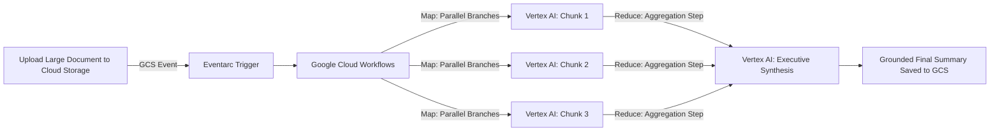

# Orchestrate Generative AI with Workflows

**Speaker(s):** Mete Atamel · **Channel:** Google Cloud Tech · **Date:** 2024-07-01
**Watch:** https://youtu.be/wi0nP6nxa0A?si=Tn3TpPQLy0wM5lcr · **Format:** Talk / Demo · **Level:** Intermediate
**Topics:** Backend/Infra, LLM Fundamentals

## TL;DR

A practical exploration of using **Google Cloud Workflows** to orchestrate resilient, event-driven generative AI pipelines. Learn why serverless workflows solve the fragility of custom API scripts, explore native Vertex AI model connectors, and examine a live event-driven map-reduce text summarization pipeline triggered by Cloud Storage uploads via Eventarc.

## Contents

- [Why orchestrate generative AI with Google Cloud Workflows](#why-orchestrate-generative-ai-with-google-cloud-workflows)
- [Calling Vertex AI foundation models from Workflows](#calling-vertex-ai-foundation-models-from-workflows)
- [Event-driven map-reduce summarization with Eventarc and Cloud Storage](#event-driven-map-reduce-summarization-with-eventarc-and-cloud-storage)
- [AI-assisted workflow authoring and future capabilities](#ai-assisted-workflow-authoring-and-future-capabilities)

---

## Why orchestrate generative AI with Google Cloud Workflows

Calling LLM endpoints directly from client applications introduces operational hazards: rate-limiting exceptions (HTTP 429), quota exhaustion, and unhandled network drops.

**Google Cloud Workflows** provides a serverless orchestration backbone:
- **Declarative YAML/JSON**: Defines multi-step execution flows clearly.
- **Built-in Resilience**: Automatic exponential backoff retries and error-catching blocks handle transient API hiccups without writing boilerplate logic.
- **State Persistence**: Workflows maintain execution state across long-running pauses and human-in-the-loop approvals.

---

## Calling Vertex AI foundation models from Workflows

Workflows provides native first-party connectors for Vertex AI:
- Authenticates securely via IAM service accounts without exposing API keys in code.
- Passes structured parameters (`temperature`, `maxOutputTokens`, `systemInstruction`) to Gemini and PaLM models.
- Parses response candidates and structured JSON output using built-in JSON expressions.

---

## Event-driven map-reduce summarization with Eventarc and Cloud Storage

Mete Atamel demos an automated document summarization pipeline:

- **Eventarc Trigger**: Automatically launches the workflow when a document is uploaded.
- **Parallel Map Phase**: Workflows parallelizes individual chapter summaries across Vertex AI inference endpoints concurrently.
- **Reduce Phase**: Aggregates chapter summaries into a final coherent executive summary.

---

## AI-assisted workflow authoring and future capabilities

The session previews AI-assisted orchestration authoring, showing how generative models can translate plain English business requirements into production-ready Google Cloud Workflows YAML templates.

---

## Source

Full cleaned transcript: `DATA/videos/orchestrate-genai-workflows-2024.json`
Raw transcript: `RAW/videos/orchestrate-genai-workflows-2024.md`
