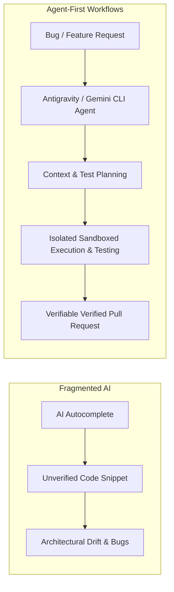

# Beyond the Hype: Orchestrating End-to-End Developer Workflows with Agents

**Speaker(s):** Ricky Robinett, Aaron Wanjala, Azim Shaik, Doug McKenzie · **Channel:** Google Cloud Tech · **Date:** 2026-06-25
**Watch:** https://youtu.be/t6jH_GPFqgs?si=MZIrswUN4IFH7vVR · **Format:** Keynote / Spotlight · **Level:** Intermediate
**Topics:** AI Agents, AI Coding Tools, Backend/Infra

## TL;DR

Cloud Next 2026 developer spotlight session addressing the DORA paradox: why individual AI code completion increases speed while unmanaged AI increases organizational instability. Demonstrates replacing isolated code assistants with unified agent-first developer workflows using **Antigravity** and **Gemini CLI** to automate full-lifecycle issue triage, refactoring, test execution, and CI/CD verification.

## Contents

- [The DORA paradox: individual productivity vs. organizational instability](#the-dora-paradox-individual-productivity-vs-organizational-instability)
- [Breaking down functional silos between product, design, and engineering](#breaking-down-functional-silos-between-product-design-and-engineering)
- [Live demo: end-to-end issue triage and remediation with Antigravity and Gemini CLI](#live-demo-end-to-end-issue-triage-and-remediation-with-antigravity-and-gemini-cli)
- [Enterprise governance, reproducible builds, and developer trust](#enterprise-governance-reproducible-builds-and-developer-trust)

---

## The DORA paradox: individual productivity vs. organizational instability

The latest **DORA (DevOps Research and Assessment)** report presents a striking contradiction:
- Over 80% of developers feel AI code assistance accelerates their individual coding velocity.
- At the organizational level, unstructured AI code generation often leads to delivery instability, architectural drift, and subtle security bugs.

**The Solution**: Transition from isolated snippet generation to **Agent-First Development**, where autonomous agents manage end-to-end task lifecycles with rigorous automated verification.

---

## Breaking down functional silos between product, design, and engineering

Agentic developer tooling dissolves traditional organizational handoff delays:
- **Product Managers**: Prototype functional features directly against live backend data schemas.
- **Designers**: Export production-ready frontends connected to real state without waiting for engineering sprints.
- **Engineers**: Orchestrate end-to-end infrastructure, security policies, and integrations through high-level intent.

---

## Live demo: end-to-end issue triage and remediation with Antigravity and Gemini CLI

The team executes a live demonstration resolving a production defect:
1. **Ingestion**: The agent ingests a crash report and parses runtime logs.
2. **Context Discovery**: Searches the codebase, traces dependencies, and creates a local reproduction test case.
3. **Refactoring**: Modifies multiple files across frontend and backend modules simultaneously.
4. **Verification**: Executes the test suite inside an isolated sandbox, verifies the fix, and opens a clean GitHub Pull Request with detailed explanations.

---

## Enterprise governance, reproducible builds, and developer trust

Scaling developer agents requires embedding enterprise guardrails:
- **Reproducible Sandboxes**: Isolates code modifications so failing tests cannot contaminate production branches.
- **Audit Trails**: Records full reasoning trajectories, tool invocations, and commit histories.
- **Human-in-the-Loop**: Developers retain final review authority, approving validated pull requests with full forensic transparency.

**Related:** [Intent-driven development with Google Cloud AI](./intent-driven-development-2026.md)

---

## Source

Full cleaned transcript: `DATA/videos/orchestrating-developer-workflows-2026.json`
Raw transcript: `RAW/videos/orchestrating-developer-workflows-2026.md`
