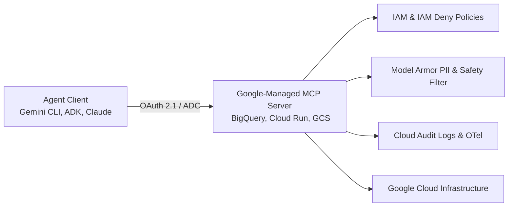
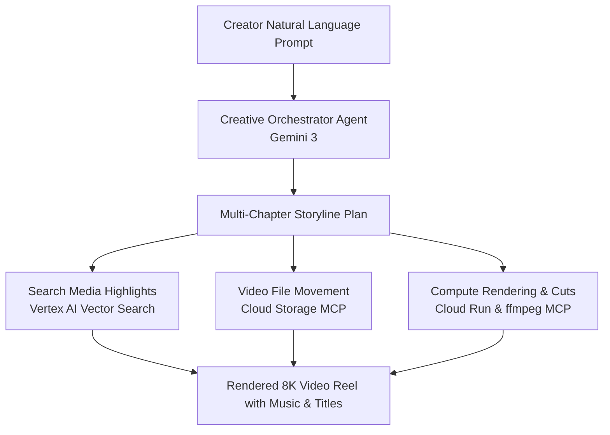

# Beyond the Prompt: Build Production-Ready Agents with Google's MCP Servers

**Speaker(s):** Vidya Nagarajan, Tarun Gumar, Keren He, Levi Chen · **Channel:** Google Cloud Tech · **Date:** 2026-06-25
**Watch:** https://youtu.be/df7ZdrBxlsE?si=tIl4FWKhUUTDo9hJ · **Format:** Talk · **Level:** Intermediate
**Topics:** AI Agents, Backend/Infra

## TL;DR

Google announced over 50 fully managed remote Model Context Protocol (MCP) servers across Google Cloud services (BigQuery, Cloud Run, GKE, Maps, Drive, Gmail). This session explores how managed remote MCP servers eliminate local stdio bottlenecks, integrate native enterprise governance (IAM allow/deny policies, VPCSC, Model Armor content scanning), and power high-scale creative agents like Insta360's Moments Pro video editing assistant.

## Contents

- [Connectivity as the bottleneck and the launch of Google-managed MCP servers](#connectivity-as-the-bottleneck-and-the-launch-of-google-managed-mcp-servers)
- [Demo: Gemini CLI extensions and BigQuery MCP server discovery](#demo-gemini-cli-extensions-and-bigquery-mcp-server-discovery)
- [Enterprise governance: IAM policies, IAM Deny, VPCSC, and Model Armor](#enterprise-governance-iam-policies-iam-deny-vpcsc-and-model-armor)
- [Insta360 case study: Moments Pro AI video editing agent](#insta360-case-study-moments-pro-ai-video-editing-agent)

---

## Connectivity as the bottleneck and the launch of Google-managed MCP servers

With industry projections estimating over 1 billion deployed agents globally by 2029, agent utility is fundamentally bottlenecked by enterprise connectivity:
- **Non-standardized integrations**: Manual custom API glue code built per application.
- **Fragmented security postures**: Brittle connections that break when underlying endpoints update.
- **Local MCP limits**: Running local stdio MCP servers on individual developer machines fails enterprise requirements for scalability, uptime, and compliance.

Google Cloud announced over 50 fully managed remote MCP servers. Every Google Cloud service is now MCP-enabled by default. When an API is turned on in a project, its managed MCP server can be immediately accessed by any compliant agent client (Gemini CLI, Claude, ChatGPT, Cursor, ADK, LangChain).

---

## Demo: Gemini CLI extensions and BigQuery MCP server discovery

Google-managed MCP servers are distributed as extensions for the Gemini CLI for zero-friction developer setup:
1. The developer inspects available MCP servers in the Agent Registry portal.
2. A single command (`gemini mcp install <url>`) registers the remote server endpoint.
3. The CLI utilizes local Application Default Credentials (ADC) for seamless OAuth 2.1 authentication.
4. When prompted to find top customers by lifetime value, Gemini CLI discovers the `list_datasets` and `get_table_info` tools, inspects column schemas dynamically, and constructs and executes valid SQL via `execute_sql`.

---

## Enterprise governance: IAM policies, IAM Deny, VPCSC, and Model Armor

Operating agents in enterprise environments requires multi-layered security controls:

- **Two-Layer Authorization**: Users and agents require both underlying API permissions (e.g., BigQuery data viewer) and the dedicated `mcp.toolUser` role.
- **Granular IAM Deny**: Security administrators can enforce organizational guardrails, such as blanket blocking of destructive mutation tools via the `is_read_only` conditional attribute or scoping access by OAuth client ID.
- **Model Armor Integration**: Automatically scans inputs and tool outputs. Switching from inspect-only to inspect-and-block automatically intercepts sensitive data (such as raw credit card numbers) and blocks prompt injection payloads before they reach the model.
- **Unified Observability**: Every tool call and underlying API event is logged to Cloud audit logs with OpenTelemetry (OTel) tracing.

---

## Insta360 case study: Moments Pro AI video editing agent

**Insta360** (the global leader in 360-degree imaging with over 6 million creators) built **Moments Pro**, an AI-powered conversational editing agent powered by Gemini 3:

By transitioning backend tools to Google-managed remote MCP servers, Insta360 decoupled application logic from infrastructure management, achieving zero-ops scaling for global video processing workflows.

**Related:** [Agent development and AgentOps with BigQuery, ADK, and MCP](./agentops-bigquery-adk-mcp-2026.md)

---

## Source

Full cleaned transcript: `DATA/videos/production-agents-mcp-servers-2026.json`
Raw transcript: `RAW/videos/production-agents-mcp-servers-2026.md`
