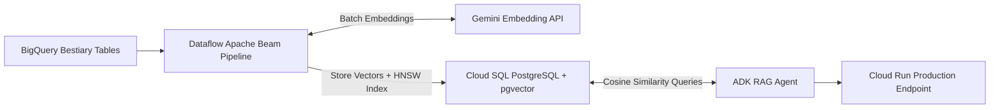

# How to Build a Production-Ready RAG AI Agent

**Speaker(s):** Ayo Adedeji, Annie Wang · **Channel:** Google Cloud Tech · **Date:** 2026-03-29
**Watch:** https://youtu.be/Ni1P8TITtE8?si=_GELuEACYOqyenjx · **Format:** Codelab / Tutorial · **Level:** Intermediate
**Topics:** AI Agents, Backend/Infra, LLM Fundamentals

## TL;DR

Episode 2 of the Hands On AI knowledge base series. Learn how to transition structured entity data into a fully deployed, production-grade **Retrieval Augmented Generation (RAG)** agent on Google Cloud. Covers provisioning Cloud SQL for PostgreSQL with pgvector, running containerized Apache Beam batch embedding pipelines on Dataflow, and serving the ADK retrieval agent on Cloud Run.

## Contents

- [Hands-on project overview: from structured data to RAG agent](#hands-on-project-overview-from-structured-data-to-rag-agent)
- [Configuring Cloud SQL with pgvector for semantic search](#configuring-cloud-sql-with-pgvector-for-semantic-search)
- [Batch embedding generation with Apache Beam and Dataflow](#batch-embedding-generation-with-apache-beam-and-dataflow)
- [ADK RAG agent integration and Cloud Run deployment](#adk-rag-agent-integration-and-cloud-run-deployment)

---

## Hands-on project overview: from structured data to RAG agent

Building on Episode 1 (where raw text files were normalized into BigQuery tables using SQL ML functions), this lab constructs the vector retrieval backend:



---

## Configuring Cloud SQL with pgvector for semantic search

Cloud SQL provides managed PostgreSQL with native vector similarity search:
- **pgvector Extension**: Enables storing 768-dimensional text embeddings in relational tables alongside metadata columns.
- **HNSW Indexing**: Creates a **Hierarchical Navigable Small World (HNSW)** vector index with cosine distance operators (`<=>`), providing sub-millisecond approximate nearest neighbor (ANN) retrieval under concurrent load.

```sql
CREATE EXTENSION IF NOT EXISTS vector;

CREATE TABLE monster_embeddings (
    id SERIAL PRIMARY KEY,
    monster_name TEXT,
    description TEXT,
    embedding vector(768)
);

CREATE INDEX ON monster_embeddings USING hnsw (embedding vector_cosine_ops);
```

---

## Batch embedding generation with Apache Beam and Dataflow

To process thousands of entity records without hitting API rate limits or writing custom batch workers:
- **Apache Beam Pipeline**: Deployed onto **Google Cloud Dataflow**.
- **Batched Invocations**: Reads records from BigQuery, groups text into parallel batches, calls the Gemini text embedding model, and streams vector records into Cloud SQL.

---

## ADK RAG agent integration and Cloud Run deployment

The **Agent Development Kit (ADK)** wraps semantic search into an autonomous reasoning agent:
- Declares a `search_bestiary(query)` tool executing parameterized SQL similarity lookups against pgvector.
- Gemini 2.5 Flash synthesizes retrieved chunks into grounded answers with verified source references.
- Containerized and deployed to **Google Cloud Run** with IAM-governed Cloud SQL connection proxies.

**Related:** [Build an AI Agent knowledge base using SQL](./agent-knowledge-base-bigquery-2026.md)

---

## Source

Full cleaned transcript: `DATA/videos/production-ready-rag-agent-2026.json`
Raw transcript: `RAW/videos/production-ready-rag-agent-2026.md`
