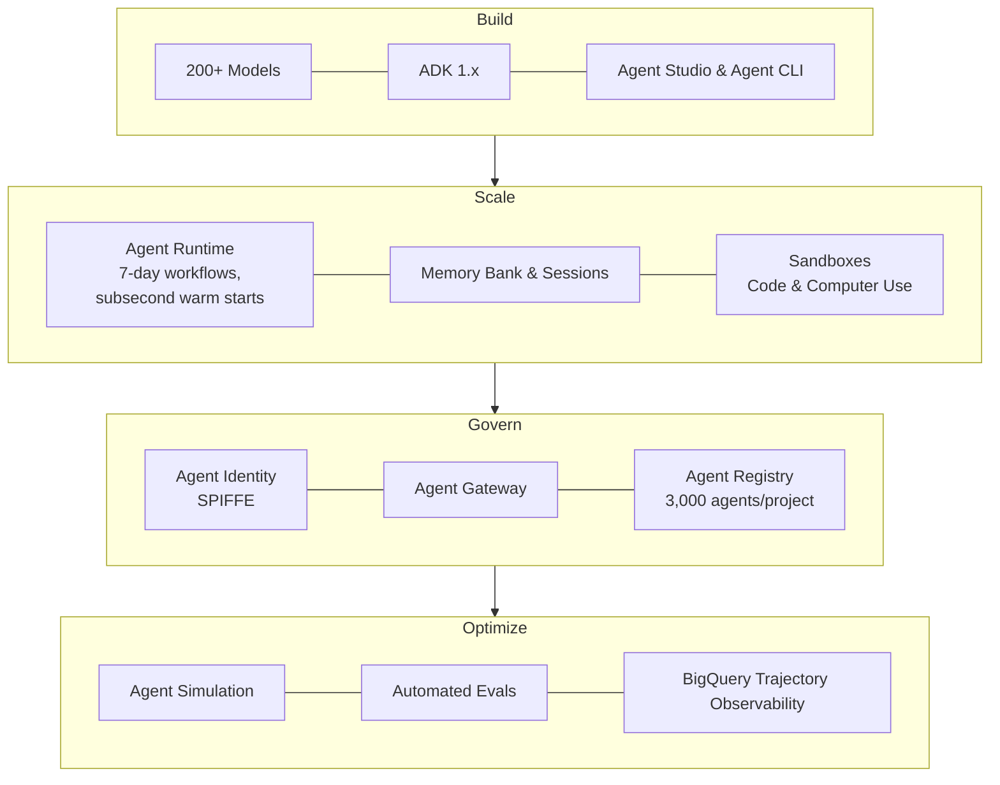

# Scale AI Agents in Production

**Speaker(s):** Ryan Ismert, Elia Secchi, Praveen Dhas, Tejal Pandit · **Channel:** Google Cloud Tech · **Date:** 2026-06-25
**Watch:** https://youtu.be/LHcjN11nNPU?si=uQ4EMOZchxCusM6- · **Format:** Talk · **Level:** Intermediate
**Topics:** AI Agents, Backend/Infra

## TL;DR

Moving from prototype to production requires a modular, enterprise-grade foundation. This session outlines Google's Gemini Enterprise Agent Platform across four key pillars (Build, Scale, Govern, Optimize). Features the new Agent CLI with automated eval-and-fix loops, upgrades to Agent Runtime and Sandboxes, and in-depth production case studies from Comcast (Xfinity Assistant 2.0) and Palo Alto Networks (autonomous network diagnostics).

## Contents

- [Gemini Enterprise Agent Platform: the four pillars](#gemini-enterprise-agent-platform-the-four-pillars)
- [Demo: Agent CLI lifecycle and automated evaluation loop](#demo-agent-cli-lifecycle-and-automated-evaluation-loop)
- [Comcast case study: Xfinity Assistant 2.0 and decoupled session management](#comcast-case-study-xfinity-assistant-20-and-decoupled-session-management)
- [Palo Alto Networks case study: autonomous network reasoning ecosystem](#palo-alto-networks-case-study-autonomous-network-reasoning-ecosystem)

---

## Gemini Enterprise Agent Platform: the four pillars

The Gemini Enterprise Agent Platform consolidates Google's agent services into a unified architecture:

---

## Demo: Agent CLI lifecycle and automated evaluation loop

The open-source **Agent CLI** integrates ADK knowledge directly into developer workflows across tools like Antigravity IDE, Gemini CLI, Cursor, and Claude Code:

1. **Scaffolding**: The CLI asks targeted design questions (purpose, constraints, safety boundaries) and scaffolds an ADK project structure.
2. **Synthetic Data & Evals**: Generates a test suite with synthetic user journeys and executes automated evaluation passes.
3. **Self-Correcting Iteration**: When an eval fails, the coding agent inspects the failure trace, adjusts the ADK code or tool parameters, and reruns tests until 100% pass criteria are achieved.
4. **Instant Deployment**: Deploys to Agent Runtime in minutes and monitors production telemetry via BigQuery views.

---

## Comcast case study: Xfinity Assistant 2.0 and decoupled session management

Comcast operates the **Xfinity Assistant (XA)** across broad consumer hardware and digital apps. In upgrading to generative agent architectures (XA 2.0):

- **The Problem**: In default architectures, active conversation sessions were bound in-memory to specific agent containers. Rolling code deployments dropped customer sessions mid-conversation during troubleshooting or payments.
- **The Solution**: Comcast and Google Cloud engineered a decoupled session management layer. Sessions persist independently in a shared session service across steering, repair, and appointment scheduling agents.
- **Operational Results**: Seamless live technician scheduling directly within chat and over 50% of customer interactions resolved autonomously without session loss during continuous deployments.

---

## Palo Alto Networks case study: autonomous network reasoning ecosystem

Palo Alto Networks engineered an autonomous multi-agent diagnostic platform to replace static, ticket-heavy customer support:

- **Multimodal Root Agent**: Ingests unstructured customer queries and physical hardware photos (e.g., blinking server rack LEDs) while enforcing strict guardrails and human off-ramps.
- **Specialized RCA Agent**: Performs automated root-cause analysis by executing a dynamic investigation **Directed Acyclic Graph (DAG)** up to three iterative cycles across Bigtable logs, metric streams, and network configs.
- **Performance Benchmarks**:
  - Sub-100 second end-to-end autonomous resolution.
  - 2-5 second streaming thought latency.
  - 24% full autonomous case resolution rate without human engineer intervention.

**Related:** [Agent context engineering for production](./agent-context-engineering-2026.md)

---

## Source

Full cleaned transcript: `DATA/videos/scale-ai-agents-production-2026.json`
Raw transcript: `RAW/videos/scale-ai-agents-production-2026.md`
