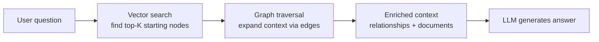

# Boost AI Context with Hybrid Search in Spanner

**Speaker(s):** Jeff Sosa, Girish Baliga, Alexander Christie · **Channel:** Google Cloud Tech · **Date:** 2026-06-25
**Watch:** https://youtu.be/fAf4Zh-CC08?si=07lUFU9TF3J7DWxN · **Format:** Talk · **Level:** Intermediate
**Topics:** Backend/Infra, AI Agents, LLM Fundamentals

## TL;DR

A Cloud Next deep dive into **Spanner Search**, Google's unified search layer built into Cloud Spanner. Covers full-text search with intelligent query expansion, vector search with ScaNN, and hybrid search templates that combine both. Includes the **Atteo** case study (migrating from Algolia to Spanner, saving $165K and eliminating ETL lag) and a technical walkthrough from Girish Baliga on how full-text, vector, and graph search work together in SQL.

## Contents

- [Spanner as the underlying search platform for Google products](#spanner-as-the-underlying-search-platform-for-google-products)
- [Three search modalities: full-text, vector, and hybrid](#three-search-modalities-full-text-vector-and-hybrid)
- [Full-text search: n-grams, fuzzy search, and intelligent query expansion](#full-text-search-n-grams-fuzzy-search-and-intelligent-query-expansion)
- [Vector search in Spanner: KNN, ScaNN, and transactional consistency](#vector-search-in-spanner-knn-scann-and-transactional-consistency)
- [Hybrid search templates: vector-ranked full-text and multi-retriever fusion](#hybrid-search-templates-vector-ranked-full-text-and-multi-retriever-fusion)
- [Graph and GraphRAG in Spanner](#graph-and-graphrag-in-spanner)
- [Atteo case study: from Algolia to Spanner](#atteo-case-study-from-algolia-to-spanner-for-full-text-and-vector-search)
- [Spanner Omni and audience questions](#spanner-omni-and-audience-questions)

---

## Spanner as the underlying search platform for Google products

**Cloud Spanner** is the data platform underpinning most Google consumer products. The search capability embedded in Spanner (Spanner Search) powers in-product search for:
- Google Drive (document content search)
- Gmail (email search)
- YouTube (video search)
- Google Photos (photo search)

Additionally, Uber uses Spanner Search for their production search workloads. When the session opened with a show-of-hands for "did you search Gmail or Drive in the last hour?" and most hands went up, the point was made: attendees were already using Spanner Search.

Spanner platform advantages for search workloads:
- **Zero maintenance**: No separate search cluster to provision, update, or monitor.
- **Near-limitless scalability**: Tested at 100 billion-plus row indexes.
- **Five-nines SLA**: Industry-best availability, shared with the underlying transactional database.
- **Multi-model**: Relational, search, and graph workloads on the same data with no copies.

---

## Three search modalities: full-text, vector, and hybrid

Spanner Search combines three modalities into a single SQL query engine:

| Modality | How it works | Best for |
|---|---|---|
| **Full-text search** | Inverted index over tokenized text; fuzzy matching via n-grams | Keyword queries, name searches, document searches |
| **Vector search** | Embedding-based similarity matching (KNN or ANN via ScaNN) | Semantic queries, intent understanding, cross-lingual search |
| **Hybrid search** | Combines both retrievers, merges results via RRF or vector reranking | Best of both: precision from keywords, recall from semantics |

Before Spanner Search, implementing all three required running separate systems: a relational database, a full-text search engine (Elasticsearch, Algolia, Solr), and a vector store, with ETL pipelines between them. Spanner collapses this into one system with zero ETL.

---

## Full-text search: n-grams, fuzzy search, and intelligent query expansion

Spanner full-text search is defined entirely in SQL DDL. No separate configuration file or external indexing pipeline is needed.

**N-gram tokenization** enables fuzzy matching:

```sql
ALTER TABLE customers ADD COLUMN name_tokens TOKENLIST
  AS (TOKENIZE_NGRAMS(name, ngram_size => 3));

CREATE SEARCH INDEX customer_name_idx ON customers(name_tokens);

-- Query: finds "Jeffrey", "Jeff", misspellings
SELECT name FROM customers
WHERE SEARCH(name_tokens, 'Jeffrey')
ORDER BY SCORE_NGRAMS(name_tokens, 'Jennifer') DESC;
```

N-grams split text into 3-character substrings ("Jef", "eff", "ffr", ...) and index each. A query for "Jennifer" will match "Jennifer," "Jenifer" (misspelling), and "Jenny" as a lower-scored alternative.

Additional features:
- **Auto language detection**: The system automatically detects both query language and document language, enabling multilingual search without configuration.
- **Synonym substitution**: Query terms are expanded to known synonyms.
- **Enhanced query (intelligent expansion)**: Google's proprietary technology from Google Search. A query for "hair dye" is automatically rewritten to include "color," "coloring," "dyeing," and other semantically related terms before hitting the index. This is the same expansion system used in Google.com search.

**Custom dictionaries** (newly GA): domain-specific synonym and expansion mappings can be plugged into Spanner Search for specialized verticals (for example, retail-specific product synonyms that Google's general expansion does not know).

**Further reading:** [Spanner full-text search documentation](https://cloud.google.com/spanner/docs/full-text-search)

---

## Vector search in Spanner: KNN, ScaNN, and transactional consistency

Spanner supports two vector search modes:

**KNN (K-Nearest Neighbors)**: Exact search. Computes embedding distance from the query against every document. Accurate, but O(N) cost. Best for:
- Small corpora (thousands of documents).
- Highly filtered queries (for example, Gmail searching only within one user's mail, a small result set).

**ANN (Approximate Nearest Neighbors)** via **ScaNN index**: Builds a tree structure by clustering all vectors. At query time, traverses only relevant clusters, trading a small amount of recall for dramatically better performance. Best for:
- Large corpora (millions to billions of documents).
- Vector search as the primary retrieval mechanism.

```sql
CREATE VECTOR INDEX product_vec_idx ON products(embedding)
  OPTIONS (distance_type = 'COSINE', num_leaves = 1000);

SELECT product_id, title
FROM products
WHERE APPROX_DISTANCE(embedding, QUERY_EMBEDDING, 'COSINE') < 0.3
ORDER BY APPROX_DISTANCE(embedding, QUERY_EMBEDDING, 'COSINE')
LIMIT 20;
```

**ScaNN** (Scalable Approximate Nearest Neighbors) is Google's proprietary clustering-based ANN algorithm, the same index used in Google Search and YouTube. Supports 10 billion-plus vectors in production. Tested and validated at this scale in Spanner.

Key property: the ANN index in Spanner is **transactionally consistent**. When a row is written or updated, the vector index is updated immediately within the same transaction. No sync delay, no eventual consistency lag. This makes Spanner vector search safe for agentic workloads that write and then immediately read.

Spanner also provides direct integration with Vertex AI and Gemini Enterprise to auto-generate embeddings: define the embedding source in DDL and Spanner calls the model to generate and maintain embeddings automatically.

**Vector latency improvements** were announced: significant latency reductions since six months prior; index build times also reduced (small indexes build in minutes).

**Further reading:** [ScaNN paper (Google Research)](https://research.google/pubs/pub48665/)

---

## Hybrid search templates: vector-ranked full-text and multi-retriever fusion

**Pattern 1: Vector-ranked full-text search**

Use full-text matching as the retriever and vector similarity as the ranking signal:

```sql
SELECT product_id, title
FROM products
WHERE SEARCH(tokens, 'space lego 8 plus')  -- full-text retriever
ORDER BY APPROX_DISTANCE(embedding, QUERY_EMBEDDING, 'EUCLIDEAN')  -- vector ranker
LIMIT 10;
```

This retrieves products matching the keyword query, then re-ranks them by semantic relevance. In a traditional architecture, this requires coordination between a full-text engine and a vector store. In Spanner, it is a single WHERE clause and ORDER BY.

**Pattern 2: Multi-retriever fusion with Reciprocal Rank Fusion (RRF)**

Two parallel retrievers whose results are merged:

```sql
WITH text_results AS (
  SELECT product_id, RANK() OVER (ORDER BY SCORE(tokens, 'space lego') DESC) AS text_rank
  FROM products WHERE SEARCH(tokens, 'space lego')
),
vector_results AS (
  SELECT product_id, RANK() OVER (ORDER BY APPROX_DISTANCE(embedding, QUERY_EMB, 'COSINE')) AS vec_rank
  FROM products ORDER BY APPROX_DISTANCE LIMIT 100
)
SELECT product_id,
  1.0/(60 + text_rank) + 1.0/(60 + vec_rank) AS rrf_score
FROM text_results FULL JOIN vector_results USING (product_id)
ORDER BY rrf_score DESC LIMIT 20;
```

**Reciprocal Rank Fusion (RRF)** is a standard information retrieval technique for combining ranked lists. The formula `1/(k + rank)` (where k=60 is a common default) gives higher combined scores to documents that appear near the top of multiple ranked lists. RRF is robust to score scale differences between different retrieval systems.

Alternatives: relative score normalization, ML model-based reranking.

---

## Graph and GraphRAG in Spanner

Spanner Graph is defined as a **virtual overlay** on the existing relational schema. No data migration or graph-specific storage is needed:

```sql
CREATE PROPERTY GRAPH product_graph
  NODE TABLES (products)
  EDGE TABLES (product_relations
    SOURCE KEY (product_id) REFERENCES products(id)
    DESTINATION KEY (related_id) REFERENCES products(id));
```

**GraphRAG** (Graph-augmented Retrieval-Augmented Generation) workflow:



Why GraphRAG outperforms standard RAG:

| Standard RAG | GraphRAG |
|---|---|
| Relationships encoded implicitly in embedding space | Relationships encoded explicitly as graph edges |
| Multi-hop reasoning requires embedding model to capture transitive relationships | Multi-hop traversal follows explicit edges deterministically |
| Adding new relationships requires re-embedding all documents | Adding new relationships adds an edge record; no re-indexing needed |

In practice with production customers, GraphRAG shows significantly improved precision and recall compared to standard vector RAG, particularly for questions requiring multi-hop reasoning (for example, "what regulations apply to this product's distribution in Germany?").

**Related:** [Power intelligent agents with AI-native databases](./ai-native-databases-agents-2026.md)

---

## Atteo case study: from Algolia to Spanner for full-text and vector search

**Atteo** is an AI-native CRM platform serving fast-growing tech companies including mModal, Granola, Railway, and several AI labs.

Timeline:
- **2021**: Large foundational AI lab customer signed up with data volumes that caused Postgres query planner failure. Migrated relational workloads to Spanner.
- **2022**: Migrated most relational workloads to Spanner. Still running full-text search on Algolia (off-platform ETL pipeline).
- **2024**: Migrated full-text search from Algolia to Spanner full-text search. Added vector embeddings to Spanner (replacing a separate vector store).
- **2026**: Running a unified Spanner stack for all modalities.

**Algolia ETL problem**: Algolia is a push-based search service. Data is sent to Algolia and indexed asynchronously. For large customers with high write throughput, materialization delays caused search results to return stale data, creating a poor user experience and debugging headaches.

**Results after migration to Spanner**:

| Metric | Value |
|---|---|
| Cost savings FY26 | $165,000 |
| Projected Algolia renewal cost FY27 | $500,000+ |
| Documents indexed | 350 million (growing 20%+ per month) |
| Reads per second (ask atteo agent) | 50,000 |
| Total documents (vector store) | 1 billion |

**Read-after-write consistency**: When an agent or API call writes a record, the search index is immediately up to date. If an agent modifies a customer record and then immediately queries for it, the updated record appears in the results. This is not possible with an ETL-based external search system.

**Ask Atteo**: Atteo's agentic chat interface combines Boolean search, full-text search, vector search, and raw SQL on a single Spanner backend. Built using Gemini embedding models and Spanner's ScaNN index.

**Query hints for deterministic query planning**: Spanner's query optimizer defaults work well for many workloads, but Atteo's multi-tenant architecture (thousands to hundreds of thousands of tenants) creates scenarios where the optimizer makes suboptimal decisions. Spanner allows explicit query hints to force join order, join methods, and parallelism, giving Atteo deterministic tail latency control that would not be possible with a fully automated query optimizer.

---

## Spanner Omni and audience questions

**Spanner Omni** is the self-managed, portable version of Spanner (runs on-premises, any Cloud, or a local laptop). All search features demonstrated in this session (full-text, vector, hybrid, graph) are available in Spanner Omni.

Exception: **enhanced query expansion** (Google's intelligent query rewriting) requires access to Google's internal keyword expansion service. This specific feature may not work in Spanner Omni running outside Google Cloud.

Audience question on HNSW (Hierarchical Navigable Small World) index:
- Spanner currently uses ScaNN (clustering-based ANN) as its primary ANN index.
- HNSW is under exploration, but no announcement was made.

**Further reading:** [Spanner Omni documentation](https://cloud.google.com/spanner/docs/omni/overview)

---

## Source

Full cleaned transcript: `DATA/videos/spanner-hybrid-search-context-2026.json`
Raw transcript: `RAW/videos/spanner-hybrid-search-context-2026.md`
