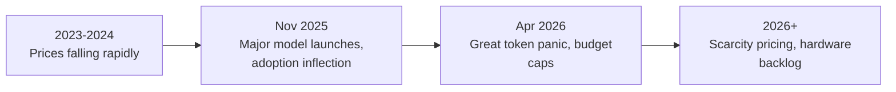

# From Tokenmaxxing to Tokenomics for Your AI Agents

**Speaker(s):** J.R. Storment, Luke Schlangen · **Channel:** Google Cloud Tech · **Date:** 2026-08-03
**Watch:** https://youtu.be/6LQNHQ7-IcI?si=DRo7Z1210viBghp6 · **Format:** Fireside Chat · **Level:** Intermediate
**Topics:** AI Agents, Backend/Infra, Product/Startup

## TL;DR

A deep dive into the emerging discipline of **tokenomics**: the economics of AI token production, consumption, and monetization. J.R. Storment, head of the newly formed Tokenomics Foundation under the Linux Foundation, traces how the AI industry moved from unlimited token budgets ("tokenmaxxing") to a hard-cap era ("the great token panic") and what companies must do to survive the shift.

## Contents

- [The era of tokenmaxxing and why it ended](#the-era-of-tokenmaxxing-and-why-it-ended)
- [Global token growth: trillions to quadrillions](#global-token-growth-trillions-to-quadrillions)
- [What a token actually is: four functions](#what-a-token-actually-is-four-functions)
- [AI spend is broader than tokens: KV cache and hidden costs](#ai-spend-is-broader-than-tokens-kv-cache-and-hidden-costs)
- [AI scarcity is ending the era of subsidized tokens](#ai-scarcity-is-ending-the-era-of-subsidized-tokens)
- [Defining tokenomics: energy to intelligence to value](#defining-tokenomics-energy-to-intelligence-to-value)
- [Pinterest five-layer cake and Adobe Big T framework](#pinterest-five-layer-cake-and-adobe-big-t-framework)
- [Tokenomics vs. FinOps: a new discipline, not a rebrand](#tokenomics-vs-finops-a-new-discipline-not-a-rebrand)

---

## The era of tokenmaxxing and why it ended

**Tokenmaxxing** is J.R. Storment's term for the 2023-2025 period when AI spending had no ceiling. Fortune 50 CIOs declared unlimited token budgets. Developer leaderboards rewarded the highest token consumers. The underlying assumption: token prices would fall forever and AI ROI would eventually materialize to justify any spend.

The turning point was a cluster of major model launches from all frontier providers in November 2025. These launches represented a step-change in coding quality: Linus Torvalds, who had publicly dismissed AI coding in November, returned after the holidays and launched his first AI-assisted coding project. The signal: if AI coding had crossed the Linus threshold, enterprise adoption was about to go vertical.

By April 2026, the "**great token panic**" had arrived. Token spend was growing faster than budgets. Finance teams began installing hard caps. AI build decisions shifted from "what can we build?" to "what can we afford to build?"

---

## Global token growth: trillions to quadrillions

Open Router data shows global token consumption went from linear to nonlinear growth after November 2025. Goldman Sachs projects:

| Timeframe | Estimated global tokens/day |
|---|---|
| Today (mid-2026) | ~6 quadrillion |
| In 3.5 years | ~120 quadrillion |
| Trajectory | Approaching quintillion scale |

Two primary causes of nonlinear growth:

1. **Context windows exploding**: From tens of thousands of tokens per conversation to 1 million-plus. A single conversation can now cost more than an entire day of usage under the old paradigm.
2. **Agentic loops**: Agents retry on failure, spawn subagents, run overnight without user intervention. Each retry is a token cost. Each subagent call multiplies the base cost.

---

## What a token actually is: four functions

J.R. Storment argues that most practitioners conflate the four distinct roles a token plays:

| Function | Description |
|---|---|
| Unit of output | The discrete output of a data center: text, image, or video segment generated by an inference call. |
| Unit of cognition | The atomic unit by which models build concepts. Each token the model generates is a reasoning step. |
| Unit of pricing | Cost per million tokens is the standard rate card. All frontier model pricing is expressed this way. |
| Unit of monetization | The layer at which neo-clouds, frontier model providers (Anthropic, OpenAI, Google), and SaaS wrappers all earn revenue. |

> [!IMPORTANT]
> Unlike a barrel of oil, a token is not a fixed-size unit. One token varies in size across models and providers. The same input text can be 100 tokens in one model and 150 in another. This makes cross-model cost comparisons tricky.

---

## AI spend is broader than tokens: KV cache and hidden costs

A common financial error: equating AI cost with token cost. J.R. Storment maps the full cost landscape:

- **KV (key-value) cache**: Most inference providers use caching to avoid recomputing attention over repeated prompt prefixes. Cached tokens cost less. However, some model-routing or prompt-restructuring decisions can invalidate the cache, multiplying cost unexpectedly. When J.R. surveyed a room of FinOps leaders, only 10% knew what KV cache was.
- **Vector database and storage**: Embedding storage and retrieval costs for RAG workflows.
- **Orchestration harnesses**: The compute to run agent loops, tool routing, and retry logic.
- **Evaluations and monitoring**: Running LLM-as-a-judge evaluations, tracing, and observability tooling.
- **Governance**: Audit logging, access control, compliance tooling.
- **Senior engineering time**: Often underaccepted as an AI cost. Architecting, debugging, and optimizing agent systems is expensive human labor.

**Further reading:** [FinOps Foundation AI & FinOps Special Interest Group](https://www.finops.org)

---

## AI scarcity is ending the era of subsidized tokens

Token prices fell dramatically through 2024 (primarily due to competitive pressure between frontier model providers) but plateaued or increased after November 2025. Key data points:

- Latest frontier models from all providers launch at the same price point as or higher than their predecessors.
- Neo-clouds are requiring 3-5 year customer commitments.
- Large public clouds report trillions of dollars in AI infrastructure backlog they cannot service.
- Intel's CEO stated hardware relief is not expected until 2028.
- Reports surfaced that $200/month subscription plans were costing frontier providers tens of thousands of dollars per user at the inference layer.

The implication: the era of below-cost subsidized tokens is ending. Organizations that built workflows assuming prices would continue to fall need to replan.

---

## Defining tokenomics: energy to intelligence to value

J.R. Storment's definition: **tokenomics** is an emerging discipline of converting energy and capital into tokens, consuming those tokens efficiently to enable intelligence, and ultimately driving value.

The shorthand: **energy to intelligence to value**.

This splits into three operational pillars:

| Pillar | What it covers |
|---|---|
| **Production** | Data centers, edge devices (Mac Minis, phones), and procured tokens from frontier providers. Who produces the tokens and at what capacity? |
| **Consumption** | Programmatic model routing, caching, prompt architecture, workload-to-model matching. How efficiently are tokens being used? |
| **Value** | Monetization models (seat-based vs. usage-based), hybrid credit systems, connecting token spend to business outcomes. Are the tokens driving revenue? |

---

## Pinterest five-layer cake and Adobe Big T framework

Two industry-contributed frameworks illustrate how companies think about tokenomics consumption:

**Pinterest five-layer cake** (presented at the FinOps Foundation conference): Pinterest's principal engineer described five layers of decision-making for any AI workload:
1. Silicon generation at the Cloud provider.
2. Whether the provider has power and capacity for the workload.
3. Inference stack choices (quantization, model routing).
4. Governance controls.
5. Other configuration factors.

**Adobe Big T framework** (donated to the Linux Foundation): A riff on Big-O notation in computer science. Big T maps how to forecast token needs for a given workload and which levers to pull:
- Model routing (which model size handles this task adequately).
- Prompt architecture (how to structure prompts to minimize token waste).
- Caching (how much of the prompt can be cached).
- Workload-to-model matching (don't use Opus for tasks that Flash can handle).
- Abstraction layer management (how much overhead the orchestration framework adds).

> [!TIP]
> The Big T framework is available via the Linux Foundation and FinOps Foundation. It provides a standardized vocabulary for engineering and finance teams to discuss AI cost trade-offs without talking past each other.

**Related:** [Agent development and AgentOps with BigQuery, ADK, and MCP](./agentops-bigquery-adk-mcp-2026.md)

---

## Tokenomics vs. FinOps: a new discipline, not a rebrand

**FinOps** (Financial Operations for Cloud) assumes Cloud resources already exist and focuses on maximizing value from provisioned instances, databases, and existing services. Its tools optimize spend on compute that has already been procured.

**Tokenomics** extends further upstream to the creation of tokens themselves: the electrical power flowing into data centers, the hardware buildout decisions, and the production capacity choices that determine whether token factories can meet demand. Jensen Huang stated at GTC in March 2026 that every CEO needs to think about "token factory effectiveness."

The Tokenomics Foundation (under the Linux Foundation, the same umbrella as CNCF and Kubernetes) was formed to create open standards for measuring and managing this supply chain, similar to how FinOps Foundation created standards for cloud cost management.

| Domain | Focus | Analogy |
|---|---|---|
| FinOps | Optimize spend on existing Cloud resources | Fuel efficiency in a car you already own |
| Tokenomics | Manage the full supply chain from energy to value | Oil production, refining, and distribution economics |

---

## Source

Full cleaned transcript: `DATA/videos/tokenomics-for-ai-agents-2026.json`
Raw transcript: `RAW/videos/tokenomics-for-ai-agents-2026.md`
