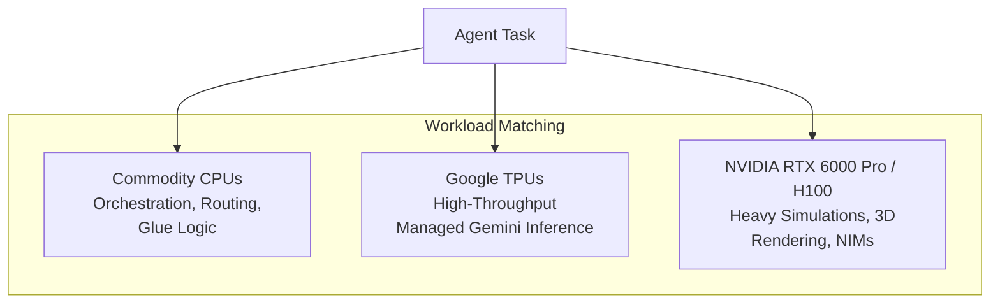
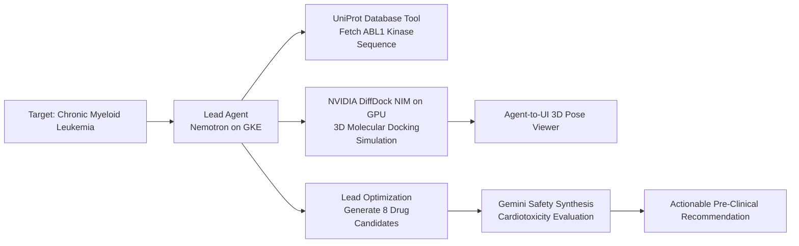

# AI Agent Infrastructure Decoded

**Speaker(s):** Chelsie Czop, Schneider Larbi · **Channel:** Google Cloud · **Date:** 2026-07-24
**Watch:** https://youtu.be/TZTDqtSpzv8?si=Frm_R3P_ezMyW0mw · **Format:** Fireside Chat / Demo · **Level:** Intermediate
**Topics:** AI Agents, Backend/Infra, LLM Fundamentals

## TL;DR

A technical exploration of the underlying compute, networking, and platform architecture required to deploy enterprise AI agents. Covers test-time thinking compute, matching workloads to CPUs, TPUs, and NVIDIA GPUs, comparing four Google Cloud deployment paths (Cloud Run, GKE Agent Sandbox, Agent Runtime, GKE), and showcases a live multi-agent drug discovery pipeline (Bio-Forge) on GKE.

## Contents

- [What defines an AI agent and why enterprise adoption converged](#what-defines-an-ai-agent-and-why-enterprise-adoption-converged)
- [Inference evolution: thinking compute and matching hardware to agent tasks](#inference-evolution-thinking-compute-and-matching-hardware-to-agent-tasks)
- [Four Google Cloud deployment patterns for AI agents](#four-google-cloud-deployment-patterns-for-ai-agents)
- [Enterprise security ground-up and decision framework](#enterprise-security-ground-up-and-decision-framework)
- [Demo: Bio-Forge multi-agent drug discovery on GKE and Gemini Enterprise](#demo-bio-forge-multi-agent-drug-discovery-on-gke-and-gemini-enterprise)

---

## What defines an AI agent and why enterprise adoption converged

While traditional chatbots execute stateless, one-shot prompt completions, an **AI agent** is an autonomous system that takes a high-level goal, formulates a multi-step plan, executes tools, observes environment feedback, and iterates until the objective is accomplished.

Enterprise adoption converged around three pillars:
1. **Reasoning Frontier**: Models capable of reliable multi-step planning and tool calling.
2. **Open Protocols**: **Model Context Protocol (MCP)** for standardized tool and data integration; **Agent2Agent (A2A)** for inter-agent communication.
3. **Platform Maturity**: Managed frameworks like the Agent Development Kit (ADK) and Gemini Enterprise Agent Platform providing scalable runtime environments.

---

## Inference evolution: thinking compute and matching hardware to agent tasks

The industry has moved beyond merely increasing pre-training model size toward allocating compute during inference (**test-time compute** or thinking budgets). Models like Gemini 3 generate Python code, execute it in sandboxes, analyze runtime errors, and iterate to deliver verified outputs.

---

## Four Google Cloud deployment patterns for AI agents

Google Cloud provides four distinct runtime options across the flexibility spectrum:

| Pattern | Best For | Key Properties |
|---|---|---|
| **Cloud Run** | Serverless speed | Scales to zero, handles spiky traffic, fast ADK and A2A API hosting |
| **GKE Agent Sandbox** | Secure code execution | Uses gVisor kernel isolation to execute untrusted agent-generated code |
| **Agent Runtime** | Enterprise governance | Managed sessions, persistent Memory Bank, IAM, and built-in tracing |
| **Raw GKE** | Maximum control | Custom GPU node pools, self-hosted NIMs, and complex multi-container topologies |

---

## Enterprise security ground-up and decision framework

Enterprise agent deployments require end-to-end security:
- **Compute Layer**: Confidential GPUs protecting memory in use.
- **Network Layer**: VPC Service Controls (VPCSC) establishing perimeters around data services.
- **Application Layer**: SPIFFE-based Agent Identity, Model Armor prompt-injection filtering, and Cloud audit logs.

**Architectural Decision Framework**:
- Knowledge Gap -> Use **RAG** (Vertex AI Search)
- Behavior / Format Gap -> Use **Fine-Tuning** (SFT / LoRA)
- Capability Gap -> Use **Model-as-a-Service** (Gemini 3)
- Strict Data Residency / Unit Economics -> Use **Self-Hosted GPU Endpoints**

---

## Demo: Bio-Forge multi-agent drug discovery on GKE and Gemini Enterprise

The **Bio-Forge** multi-agent system accelerates leukemia drug discovery:

By leveraging GKE GPU clusters for compute-heavy DiffDock docking and Gemini Enterprise for reasoning, the platform synthesizes complex molecular workflows that previously took weeks of manual research into minutes.

**Related:** [Build a multi-agent system: A2A and Agent Registry](../google-cloud-tech/multi-agent-a2a-agent-registry-2026.md)

---

## Source

Full cleaned transcript: `DATA/videos/ai-agent-infrastructure-decoded-2026.json`
Raw transcript: `RAW/videos/ai-agent-infrastructure-decoded-2026.md`
