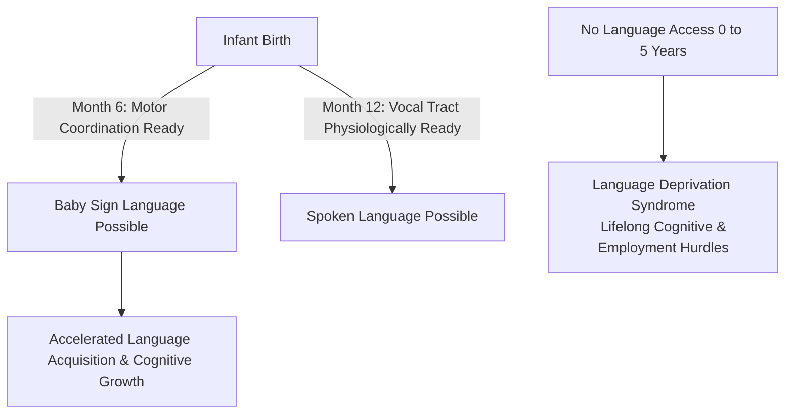

# How AI Is Revolutionizing Sign Language Recognition with Sam Sepah and Thad Starner

**Speaker(s):** Ashley Oldacre, Sam Sepah, Thad Starner · **Channel:** Google for Developers · **Date:** 2025-07-23
**Watch:** https://youtu.be/1NJX4sP6ubc?si=JQKH2QN0g-TEe9cZ · **Format:** Interview / Podcast · **Level:** Beginner
**Topics:** Machine Learning, Product/Startup

## TL;DR

An inspiring conversation on the People of AI podcast featuring Google AI/ML Research Manager Sam Sepah and wearable computing pioneer Professor Thad Starner. Explores the thirty-year evolution of wearable AI and computer vision for American Sign Language (ASL), examines the critical human impact of Language Deprivation Syndrome in deaf children, and highlights PopSign AI, an educational game empowering hearing parents to learn sign language.

## Contents

- [Pioneering wearable computing and early augmented reality](#pioneering-wearable-computing-and-early-augmented-reality)
- [Evolution of Google Glass and accessibility captioning](#evolution-of-google-glass-and-accessibility-captioning)
- [The critical stakes of language acquisition and deaf education](#the-critical-stakes-of-language-acquisition-and-deaf-education)
- [Computer vision for ASL: from Hidden Markov Models to PopSign AI](#computer-vision-for-asl-from-hidden-markov-models-to-popsign-ai)

---

## Pioneering wearable computing and early augmented reality

Professor Thad Starner (Georgia Tech) began building wearable computers in 1993, coining early terms for augmented reality. His early system, the **Remembrance Agent**, listened to live spoken conversations and projected relevant past notes and emails onto a wearable heads-up display in real time.

In 1998, Starner demonstrated the Remembrance Agent to Google co-founders Larry Page and Sergey Brin, discussing how heads-up real-time information retrieval could eliminate conversational friction.

---

## Evolution of Google Glass and accessibility captioning

Starner joined Google as a technical lead on **Google Glass**, transitioning bulky 10kg wearable prototypes into lightweight 42g optical displays. 

One of the central accessibility use cases was live audio captioning for deaf and hard-of-hearing individuals. This project brought Starner into collaboration with Sam Sepah, Google's accessibility research manager, initiating a multi-year partnership centered on sign language technology.

---

## The critical stakes of language acquisition and deaf education

Sam Sepah lost his hearing at 14 months due to spinal meningitis. With over 95% of deaf infants born to hearing parents, lack of accessible sign language education often leads to **Language Deprivation Syndrome**:
- **Critical Window (0 to 5 years)**: Lack of structured language exposure during formative neural development causes irreversible deficits in short-term memory, emotional expression, and future academic performance.
- **Baby Sign Benefits**: Human infants develop motor capability to sign around 6 months, whereas vocal tract physiology (larynx position) delays speech until approximately 12 months. Early sign language acquisition accelerates language and cognitive milestones for both hearing and deaf children.

---

## Computer vision for ASL: from Hidden Markov Models to PopSign AI

Recognizing sign language via computer vision poses distinct technical hurdles: fast 3D hand articulation, facial expressions, and spatial grammar.

- **Early Vision (1990s)**: Starner developed the first phrase-level ASL recognizer using Hidden Markov Models (HMMs) tracking 40 basic signs.
- **Kaggle ASL Competitions**: Google and Kaggle hosted open sign language recognition competitions, engaging thousands of ML engineers globally to improve landmark detection and gesture classification.
- **PopSign AI**: An educational smartphone game developed by Georgia Tech and Google. By leveraging on-device camera ML models, parents practice and verify ASL vocabulary interactively at home, overcoming geographic and financial barriers to sign language education.

---

## Source

Full cleaned transcript: `DATA/videos/ai-sign-language-recognition-2025.json`
Raw transcript: `RAW/videos/ai-sign-language-recognition-2025.md`
