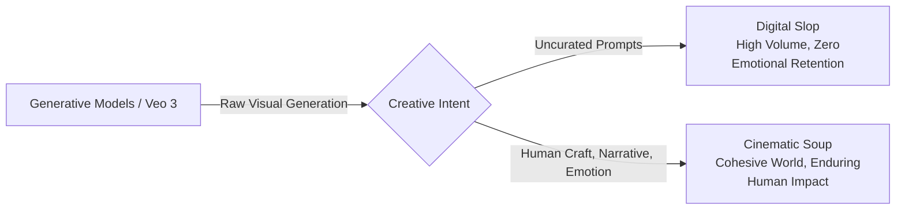

# Darren Aronofsky and Demis Hassabis on Storytelling in the Age of AI

**Speaker(s):** Mira Lane, Darren Aronofsky, Demis Hassabis, Eliza McNitt · **Channel:** Google for Developers · **Date:** 2025-05-24
**Watch:** https://youtu.be/VJllI3jMEb4?si=rcmRah8Dfq5_wRIS · **Format:** Keynote / Discussion · **Level:** Beginner
**Topics:** LLM Fundamentals, Product/Startup

## TL;DR

A thought-provoking keynote conversation between Oscar-nominated director Darren Aronofsky (Primordial Soup) and Google DeepMind CEO Demis Hassabis on the creative frontier of generative AI. Explores the philosophy of "Make soup, not slop," intentional hallucination as imagination, video generation as world modeling (Veo 3), and features director Eliza McNitt presenting *Ancestra*, an emotional film blending live performance with LoRA-trained archival generations.

## Contents

- [Make soup, not slop: creative philosophy and partnership](#make-soup-not-slop-creative-philosophy-and-partnership)
- [Generative video, world models, and intentional hallucination](#generative-video-world-models-and-intentional-hallucination)
- [Creativity beyond Move 37: tool precision vs. human artistry](#creativity-beyond-move-37-tool-precision-vs-human-artistry)
- [Ancestra case study: hybrid filmmaking with Eliza McNitt](#ancestra-case-study-hybrid-filmmaking-with-eliza-mcnitt)

---

## Make soup, not slop: creative philosophy and partnership

Darren Aronofsky and Demis Hassabis announce a partnership between production company **Primordial Soup** and **Google DeepMind**. Aronofsky outlines the core philosophy: while AI models can effortlessly flood screens with generic visual content ("slop"), enduring cinema requires emotional resonance, intentional character arcs, and disciplined craft ("soup").

DeepMind collaborates directly with veteran and emerging filmmakers to ensure tools like **Veo 3** and **Flow** are designed around the real workflows and expressive needs of human artists.

---

## Generative video, world models, and intentional hallucination

Demis Hassabis explains that generative video models represent a critical milestone on the path toward Artificial General Intelligence (AGI):
- **World Models**: To reason generally, an AI must understand physical reality (3D geometry, lighting, momentum, gravity). High-fidelity video generation proves that a model internally simulates these physical dynamics.
- **Hallucination vs. Imagination**: While factual hallucination is undesirable in search engines, in creative contexts hallucination is the engine of imagination. Aronofsky and Hassabis advocate for fine-grained user controls that allow creators to dial intentional hallucinations up or down.

---

## Creativity beyond Move 37: tool precision vs. human artistry

Reflecting on AlphaGo's legendary **Move 37** during the match against Lee Sedol, Hassabis distinguishes between:
1. **Constrained Exploration**: Discovering radical, novel tactics within an established game space or mathematical manifold.
2. **True Paradigm Shifts**: Conceptual leaps like formulating the theory of General Relativity or inventing the game of Go itself.

Aronofsky compares contemporary AI filmmaking to digital collage: human directors curate, prompt, and combine fragments into unified emotional expressions that machines cannot independently conceive.

---

## Ancestra case study: hybrid filmmaking with Eliza McNitt

Director Eliza McNitt shares the creative process behind *Ancestra*, the first film produced under the Primordial Soup and DeepMind partnership:
- **Story**: McNitt's personal account of her life-threatening emergency birth and her mother's fierce devotion.
- **Hybrid Production**: Integrates emotional live-action performances by actress Audrey Corsa with Veo generative video sequences.
- **Ethical Archival LoRA**: Filming a newborn infant in intensive medical distress is ethically fraught. The team fine-tuned a **LoRA (Low-Rank Adaptation)** model exclusively on McNitt's late father's copyrighted 35mm film photography and baby albums, creating photorealistic, emotionally grounded newborn imagery.

---

## Source

Full cleaned transcript: `DATA/videos/aronofsky-hassabis-ai-storytelling-2025.json`
Raw transcript: `RAW/videos/aronofsky-hassabis-ai-storytelling-2025.md`
