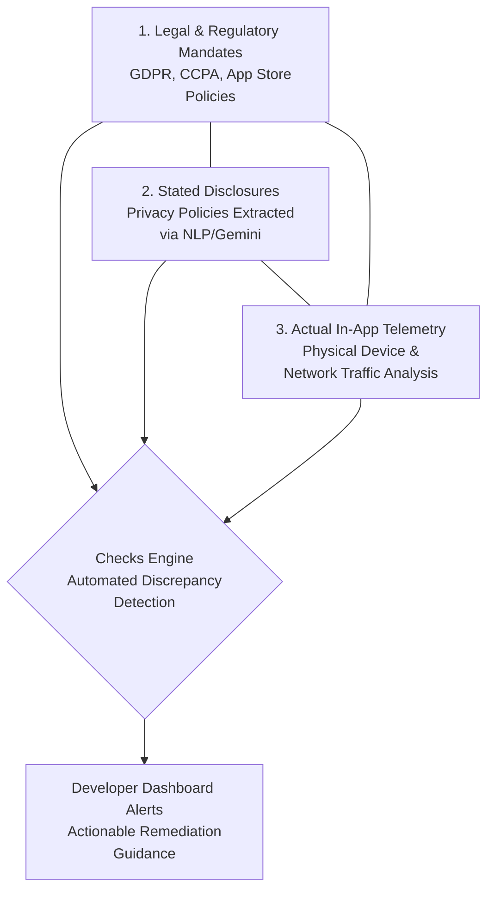

# 3-Step Approach to Mobile App Compliance with Checks Co-Founders Fergus Hurley and Nia Castelly

**Speaker(s):** Ashley Oldacre, Fergus Hurley, Nia Castelly · **Channel:** Google for Developers · **Date:** 2025-07-23
**Watch:** https://youtu.be/Zcw427_z6Xg?si=28tg_6nMIvr18W82 · **Format:** Interview / Podcast · **Level:** Intermediate
**Topics:** Product/Startup, Machine Learning

## TL;DR

An in-depth episode of the People of AI podcast featuring Fergus Hurley and Nia Castelly, co-founders of Checks (Google's AI compliance platform). Traces the product's incubation inside Area 120, the use of NLP and Gemini classifiers to analyze dense privacy policies at scale, and their core 3-step compliance framework comparing regulatory mandates, stated developer disclosures, and real-device network traffic.

## Contents

- [Founders' backgrounds: from Android Vitals and e-discovery to Area 120](#founders-backgrounds-from-android-vitals-and-e-discovery-to-area-120)
- [NLP of privacy policies: extracting structured meaning from unstructured legal text](#nlp-of-privacy-policies-extracting-structured-meaning-from-unstructured-legal-text)
- [The 3-step Checks compliance triangle](#the-3-step-checks-compliance-triangle)
- [Third-party SDK risks and building trust for digital products](#third-party-sdk-risks-and-building-trust-for-digital-products)

---

## Founders' backgrounds: from Android Vitals and e-discovery to Area 120

Fergus Hurley (entrepreneur and product lead for Android Vitals and Pre-Launch Reports) and Nia Castelly (senior product counsel for Google Play, former litigator with a computer science background) identified that escalating privacy regulations (GDPR in Europe, CCPA in California) posed enormous compliance burdens for mobile developers.

They partnered within Google's internal incubator, **Area 120**, to build **Checks**, an automated AI platform to simplify compliance and mitigate privacy risk for digital product creators.

---

## NLP of privacy policies: extracting structured meaning from unstructured legal text

Privacy policies are lengthy, unstructured legal documents that are difficult for automated systems to parse. 

Partnering with Dr. Hamza Harkous (pioneering NLP privacy researcher), the team built specialized transformer classifiers:
- **Expert Labeling**: Legal experts annotated thousands of privacy policies to train supervised models.
- **Information Extraction**: Classifiers isolate specific declarations (what personal data is collected, who data is shared with, and data retention durations).
- **Technology Sharing**: Labeling tooling and classifier pipelines were subsequently shared across other Google product teams.

---

## The 3-step Checks compliance triangle

Checks structures compliance verification through an automated three-pillar framework:

1. **What is Required**: Up-to-date legal frameworks, regional privacy laws, and platform store guidelines.
2. **What is Stated**: What the developer's privacy policy and store safety labels claim the app does.
3. **What Actually Happens**: Real-world behavioral testing on physical Android and iOS devices, monitoring transmitted network payloads and API permissions without requiring source code instrumentation.

---

## Third-party SDK risks and building trust for digital products

Modern applications frequently integrate 20 or more third-party Software Development Kits (SDKs) for analytics, monetization, crash reporting, and social login. 

Developers are legally liable for all network data transmitted by embedded libraries. Checks detects undocumented third-party data transmissions in background processes, enabling developers to remediate SDK misconfigurations before facing store suspensions or regulatory fines.

---

## Source

Full cleaned transcript: `DATA/videos/checks-mobile-app-compliance-2025.json`
Raw transcript: `RAW/videos/checks-mobile-app-compliance-2025.md`
