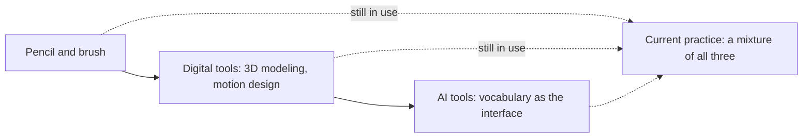
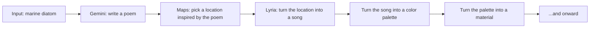
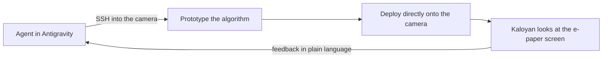
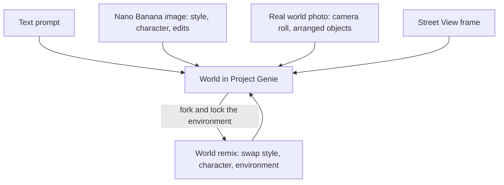

# AI tools for human creativity

**Speaker(s):** Matthew Carey, Alex Chen, Sanchit Sawaria, Khyati Trehan, Kaloyan Kolev, Shashwath Santosh, Samuel Lawton, Henry Ives, Kendall Rankin · **Channel:** Google for Developers · **Date:** 2026-06-27
**Watch:** https://youtu.be/cL7uFe5RqHY?si=9TZUVuK1Ga4_ygOS · **Format:** Talk · **Level:** Beginner
**Topics:** Prompt Engineering · AI Coding Tools · Career/Advice

## TL;DR

Nine creatives from Google Creative Lab, Google Labs and the Flow Music team present their actual working processes with Google Flow, Flow Music, Antigravity, AI Studio and Project Genie, with the explicit instruction not just to show finished work but to show the sketches, the failed attempts and the reasoning behind them.

The argument that recurs in every section, from four independent directions, is that the tools are not the differentiator: design fundamentals are what let you write a precise prompt, iteration is what makes work ownable, and taste is what tells you when to stop. The most transferable technical lessons are Sanchit Sawaria on prompts as accumulated design vocabulary, Henry Ives on why prompting at the level of genre produces generic results by definition, Kaloyan Kolev on running a coding agent over SSH against physical hardware, and the Genie pair on steering a world model through images rather than words.

## Contents

- [Creative Lab's job, and the one thing that is not changing](#creative-labs-job-and-the-one-thing-that-is-not-changing)
- [Sanchit Sawaria: which software did you use is the wrong question](#sanchit-sawaria-which-software-did-you-use-is-the-wrong-question)
- [Prompts as design vocabulary, with three worked examples](#prompts-as-design-vocabulary-with-three-worked-examples)
- [Process and iteration are what make the work ownable](#process-and-iteration-are-what-make-the-work-ownable)
- [Making things that make things: custom tools inside Flow](#making-things-that-make-things-custom-tools-inside-flow)
- [The Primordial Soup identity, and why isolation costs you objectivity](#the-primordial-soup-identity-and-why-isolation-costs-you-objectivity)
- [Khyati Trehan: vibe coding as a way to broaden what a designer can do](#khyati-trehan-vibe-coding-as-a-way-to-broaden-what-a-designer-can-do)
- [Shipping the tool alongside the artifact, and designing from inside the room](#shipping-the-tool-alongside-the-artifact-and-designing-from-inside-the-room)
- [Kaloyan Kolev: speed, control and improvisation](#kaloyan-kolev-speed-control-and-improvisation)
- [Building tools around a medium: Super Looper, ASCII Film Studio, Flow tools](#building-tools-around-a-medium-super-looper-ascii-film-studio-flow-tools)
- [Prototyping a dithering algorithm on real hardware, with an agent over SSH](#prototyping-a-dithering-algorithm-on-real-hardware-with-an-agent-over-ssh)
- [The provocation: speed comes with responsibility](#the-provocation-speed-comes-with-responsibility)
- [Kendall Rankin: a retreat playlist and a bespoke ambient filter in Flow Music](#kendall-rankin-a-retreat-playlist-and-a-bespoke-ambient-filter-in-flow-music)
- [Henry Ives: prompting past genre to build a practice accompaniment](#henry-ives-prompting-past-genre-to-build-a-practice-accompaniment)
- [Building bespoke instruments: a vocal chopper and a granular synth](#building-bespoke-instruments-a-vocal-chopper-and-a-granular-synth)
- [Sharing spaces, and the human at the center](#sharing-spaces-and-the-human-at-the-center)
- [Shashwath Santosh and Samuel Lawton: from generative images to explorable worlds](#shashwath-santosh-and-samuel-lawton-from-generative-images-to-explorable-worlds)
- [Testing what a character can do by isolating variables](#testing-what-a-character-can-do-by-isolating-variables)
- [Nano Banana as a visual steering engine, and the origin of world remixing](#nano-banana-as-a-visual-steering-engine-and-the-origin-of-world-remixing)
- [Exploiting visual biases: motion blur for speed, a sketched racetrack](#exploiting-visual-biases-motion-blur-for-speed-a-sketched-racetrack)
- [Every photo in the camera roll as a game cartridge](#every-photo-in-the-camera-roll-as-a-game-cartridge)
- [Street View inside Project Genie](#street-view-inside-project-genie)
- [What else could the model do: creatives as the ones who find the edges](#what-else-could-the-model-do-creatives-as-the-ones-who-find-the-edges)

## Creative Lab's job, and the one thing that is not changing

**Google Creative Lab** is a team of writers, designers, coders and filmmakers that collaborates with research and product teams across Google, gets early access to the latest models, and explores the edges of what is possible with them. Matthew Carey and Alex Chen host, opening what they note is the first ever builder stage at Google I/O.

Both came to the work through music, which sets up the session's recurring theme that fundamentals transfer. Alex grew up playing viola and piano while getting into coding early, so his whole life has been an attempt to blend code, design and music. Matthew went choir boy, theater kid, films, copywriting, then interactive art, which is when he first met Creative Lab. They call themselves creatively omnivorous: they love making things, and now they love shaping the tools that help other people make things.

Their framing is that technology is a blank canvas and human imagination is what shapes it into new stories and new ways of telling them. They are candid about the pace: if it feels like things are moving fast, they feel it too from inside Google, where a new tool or model appears every day that you are supposed to keep up with.

The counterweight is the claim the whole session is built to support. Some things are not changing at all. Human collaboration has always been at the center of the creative process and has to stay there. That is why they value sessions where people talk to each other about what they are using, what is working, what they like and dislike.

A Creative Lab collaborator had spoken in the previous day's keynote about Google building tools *with* creatives and *for* creatives, working with artists outside Google. This session is the inside view: nine people who work at Google going deep on Google Flow, Flow Music, Antigravity, AI Studio and Project Genie.

The format constraint is worth noting because it is what makes the session useful. Speakers were asked not just to show what they made but how they made it, sketches included, and how much work went in. Matthew adds that his own favorite part is the why.

## Sanchit Sawaria: which software did you use is the wrong question

**Sanchit Sawaria** is a design generalist on Google Flow who makes images, videos and products. He was central to conceiving, designing and launching **Google Flow** (Google's AI filmmaking and image tool, launched at I/O a year before this talk) and has since been embedded in the Google Labs design and UX team, helping evolve Flow into a full AI creative studio. He frames his talk as a conversation between the student version of himself and the professional version.

In design school he was in awe of the work around him, and his favorite question to ask his superiors was which software they used. He never got a straight answer. The response was that this was the wrong question, and that what he should be asking was what the thought process was.

His point is that nothing has changed. The current version of the wrong question is *what was your prompt*. Both questions carry the same faulty assumption: that access to the prompt, or to the same tools, is enough to replicate someone's ideas and process. It is not, because it is not about the tools, it is about the fundamentals.

He considers himself fortunate to have attended a design school that taught no design tools at all. The foundational program was design drawing and analytical drawing: painting color wheels with brushes, drawing type with pencils, and courses in **gestalt** (the perceptual principles governing how the eye groups elements into wholes), composition and typography. Because of that he never had to rely on a tool, and could use whichever tool he wanted.

The trajectory he describes is explicitly additive rather than substitutive, and he corrects the assumption before it forms.

He started with pencil and brush. On graduating he used the digital versions of those tools and picked up 3D modeling and motion design, which he could do because the fundamentals were strong. What he uses with AI tools is his vocabulary. He is emphatic that he has not left the pencil and the digital tools behind.

**Further reading:**
- [Gestalt psychology](https://en.wikipedia.org/wiki/Gestalt_psychology) for the perceptual grouping principles he names as foundational.

## Prompts as design vocabulary, with three worked examples

This is the most directly transferable section of the talk for anyone writing image prompts.

Sanchit explains why vocabulary is the operative asset: he had to use manual tools in order to learn the terminology, and now he can deploy those terms in prompts. On what makes a good prompter, he does not believe there is one right way. His own prompts are informed by internalized design school fundamentals, and they never follow the same structure, but he always covers texture, color and composition, and defines the kind of type if there is type in the image.

**Example one** uses a ray traced 3D rendered style, so his 3D modeling and rendering experience pays off in referencing the right terminology. The specific lever is **Art Nouveau typography** (the flowing, organic, late nineteenth century lettering style with elongated forms and plant-derived curves). Because he knows what Art Nouveau typography looks like, he can produce it with precision and knows in advance how it will look.

The distinction he draws here is the sharpest line in the section. There is an enormous difference between prompting *elegant typography* and prompting *elegant Art Nouveau typography*. That gap is the difference between having gone through a design curriculum, and being an actual type designer, versus someone who is only referencing things.

**Example two** is precise about **hex codes** (the six digit notation that specifies an exact color, such as `#1A3B5C`). He built the color palette separately, confirmed the exact colors he wanted, and put the hex values in the prompt. The prompt also has a composition section and a photography section specifying a 300 millimeter lens, chosen because a long focal length gives less distortion.

**Example three** sets color and subject, and its final line is the one he flags as most important: off center, **rule of thirds** (the compositional convention of dividing the frame into a three by three grid and placing subjects on the lines or their intersections rather than dead center), section composition. Without the composition course, he says, he would not have been able to communicate and articulate the idea properly.

His conclusion generalizes past image models entirely: everyone can have good ideas, but you need to be able to articulate them, and that ability comes from experience.

**Further reading:**
- [Rule of thirds](https://en.wikipedia.org/wiki/Rule_of_thirds) and [Art Nouveau](https://en.wikipedia.org/wiki/Art_Nouveau) for the two terms doing the most work in his prompts.

## Process and iteration are what make the work ownable

Sanchit had a process before and still has one, and his claim is that the process is what makes work ownable.

He notes that many people talk about **one shotting** (getting an acceptable result from a single prompt with no iteration), and while it is impressive that this is possible, it is not satisfying for him. The only way he can author work is through iteration. Even a prompt that looks perfect and reusable may be the product of many iterations to get the language right.

He used to start with sketches and still does, because it is often the easiest way to get thoughts onto paper. He shows a 3D model he made and rendered into an animation with ray tracing software, next to sketches used to visualize a furniture line, then rendered with **Nano Banana** (Google's image generation and editing model) inside Flow.

Going deeper into the process: Flow has both image making and video making tools. In the image editor he starts from the sketch of a chair, changes the legs, changes the background, adds a polar bear, and arrives at a composition. The detail he singles out is that he did not think of the cats at the beginning and they showed up somehow. That is what he means by process: you discover the work through iterations. The image editor records version history, which is what he loves about working in it.

On character work he is careful not to overclaim. He used to have to learn **character rigging** (building a skeleton and control system inside a 3D model so an animator can pose and move it), which he did not enjoy. Now he can explore a character's movement logic directly in Flow with frame animation. Rigging is not dead and is still the best way to get real control over a character, but for a graphic designer entering the world of characters and 3D modeling, this is a good entry point.

His example is Rothko, built in Flow's character creator tool: an empty vessel whose beverage changes with the day, a cocktail on vacation, a soft serve on a hot day. Having made the stills, he can produce many variations, then explore motion dynamics and things that cannot be rigged, such as liquid simulation. He shows melancholic Rothko, surprised Rothko, and a third that is probably listening to music.

The honest note on volume: he used to iterate and now iterates far more. What AI provides is abundance, which he calls a blessing and a curse, because you can have infinite variations of one thing and then have to know when to stop. His answer is organization. He makes small tweaks with every variation, so with hundreds of variations of one character the fiftieth might be the one selected, and being able to see the journey of how one thing was crafted has value in itself.

He states his position on craft plainly: working on something for a long time and spending time on it is what craft is about, it is not just about using your hands, and craft is not dead.

## Making things that make things: custom tools inside Flow

One line marks a shift in what a designer's output even is: he used to make things, and now he makes things that make things. He is a graphic designer who now makes products, and the route to making products is coding inside Flow.

He could build a tool in another surface such as **Google AI Studio** (Google's browser based environment for prototyping with Gemini and other Google models), but building it inside Flow has a specific advantage: his assets already live in his Flow projects, so the tool and the assets share a home.

His example is a style he developed over ten years. He loved working with gradients, and built a pulsating continuous gradient animation by making vector shapes, animating them, and exploring blending modes between them. What he then did was distil that style into a brush, and he says it felt like inventing a new medium.

He could own the result because there is a direct lineage between the two images, but the new one is interactive, with parameters adjustable in real time: gradient color, animation speed, and more, all changeable on the fly. The reason he could do it at all is that he had already spent a decade working with gradients in earlier versions of the tools.

**Further reading:**
- [Google AI Studio](https://aistudio.google.com/) to try the model prototyping surface he compares Flow's tool layer to.

## The Primordial Soup identity, and why isolation costs you objectivity

Sanchit used to make logotypes as a type designer; now he makes animated logotypes.

The project he shares is an identity design for **Primordial Soup**, Darren Aronofsky's AI studio. He wanted something that reads as microscopic life while also functioning as lettering and typography. The process was: rough sketch, then vector form, drawing **bezier curves** (the mathematically defined curves, controlled by handles, that vector drawing tools use to describe smooth outlines), heavy refinement, then into Flow to render.

That render step is where he says the process genuinely changes, and he is direct that he could not have done it this easily before. He tried a subtle ink rendering with highlights, then explored more organic renderings. This is the process argument again: he could have stopped at the black and white vector, but he wants to introduce more steps, and AI lets him. Finally he took frames from the organic renderings, took the first frame, and animated the logotype.

His framing of the payoff inverts the usual efficiency pitch. He is not trying to make his work faster. You can, but that is not his aim. He is trying to make the process richer, sometimes by adding steps, and he is obsessed with pushing the medium forward.

The last and most important element of his process is that he works with people, and always did. He shows a hazy photograph of himself and a roommate looking at offset print proofs at night, alongside a photo of Reed, a Flow team colleague he still collaborates with.

Critique and collaboration are not optional for him, because without them he loses all objectivity. He cannot work in isolation, so discussing ideas and getting feedback simply makes the work better.

He closes on the specific risk this technology introduces, and it is the sharpest warning in the session. With AI it is very easy to isolate yourself and make your own tools, where everything is bespoke and tuned to your liking. But we make work for others, so the conversation has to keep going. Note that this sits in productive tension with Kaloyan's later celebration of tools whose audience is just you and your friends: the session presents both without pretending they resolve.

## Khyati Trehan: vibe coding as a way to broaden what a designer can do

Kaloyan Kolev and Khyati Trehan present together, and the pairing is the point: Kaloyan is a creative technologist who uses code every day, Khyati is a graphic designer who does not write code at all, and both have found value in the same practice.

They define the term for the room. **Vibe coding** is describing what you want in plain language and using an **LLM** (a large language model, the kind of model that generates text and code from a prompt) to write the code that does it. They have been prolific vibe coders for about a year, and it has dramatically transformed their creative process.

Khyati's background is deliberately varied: designer and visual artist, a long stretch as a type design intern, an **AR** (augmented reality) phase, many editorial illustrations for newspapers. She calls it a lot of bouncing around, and says she has always tried to broaden those labels by asking what else she is capable of and what learning a new skill unlocks.

Her learning method is worth stealing: when learning something new, start with something old, because it makes the unlock obvious by putting a literal before and after in front of you. Her example pairs stage visuals she made for Lollapalooza in 2023 with a recent interactive sketch that borrows from them and reinvents them.

She describes the experience as being back in design school: making things, learning about libraries, asking questions, figuring out how to use sound. Those sketches became a personal assignment where she turns favorite quotes from books into expressive typography posters, but only when vibe coding or interaction genuinely helps convey the meaning. Her favorite reads: it is a simple idea, but also stupid, and the thing is, when stupid ideas work, they become genius ideas.

## Shipping the tool alongside the artifact, and designing from inside the room

Khyati identifies a change in what she publishes. Now that she makes both the final asset and the tool that produced it, she ships both.

The consequence is a small button in the corner: other people can not only play with the tool, they can riff on it. She admits this was culturally new for her. She expected to feel cagey, because it is like handing over your Photoshop file or your **Cinema 4D** file (a 3D modeling and motion graphics application, whose project files are the working source rather than the finished render), essentially your working file. Instead it was gratifying to watch someone take it further and make it their own, more broadly useful than the single purpose she built it for.

Her explanation for the explosion of new ideas, micro-interactions and features is compact: she now gets to be the designer and the user at the same time.

Working in AI Studio also gives her access to an ecosystem of Google models and APIs, so she can reach Translate, sound, **Lyria** (Google's generative music model), text to speech, and Maps. She built *Around the World in Good News* to set the tone for 2026 with something positive: it helps you explore uplifting historical events and stories of human achievement across the globe and across time, and it is **grounded in Google Search** (meaning the model's claims are tied to retrieved search results rather than generated from memory alone), so buttons take you to an actual article.

She pushed the ecosystem much further with *Machine Telephone*, the telephone game played between you and Google's APIs and models. You enter an input and pass it sequentially through whichever medium or model you choose, watching context shift, translate and sometimes get misunderstood along the chain.

She had wanted to make a telephone game between unlikely participants for years. The origin was advice that you should look for inspiration outside your own field, because it is in those strange middles that new ideas usually appear.

She took her time, marinating on details that do not usually get the love they deserve, and names the assumption she is pushing against: that with AI you hit a button and something magically appears. Sometimes that does happen, but even when she gets something in one shot she does not stop there, because good ideas take time. Had she not slept on it, she might not have thought of the tiny dog ear in the corner of the input card that signals you have pressed Enter.

Her description of why the process feels different is the best line in her section: it is like the difference between seeing a blueprint of a room and also getting to be in it. You can gauge the space, and design better for it.

The consequence is a change in nerve. Where she would otherwise have reached for standard UI, which is genuinely the right call when designing for millions of users, in these cases she feels much braver about departing from convention and reaching for delight and identity. Her example is loading states, which should be boring and are not.

Her conclusion, having vibe coded her way through many tools: years of practice, skill, knowledge, expertise and experience still pay off.

## Kaloyan Kolev: speed, control and improvisation

Kaloyan's background is video and music production, with computer graphics studied in college. His whole practice now is building creative tools and generative art with high tech software and low tech hardware.

Thinking as both a user and a builder of tools, he names three values:

1. **Speed.** Move from idea to result as fast as possible, and equally, be able to abandon an idea without feeling guilty about wasted time.
2. **Control.** Be hands on in every part of the process, and move between very high level and very specific very quickly.
3. **Improvisation.** Coming from music, he wants everything to feel like a guitar pedal: surfaces and systems arranged so that happy accidents and free flowing exploration are possible.

His read on what changed is precise about the historical trade-off. Code as a medium always gave a lot of control, but sacrificed speed and improvisation. A year before this talk, building your own tools was often more trouble than it was worth. AI tools have now removed enough of the overhead that you do not get hung up on syntax and debugging, you can explore an unfamiliar library, and the whole thing feels casual, quick and spontaneous.

His evidence is a changed habit rather than a benchmark. He used to write ideas in his notes app. Now he opens AI Studio on his phone, writes the idea there, fires off the prompt and moves on, and when he comes back a first version of the app is waiting. Ideas feel lightweight that way.

His practice with code has become almost improvisational. Working with designers on commercial projects, or brainstorming visuals for himself, he now often starts directly in code and builds a web app.

The team example is **Project Genie**, where designers had to invent an interface around a brand new category: a **world model**, which is neither a video nor an image but a whole navigable environment that responds to input. The designers produced a volumetric 3D sphere effect, which the team built in code along with custom sliders so they could dial in exactly what was needed. That worked because everything was made in code and could be handed straight to front end engineers, with both sides speaking the same language.

## Building tools around a medium: Super Looper, ASCII Film Studio, Flow tools

Kaloyan's next method is to take his favorite parts of his favorite software and build around them. He loves spamming contrast, blur and sharpness in image editors, so he built *Super Looper*, which chains blur, sharpen, blur, sharpen and runs it a hundred times in a row, surfacing patterns that emerge from how the algorithms are constructed.

Sometimes the medium arrives before the tool. When Gemini 3 came out he discovered it was very good at making animated ASCII drawings in **p5.js** (a JavaScript library for creative coding, designed around a sketch-and-draw-loop model). He would ask for a short film, write the music himself, and let the model make the visuals, and found the results charming enough to build a tool around: *ASCII Film Studio*, where you write a short script on the left, tweak settings, and Gemini produces the film.

He calls this a new kind of co-creation between himself and the models, entirely through code, which is why he is enthusiastic about **Flow tools**, launched the day before: a new coding layer inside Flow, which he hopes lets many more creatives build tools like this using their own footage.

He built several tools for the starter gallery. His favorite is *weirdcore*, a box of ten glitchy visual effects that can be stacked and chained. What he loves most is the random button: keep clicking, get new combinations, and it feels spontaneous, surfacing values you would not have reached by manually tweaking sliders.

**Further reading:**
- [p5.js](https://p5js.org/) for the creative coding library behind the ASCII film work.

## Prototyping a dithering algorithm on real hardware, with an agent over SSH

This is the most technically interesting workflow in the session.

Kaloyan works a lot with hardware, and names the thing he has always hated about it: everything takes so long, because when you code something you have to run it on the actual device.

His project of the last three or four years is *reframe*, an experimental camera using a color e-paper display, almost like a digital Polaroid. You take a picture and it stays on screen even after the camera is off, but you can only hold one photo at a time.

The constraint is what makes it interesting. E-paper displays have a limited color palette, so every image has to be **dithered** before it goes on the display. Dithering approximates colors the display cannot reproduce by arranging the colors it can reproduce into a pattern that reads as the intended color at normal viewing distance. Developing dithering algorithms is enjoyable but normally slow, because you have to see the output on the real screen to judge it.

He shows an unstaged, admittedly messy photo from his kitchen, where he was prototyping a new dithering algorithm the previous week in **Antigravity**, another of Google's coding surfaces. The workflow is the payload:

The agent was **SSH'd** into the camera (SSH being the standard protocol for opening a shell on a remote machine over an encrypted connection), so it could prototype the algorithm, put it directly on the camera, and let him look at the physical screen and give feedback. The iteration loop closes on the hardware itself rather than in a simulator.

On audience, he makes the case for a deliberately tiny one. The audience for your own micro-tools can be just you, or you and your friends, loved ones or colleagues, so you can make them as weird and specific as you want. If you want a liquid chrome SVG border around every part of the UI, it is your tool. If you want to work with your own data, your own archives, or your community's archives, you can.

What he hopes the new accessibility of coding brings is an explosion of interfaces built on top of archives: search engines, art projects, curatorial projects that can finally dig into digital archives which previously demanded a heavy coding background.

**Further reading:**
- [Dither](https://en.wikipedia.org/wiki/Dither) for the technique the hardware loop is iterating on.
- [Secure Shell](https://en.wikipedia.org/wiki/Secure_Shell) for the protocol the agent uses to reach the device.

## The provocation: speed comes with responsibility

Kaloyan ends on a deliberate provocation: he thinks it is possible to go too far with this.

The new ability to write and deploy code so fast comes with a responsibility. We should not put slop into the world, or make things for the sake of making, just to feel creative. Using a model to write the code does not license anyone to stop paying attention to detail, especially when sharing work with other people, with loved ones, with coworkers. His closing standard is to be respectful of our time, our craft, and our taste.

Matthew picks up the thread on personal software. He feels a genuine inflection point, and what makes it interesting is that what he wants to make is entirely different from what anyone else in the room wants to make. He calls the silver chrome borders shallow, and that is exactly the point: everyone would make something entirely different and unique to them, which is what the new Flow tools are for.

## Kendall Rankin: a retreat playlist and a bespoke ambient filter in Flow Music

Matthew introduces Kendall Rankin and Henry Ives from the **Flow Music** team, thirteen people and the newest member of Google's family of creative tools. What he values is that music does not have to be one thing, and that these two use their own product for genuinely personal purposes that are completely different from each other.

Kendall has had music at the core of her life since growing up in the gospel choir at church, and is interested in music as a force for expression in everyday life. She was an engineer in undergrad, studying a technical field while keeping a passion for the creative world, then found **Fusion**, which became Google Flow Music, and now does community and artist engagement work.

Henry is a percussionist and composer whose range runs from film music to experimental improvisation to drumming in the 49ers drumline. He joined the team that would become Flow Music a little over a year earlier, out of interest in how the next generation of technology would shape the next era of music.

They level set before showing anything. This could have been a feature talk, but what matters to them is that the tool supports experimentation, iteration and the creation of new music, and that the use cases run in two directions: broadening who becomes a creator, and letting artists and professional musicians go deeper.

Kendall's example comes from outside work. She hosts retreats for friends, family and community, and believes community and connection are core to the human experience and to how we engage with music. Her question is how to use technology to enrich experiences that already connect people.

At the last retreat the meditation session was the most popular part: sitting, looking out at the Calistoga hills, enjoying the time together. So she built a playlist for it, thinking about which feelings she wanted to evoke and tapping into a shared love of neo soul that the group had discovered over dinner the night before.

In Flow Music she worked with the **producer agent** (the conversational agent inside Flow Music that turns a described intent into tracks and into code for custom effects) to craft a prompt carrying all of that: a five song playlist evoking serenity and stillness, feeling rich, moving and grounding. From that prompt she got five songs she believes fit.

She then went further using **spaces**, which is Flow Music's term for music coded apps: small interactive instruments or effect units generated as code. She asked the producer agent for an ambient filter with atmospheric tones and shimmering effects to enrich the music she had already made. It returned a first draft and let her iterate.

The detail she flags as most valuable is pedagogical rather than technical: the agent also broke down what it was doing and used the exchange as a teaching moment, which mattered to someone who had a clear vision and the music but not the path between them.

In the demo, sliding the atmospheric filter right increases the atmospheric sounds so the track becomes hazier, and bringing it down highlights the shimmering effects. Any combination works, and further filters can be mixed in. What made it powerful for her was being able to add elements to both the tool and the music.

## Henry Ives: prompting past genre to build a practice accompaniment

This section is the clearest prompt engineering lesson in the talk, and it works because Henry shows the failures in order.

He notes that Creative Lab suggested using a real photo of himself rather than a product photo, which he takes as a compliment to his photographer friend Cat. The picture is of his hands.

As a percussionist he has spent countless hours building fundamentals, and has noticed that the way you spend those hours shapes the type of player you become. Given a generative music platform, the question becomes how to make a practice routine a reflection of yourself. Generative music creates a genuinely new use case: accompaniments that satisfy both the technical requirements of an exercise and the musical direction you want to move in.

He worked on his favorite drum exercise, triplet rolls, and the attempts went:

1. **Synthwave, steady kick drum pulse, 160 BPM.** Lyria got the tempo right, but the vibe was too 1980s movie and too dramatic.
2. **Breakcore**, a genre he loves for its energy, with a more specific request for a triplet groove (needed because the exercise is a triplet exercise). Lyria took an interesting interpretation, but the genre does not lend itself to the exercise.
3. **Swing**, which always has the rhythmic style he needs, but came out very romantic montage and very coffee shop.
4. **Drum and bass**, back to electronic for more energy, but this is not a genre where the triplet groove he needs is commonly heard. He notes this is an active area of research: making Lyria cleverly reconcile prompts that are somewhat conflicting or require creative interpretation.
5. **A specific synth sound, a specific type of beat, and a specific snare material.** Far more him.

The realization that got him from step four to step five is the generalizable one, and it applies well beyond music. If you prompt at the level of genre, the results will be generic, essentially by definition, because a genre label is a description of a category rather than of a thing. That forced him to think about what he actually wanted to hear and which skills he wanted to train. For percussionists, rolls should be smooth and connected while staying in great time, and reasoning about that requirement is what produced a prompt specific enough to be personal.

## Building bespoke instruments: a vocal chopper and a granular synth

Henry is also a composer, and has noticed that the more of your identity you put into the process, the more expressive the final piece will be. The same question appears in a new place: how do you build a process that is a reflection of you.

One answer he found before AI existed is to collect or create unique tools. As you accrue a bespoke tool belt, the process becomes more your own and the pieces become more unique.

His current interest is chopping up vocals, specifically pitched up gospel sounds. He went to Flow Music and to spaces and iterated until he found a gospel track worth sampling, then spent time thinking about the aesthetics and functionality that would turn that song into a playable instrument. The demo is built around the phrase "when we sing together".

He is candid about the presentation, which is the sort of detail the session's format was designed to surface. He is not sure it lands as a finished piece; he stayed up too late building it and got distracted playing it; and there is some movie magic, since he recorded at half tempo and sped it up. He believes he can play it in real time and offers to prove it at the demo booth.

The second process is **granular synthesis**, which he explains simply: take an existing track, chop it into tiny grains, and build a new ambient textured sustain out of them. He again went to Flow Music and worked out which aesthetics and functionality would make a granular synth that felt like what he wanted to express.

**Further reading:**
- [Granular synthesis](https://en.wikipedia.org/wiki/Granular_synthesis) for the technique behind the second instrument.

## Sharing spaces, and the human at the center

Kendall closes the music section on the two directions: broadening access, and deepening for people who already have craft. Henry showed the deepening case, so she shows a mini keyboard the team built. As a vocalist who does not play instruments, she has found it useful for both developing an understanding of how these instruments work and creating new sounds to sing over.

Having spent the section on making things more personal and bespoke, she names the counterweight, echoing Sanchit's warning from earlier. Art and music are about sharing, cross-pollination of ideas, and the social dimension. Their mechanism for that is letting you share spaces with others.

Her example is Colby, whom she describes as an evil wizard on the Flow Music team and a fantastic music producer. When spaces launched he was tasked with exploring it and made many, then shared them all. Her favorite is an effect randomizer knob, which takes a set of curated effects and exposes them through one large control. She was also up too late finalizing the presentation, throwing old demos in and finding unexpected combinations of sounds and effects.

The conclusion she draws across every presentation in the session is that the human is at the center of how this technology gets used, whether the goal is broadening or deepening.

## Shashwath Santosh and Samuel Lawton: from generative images to explorable worlds

Matthew's introduction contains the session's thesis about why creatives matter during a capability jump: most creatives are in this work because they have hungry, novelty seeking minds, and as models get more capable he believes ravenous curiosity is the innately human quality that cannot be replaced.

Shashwath Santosh and Samuel Lawton are multidisciplinary creatives who have been exploring the frontier of world models: designers, tinkerers, builders, but really creative explorers who build worlds, jump into them, work out how to operate inside them, and share what they learn. They have been creative partners at Google for essentially the entirety of this AI era.

They lay out the progression compactly. Just over three years earlier the state of the art was generative imagery: type a few words, get an image. That graduated to video. A few months before this talk it became possible to generate entire worlds, explorable and interactive in real time.

The simplest way to create a world is a text prompt. Ask to be a surfer riding a wave and you get something where the physics of a video model combine with game like controls: you choose the direction you move, and the environment expands to adapt.

As they prompted more with words they began testing wordplay, including an attempt to create a portal between two contrasting worlds. The interactivity made these good mediums for visualizing complex scenes and thought experiments, including stepping into Plato's cave.

The most evident novelty, though, was navigating a world as a character. It changed how they experienced the world, and they consider it what set the model apart.

## Testing what a character can do by isolating variables

The question that followed was whether, if Genie could create infinite environments, the characters could do infinite things.

Their method is a good template for probing any new model's capability surface: isolate one variable at a time. They made the environment a big white lab containing one giant ladder, so they could test whether the model knew how to make a character climb, and how well it understood a concept as simple as jump. They then moved to more nuanced actions: interacting with furniture, using electronic devices. Each test mapped a boundary of what the model could and could not do.

The honest failure mode they report is dissonance. The leap from words to worlds was large enough that the world you imagined in your head and the world you actually received often diverged considerably.

## Nano Banana as a visual steering engine, and the origin of world remixing

The dissonance problem was resolved by bringing in a different model rather than by better word prompts.

Nano Banana arrived and gave them a very strong image model. Because they are visual creatives and this is a visual model, they realized they could steer Genie through imagery, using Nano Banana as a visual engine to bias the world model toward a specific visual style, photorealistic or stylized.

The second capability Nano Banana unlocked was remixability. They could iterate on an existing world, locking a specific environment while swapping characters. They noticed Genie carried underlying knowledge of physics and the natural world, which affected body mechanics and the degree of control across different characters.

That granular experimentation both honed their intuition and produced the foundational idea of **world remixing**, now a shipped feature: fork a specific world, much as you would fork a code base, and then perform transformative edits to style, environment, character and more.

## Exploiting visual biases: motion blur for speed, a sketched racetrack

With visual steering established, they leaned into the visual biases they found in the model. These are the most practically useful tricks in the section, because each one substitutes an image edit for a hard prompt.

If you wanted a car in a world to go faster, you added motion blur to the source image, and Genie did the rest, propelling the car with much more speed and acceleration than before.

The same held for a skydiving example. Take the image, change it to winter, add floating rings, and you have a richer and more engaging experience complete with objectives and game mechanics, all from a handful of image edits.

Nano Banana also let them place game mechanics by sketching. Starting from a photo of a backyard, Samuel sketched how he wanted a racetrack to run around a tree, used simple prompts to raise the fidelity and define his character, and was then driving that exact track, with the right curves, in the same backyard.

## Every photo in the camera roll as a game cartridge

At this point they recognized the creative potential in the casual photos everyone takes every day. With Genie it was as if every photo in the camera roll had become a game cartridge.

One example was shot at the Natural History Museum. Samuel had always wanted to step into the dioramas, and now they could explore one as the water buffalo. His technical observation is the important part: Genie expands on the details in the source image using its world knowledge, producing a fully interactive environment from a still. Another example was a toy car, taken drifting around the office.

A teammate, Arden, had the idea of making his own toys. He tested whether he could get Genie to activate his pipe cleaner worm, and it worked. The unlock was that the worm could interact with marbles placed around it. Where they had previously added game mechanics through Nano Banana edits, they now realized they could do it by physically arranging objects in the real world, photographing the arrangement, and letting the model interpret it.

Arden then tried a pipe cleaner human, which worked exactly as imagined and entirely bypassed any complex 3D rigging setup: a simple image and some text prompts. Before long the figure was scoring goals and riding a bicycle, and placing it on a bicycle led Genie to work out the most natural way to combine the props so the same character moved differently.

They tried photos of themselves too. Samuel shows himself on a boat, able to paddle and look around, and notes they could go further and use Nano Banana to restyle the image being stepped into.

They also noticed Genie felt drastically different moving from standard monitors to bigger screens, which led to a question about perspective. Humans are very familiar with their own point of view, so what about points of view we could never otherwise experience.

The team began experimenting with photos of their pets, and this is where Genie's photorealism and biomechanics stood out. A cat navigates the apartment gracefully, whips its tail in the air, and climbs over furniture without missing a step. A gecko scales the walls of its surroundings, creating a vantage point you would never otherwise see. A hamster waddles around a table, interacting with the toys around it, and Genie sneaks in a double jump, which Shashwath finds consistently funny. Every animal shown belongs to their teammate Jocelyn.

They then used New York City as a test ground. From a photo of a yellow cab they could drive it around on their phones, and Genie adapted its character logic to the physical attributes of the object: a truck moves differently from the taxi, feeling more top heavy, and Samuel's feet naturally start pedaling as he begins moving on a bicycle.

Genie felt different again on mobile, which they found the ideal platform to run around, capture and play. They tested that with early prototypes, and a sandbox version was available to try at the event.

## Street View inside Project Genie

The limitation in the real world examples is that Genie is given only a limited view of its surroundings, so some environments do not come back as a one to one representation of reality.

The feature that addresses this launched the day before the talk: by leveraging existing Google tools and data, researchers implemented **Street View** as a native feature inside Project Genie.

Using Street View, Samuel can scan around an environment, select a frame, and lock in a character: a spaceship flying over the Golden Gate Bridge, or a bald eagle soaring over El Capitan. Stated plainly, the capability is that you can transport yourself anywhere in the world and explore that real environment as any character you can imagine.

## What else could the model do: creatives as the ones who find the edges

The through line of their time at Google, and of every experiment shown, was a single question: what else could the model do.

Their argument for why this is specifically the creative's job is the closing thesis of the whole session. In a time of abundant research, it falls to creatives to discover the edges of a model, and thereby the use cases that matter. These things do not ship with user manuals. They come with inventive play and creative critical discourse, and creatives are the ones who get to write those manuals, seeing the world differently as they do.

The consequence is that everything around you becomes a potential playable character, and you begin imagining interactions that do not exist. Shashwath points at the concrete spheres scattered around the event grounds: he had always wanted to take one for a spin, and shows how he did it.

He admits they sometimes test things in places they probably should not, including during a section of the previous day's keynote, and then, live on stage, controls a butterfly flying around the room everyone is sitting in.

His closing line reframes the session as an invitation rather than a demonstration: in a time when these worlds can be infinite, this is how they use Genie, and the question is how you would.

**Related:**
- [Sameer Samat on Android 17 and the Future of Intelligent Computing](../google-for-developers/sameer-samat-android17-2026.md) covers generative UI arriving in the operating system itself, and makes the same argument about leading with the benefit rather than the technology.

## Source

- Structured record: [`DATA/videos/creative-lab-ai-creative-tools-2026.json`](../../DATA/videos/creative-lab-ai-creative-tools-2026.json)
- Original video: https://youtu.be/cL7uFe5RqHY?si=9TZUVuK1Ga4_ygOS

Raw transcripts are held locally and are not published in this repository. The cleaned, segment-by-segment transcript lives in the structured record linked above.
