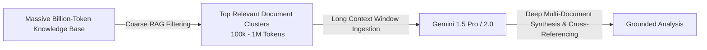

# Deep Dive into Long Context

**Speaker(s):** Logan Kilpatrick, Nikolay Savinov · **Channel:** Google for Developers · **Date:** 2025-05-02
**Watch:** https://youtu.be/NHMJ9mqKeMQ?si=15tgX0ycptnfiOPn · **Format:** Interview / Podcast · **Level:** Intermediate
**Topics:** LLM Fundamentals, Machine Learning

## TL;DR

A technical exploration of 1M to 2M+ token context windows with Google DeepMind research scientist Nikolay Savinov. Discusses the linguistic and computational role of tokens vs. characters, the mechanics behind needle-in-a-haystack retrieval, the complementary relationship between RAG and long-context reasoning, and the latency and cost economics enabled by Context Caching.

## Contents

- [Foundations: what is a token and why tokenization persists](#foundations-what-is-a-token-and-why-tokenization-persists)
- [Scaling context windows to millions of tokens](#scaling-context-windows-to-millions-of-tokens)
- [Long context vs. RAG: synergy and trade-offs](#long-context-vs-rag-synergy-and-trade-offs)
- [Context Caching: economics and latency breakthroughs](#context-caching-economics-and-latency-breakthroughs)

---

## Foundations: what is a token and why tokenization persists

A **token** represents a sub-word chunk averaging approximately 0.75 words in English text, along with punctuation markers and whitespace.

While tokenization introduces subtle quirks (such as difficulty counting individual letters in words), attempts to replace tokens with pure character-level autoregression fail to match production performance. Predicting sub-words generates text significantly faster and with lower computational cost per sequence than generating single characters sequentially.

---

## Scaling context windows to millions of tokens

Scaling the context window to 1,000,000 and 2,000,000+ tokens required architectural innovations in attention mechanisms, rotary position embeddings, and curated synthetic long-horizon training data.

Gemini models demonstrate near 100% recall on **Needle In A Haystack (NIAH)** evaluations across multimodal inputs:
- Scanning entire Git repositories (hundreds of thousands of code lines).
- Processing 1 hour of video or 11 hours of audio in a single prompt.
- Retaining fine-grained factual associations without "lost in the middle" degradation.

---

## Long context vs. RAG: synergy and trade-offs

Rather than rendering Retrieval Augmented Generation (RAG) obsolete, massive context windows transform how RAG is architected:

- **RAG for Coarse Search**: Ideal for filtering billions of enterprise documents down to relevant sub-clusters.
- **Long Context for Deep Synthesis**: Ingests hundreds of pages simultaneously, enabling the model to resolve conflicting statements, follow complex multi-hop logic, and synthesize comprehensive reports.

---

## Context Caching: economics and latency breakthroughs

Processing million-token prompts repeatedly for interactive agent turns can be cost-prohibitive. **Context Caching** solves this:
- **Pre-computed Key-Value (KV) States**: Activations for static document sets (codebases, reference manuals, standard operating procedures) are cached in memory.
- **Cost Reduction**: Re-querying cached tokens provides up to a 75% cost discount.
- **Latency Gains**: Substantially reduces time-to-first-token (TTFT), making multi-turn long-context agents responsive in real time.

---

## Source

Full cleaned transcript: `DATA/videos/deep-dive-long-context-2025.json`
Raw transcript: `RAW/videos/deep-dive-long-context-2025.md`
