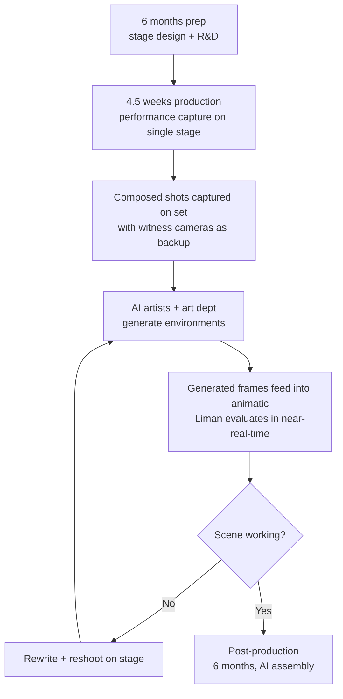

# Directing the future: craft and creativity in the age of AI

**Speaker(s):** Mira Lane, Doug Liman, Julina Tatlock, Jed Weintrob - **Channel:** Google for Developers - **Date:** 2026-05-22
**Watch:** https://youtu.be/3AIme0FZr4g?si=A0moCFMArrYeJTmL - **Format:** Fireside Chat - **Level:** Beginner
**Topics:** Generative Media - AI Agents - Research/Papers

## TL;DR

Filmmaker Doug Liman and his 30 Ninjas co-founders discuss making the first fully AI studio feature film (Bitcoin, starring Casey Affleck, Gal Gadot, and Pete Davidson) and the ASTEROID immersive XR experience with an AI-powered interactive character. The core argument: AI removes location and budget constraints for filmmakers but amplifies creative ambition rather than replacing human craft, and actually creates more jobs when scope expands.

## Contents

- [Technology as a creative tool through Doug Liman's career](#technology-as-a-creative-tool-through-doug-limans-career)
- [Bitcoin: the first fully AI studio feature film](#bitcoin-the-first-fully-ai-studio-feature-film)
- [How AI removes location and budget constraints](#how-ai-removes-location-and-budget-constraints-for-filmmakers)
- [The production workflow for Bitcoin](#the-production-workflow-for-bitcoin)
- [ASTEROID: immersive VR film with AI interactive character](#asteroid-immersive-vr-film-with-ai-interactive-character-extension)
- [AI writing and jobs: the reality at 30 Ninjas](#ai-writing-and-jobs-the-reality-at-30-ninjas)
- [Advice for filmmakers working with AI tools](#advice-for-filmmakers-working-with-ai-tools)

## Technology as a creative tool through Doug Liman's career

Liman describes his relationship with technology as consistent throughout his career: every new tool has expanded what stories he could tell.

- **Swingers (1996)**: A new high-speed Kodak film stock enabled the night exteriors and handheld intimacy of the film on a shoestring budget that would not have been feasible two years earlier.
- **Invisible (2015)**: First long-form VR series, made with Google Cardboard and Samsung. Entered the Guinness Book of World Records.
- **AI filmmaking (2023-2026)**: When Google invited him to explore AI, he arrived with a full feature script rather than the short film they expected.

His approach is consistently to jump into journeys without knowing how they will end: "like guiding whitewater rafting trips where not everyone ends the trip in the boat." He frames Bourne Identity as his $50 million film school, openly admitting on the Warner Bros. set that he had never made a movie like that before, and only feeling comfortable saying it publicly now because Tom Cruise responded to the admission by saying: "I love that Doug doesn't know what he's doing. I want to be on the journey with him as he figures out how to make this movie."

## Bitcoin: the first fully AI studio feature film

**Bitcoin** is described as the first fully AI studio feature film, produced through 30 Ninjas with producer Ryan Kavanaugh.

**Cast:**
- Casey Affleck as Craig Wright (the man who may or may not have created Bitcoin)
- Pete Davidson as a billionaire making the largest financial gamble in history
- Gal Gadot as a journalist trying to determine the truth
- Approximately 125-140 total actors across 150 locations worldwide

**Thematic fit with AI production**: Bitcoin's core ethos ("don't trust, verify; let the computers do it") mirrors the tension between human creativity and machine generation. Setting a film about humans-versus-machines in cryptocurrency while making it with AI was deliberate.

**Production timeline:**
- 6 months of prep and R&D
- 4.5 weeks of production on a single stage
- Post-production initially estimated at 40 years; compressed to 6 months by the time of this talk
- 10-minute preview shown at Cannes

All performances are from human actors. Liman explicitly chose not to use any AI-generated performances.

## How AI removes location and budget constraints for filmmakers

In conventional filmmaking, a director's creative ambitions are constantly negotiated against budget. The typical exchange: "I want to shoot in Vegas" -> "We can't afford Vegas, how about this basement conference room in London?" -> forced trade-offs and compromises.

With AI-generated environments, Liman realized he could go to Vegas and Antigua in the same film without giving anything up. The only constraint became: does this location actually serve the story?

Bitcoin spans approximately **150 locations worldwide** (vs. around 40 in a typical production). He wanted to portray the excess of the cryptocurrency world so extravagantly that it would make Wolf of Wall Street look sleepy. Before AI generation, that would have been impossible on any reasonable budget.

**Counterintuitive result**: More locations created more work, not less. Each location needs characters and people, so the cast expanded dramatically. Liman's line producer asked him to cut from 140 actors to 70. He declined. The film has more actors than any of his previous productions.

This is Liman's central argument against the "AI eliminates jobs" narrative: AI expands creative ambition, and expanded ambition requires more human work to execute.

## The production workflow for Bitcoin

The workflow evolved significantly through the project. A key lesson from ASTEROID informed Bitcoin's production: capturing only raw motion capture data with no pre-selected shots left the editing team unable to start editing, because they had to generate shots from data before any editing decisions could be made. Bitcoin adjusted for this.

**Bitcoin's production pipeline:**

**Key roles:**
- **Julina Tatlock**: AI supervisor on set, overseeing capture and AI team
- **AI artists**: worked alongside art department to generate environments
- **VFX team**: 360 capture of actors on set for likeness preservation

**Pipeline philosophy (Jed Weintrob)**: Unlike traditional VFX pipelines (largely fixed processes), 30 Ninjas's pipeline is explicitly agile. It changes every few weeks as new tools become available. **Gemini Omni** was specifically credited with enabling the compression from the original 40-year post estimate to 6 months.

The boundary between pre-production, production, and post has become fluid: scenes can be rewritten and reshot based on how AI generation is working in the animatic, similar to how software products iterate through versions.

## ASTEROID: immersive VR film with AI interactive character extension

**ASTEROID** was made for the Galaxy XR headset in 180-degree stereoscopic and was shot in collaboration with the Android XR team. The cast includes Hailee Steinfeld, Ron Perlman, and DK Metcalf (NFL wide receiver, playing a version of himself).

**The story**: A group of people travel to an asteroid laden with gold. Things go badly. Most characters do not survive. DK Metcalf's character is left behind, thought to be dead.

**The interactive extension**: After the film ends, the viewer discovers DK is not dead - he is stranded. The viewer assumes the role of a NASA employee on Earth and must have a live voice conversation with DK to help him survive and be rescued.

**Technical stack:**
- Built in **Unity**
- **Gemini Live native audio API** powers the conversational character
- Photorealistic but abstracted visual representation of the asteroid environment

**Why Gemini Live was a game changer**: The team designed the interactive extension about four months before it launched. When Gemini Live native audio became available, it replaced what would have been scripted NPC dialogue trees with genuine open-ended natural language conversation. This crosses the line from interactive NPC to agentic character.

**Character preparation requirements**: The DK character required approximately **1,000 pages of writing** to prepare for a short interactive experience. This writing includes:
- Complete backstory and motivations
- Responses to hundreds of scenarios the character might encounter
- Behavioral guardrails (e.g., if users try to get DK to trash-talk other NFL players, he diplomatically redirects: "everyone who reaches the NFL is a super talented athlete")
- DK Metcalf's own sign-off on the character's voice and behavior

**The sequel problem**: Liman compares ASTEROID's interactive extension to the producer demand he encountered on Roadhouse, where a character had to both die (for the protagonist's arc) and survive (for sequel potential). ASTEROID's AI interactive chapter solves the same problem: the story ends, the character "dies," and then continues in a new form that audiences who want more can engage with.

## AI writing and jobs: the reality at 30 Ninjas

The standard concern is that AI replaces screenwriters, editors, and directors. The 30 Ninjas experience is the opposite.

**What is actually happening:**
- The traditional Hollywood industry is producing significantly fewer large-budget productions than five years ago. Many of Liman's industry peers are not currently working.
- 30 Ninjas is a startup that is expanding and actively hiring experienced film professionals: top film editors, screenwriters generating shot sequences for Bitcoin, creative technologists.
- One lead creative is a top-tier feature film editor from Brazil, discovered through an AI film festival after he began making AI shorts because large-budget feature production in Brazil has effectively ended.
- AI-native artists are hired alongside experienced filmmakers, not instead of them.

**The scale effect**: Expanding a film from 40 locations to 150 creates more work, not less. More characters are needed, more casting is required, more scenes need to be written and captured. The AI enables the expansion; the expansion generates the employment.

Weintrob is explicit: "We are creating jobs. We are not generating jobs with AI."

## Advice for filmmakers working with AI tools

**Jed Weintrob**: Just go do it. Google and other companies have invested billions of dollars building tools that are freely available. The path into 30 Ninjas for one team member was making independent AI shorts, being discovered at a festival, and getting hired. Use what exists.

**Julina Tatlock**: Learn what the tools do well, then try to break them. AI video generation has recurring visual tendencies (centered subjects, specific lighting patterns) that show up everywhere. Understanding these tendencies is the first step toward using them deliberately or subverting them for creative effect. In Bitcoin, some scenes told from memory deliberately lean into AI's particular visual qualities rather than fighting them. Find your own style by exploring the edges of where the models fail in interesting ways.

**Doug Liman**: The advice is the same as he always gave at film schools: chart your own path, do not copy what others have done. If someone wants a film that looks like Bourne Identity, they will hire the people who made Bourne Identity. Swingers does not look like anyone else's film. Using AI to write scenes for you produces terrible results precisely because the output is generic. Use these tools to amplify your specific creative voice and your humanity, not to skip the creative work.

## Source

Full cleaned transcript: `DATA/videos/doug-liman-directing-future-2026.json`
Raw transcript: `RAW/videos/doug-liman-directing-future-2026.md`