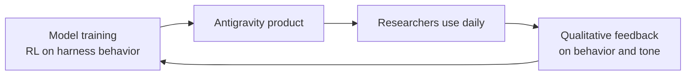

# The future of software development

**Speaker(s):** Logan Kilpatrick, Tulsee Doshi, Varun Mohan, Michael Gerstenhaber - **Channel:** Google for Developers - **Date:** 2026-05-23
**Watch:** https://youtu.be/v0RQiNJ9nhw?si=2UzULe4B5jMgxxCt - **Format:** Panel - **Level:** Intermediate
**Topics:** AI Coding Tools - AI Agents - Backend/Infra

## TL;DR

Leads of Gemini models (Tulsee Doshi), Antigravity (Varun Mohan), and the Gemini Enterprise Agent Platform (Michael Gerstenhaber) discuss two coding paradigms (vibe coding vs. agentic engineering), how Antigravity is integral to model training, where bottlenecks move as coding becomes easier, and how the agent interaction interface needs to evolve for long-running autonomous work.

## Contents

- [Gemini 3.5 Flash capabilities](#gemini-35-flash-best-model-yet-for-agentic-and-long-running-tasks)
- [Vibe coding versus agentic engineering](#vibe-coding-versus-agentic-engineering-two-distinct-use-cases)
- [The product-model flywheel](#the-product-model-flywheel-why-antigravity-is-integral-to-training)
- [How to build products on a rapidly improving model](#how-to-build-products-on-a-rapidly-improving-model-foundation)
- [Where the bottleneck moves when coding is mostly solved](#where-the-bottleneck-moves-when-coding-is-mostly-solved)
- [Benchmarks evolving toward product-like complexity](#benchmarks-evolving-toward-product-like-complexity)
- [Agent interface: interruption, audio, multi-agent orchestration](#agent-interface-when-to-interrupt-audio-vs-visual-multi-agent-orchestration)
- [Avoiding AI slop: integration testing with agents](#avoiding-ai-slop-integration-testing-with-agents)

## Gemini 3.5 Flash: best model yet for agentic and long-running tasks

**Gemini 3.5 Flash** outperforms Gemini 3.1 Pro on most benchmarks, with particular strength in:
- Tool use
- Long-running coding tasks (demonstrated: building an operating system through 15,000 model invocations)
- Real-world finance tasks
- Productivity tasks (slide deck creation, PM workflows)

Speed: over **200 tokens per second**, significantly faster than competing frontier models. Available via the Gemini API, in AI Studio, in the Gemini app (including AI Mode), and in Antigravity.

The definition of "Flash" has shifted meaningfully. Earlier Flash generations were optimized for AI Overviews-style use cases: quick responses, light reasoning, summarize search results. Gemini 3.5 Flash sustains deep reasoning (Mohan has observed the model thinking for 30-40 seconds on a single step), runs for thousands of steps, and handles complex agentic workflows. Both speed and intelligence are now present simultaneously.

## Vibe coding versus agentic engineering: two distinct use cases

The software development use case is not a single target. Kilpatrick borrows Andrey Karpathy's framing to describe two ends of a spectrum:

**Vibe coding**: non-programmers (or casual developers) building software for the first time. Priorities: aesthetic quality, fast iteration, low cognitive overhead. Verification is informal. Context window is small.

**Agentic engineering**: professional developers working on production systems. Priorities: handling legacy codebases with thousands of lines of context, correct behavior under complex specifications, long-running task management, and verifiable outputs.

Doshi explains that these two modes share the same foundational model requirements (reasoning capability, tool use, multimodal input, high-quality code generation), but models need to be trained and evaluated on both. A model that excels at vibe coding web apps may fail badly when given a large legacy codebase because it has not developed the context management capabilities that mode requires.

The three stages of software development (decide what to build, figure out how to build it, build it) now look like: stage three (build it) is largely solved if the specification is precise. Stages one and two remain deeply interactive human-AI collaboration problems.

**Related:** [Intent-driven development with Claude Code and Fable 5](../google-cloud-tech/intent-driven-development-2026.md) - related panel on how the developer experience is shifting

## The product-model flywheel: why Antigravity is integral to training

Antigravity is not just a consumer product. It is a training and research tool that the model team uses directly.

Early agent harnesses were simple: bash commands, file system reads, user prompts. The current Antigravity harness includes:
- Native subagent creation (the main agent spawns specialized subagents)
- Asynchronous parallel tool calls (the agent does not block while a training job runs)
- Mid-task user override (user can interrupt and redirect a running agent)
- Multi-task management (multiple concurrent long-running tasks)

These behavioral capabilities cannot be learned from **SWE-bench** (GitHub PR-style tasks). The team does **reinforcement learning directly on harness behavior**, training the model to handle these specific interaction patterns.

Because researchers use Antigravity every day for their own work, benchmarks and product experience cannot diverge. A model that looks great on metrics but behaves poorly in practice gets caught immediately because the researchers are the users.

## How to build products on a rapidly improving model foundation

Gerstenhaber's core advice: distinguish between two types of product failure.

- **Failure because the model is not smart enough yet**: acceptable, will resolve as models improve
- **Failure because you built something wrong**: avoidable now

Design for the former. Build products that are architecturally correct but stalled by current model limitations, rather than products that work around limitations in ways that will become liabilities when models improve.

The conversation with enterprise customers has already shifted in the last few months: from "help me build an agent" to "help me use your agent for my purpose." Pre-built agentic infrastructure (agent API, agent CLI, harness behavior baked into the model) often outperforms custom-built agents. Customers are increasingly providing the model with tools, context, and goals rather than building orchestration from scratch.

Frame the model as a coworker: the same entity regardless of whether you interact via Slack, phone, email, or in person. Build one consistent underlying model of how to work with it, not a separate workflow for each channel.

## Where the bottleneck moves when coding is mostly solved

As model capability makes code execution increasingly automatic, bottlenecks redistribute in two directions:

### Upstream: product judgment

When building is fast, the hard problem becomes deciding what to build. Mohan argues that **high-agency product judgment** (making hard calls about what to cut, what matters, what users actually need) will be scarce. You cannot add 100 features and expect users to benefit from all of them. The builders who will stand out are those who can exercise taste and restraint: identify the real pain point and ship only the thing that solves it.

### Downstream: information retrieval, deployment, and operations

Gerstenhaber distinguishes between intelligence (the model) and information retrieval (the harness):

- **Coding agents** work largely with static information already present in a codebase. The information retrieval problem is manageable.
- **SRE agents** must continuously query live system state (etcd cluster status, Kubernetes health, real-time telemetry) to plan each next step. This is much harder to architect.
- **Compliance agents** (banking KYC, Know Your Customer): two banks are now running full KYC processes with AI agents, but they started running them not when the model got smart enough (it was already smart enough), but when they solved the credentialing and data access problem to give the agent access to sensitive background check data safely.

The information retrieval and access problem is a software engineering problem, not primarily a model intelligence problem. Models can already plan around missing information instead of hallucinating; getting them the right data securely is the actual challenge.

## Benchmarks evolving toward product-like complexity

Standard benchmarks are insufficient for measuring real-world coding model quality:

**What benchmarks miss**: developer feedback is largely qualitative even in coding. The model's tone during a task, its eagerness to generate code before fully understanding the problem, its communication while working, and its tendency to be lazy or overconfident are all things that matter to developers but are hard to capture in pass/fail metrics.

**What better benchmarks look like**: internal evals are shifting toward approximating full product experiences. An external example is **vending bench**, which evaluates whether a model can run a functional store and earn profit over multiple days. This requires the model to handle ambiguity, long time horizons, and economic feedback simultaneously.

**The two-track approach**: automated benchmarks need to get more complex and represent more diverse use cases. But live experiments and side-by-side human feedback are becoming permanent complements. Neither replaces the other.

## Agent interface: when to interrupt, audio vs. visual, multi-agent orchestration

As agents run autonomously for longer periods, two new interface problems emerge:

**1. Agent interruption behavior**: when should an agent pause a 30-day-long task to ask a human for information? Gerstenhaber frames this as requiring agents to develop what he calls savoir-faire: judgment about whether to ping immediately, wait an hour, escalate, or proceed with a reasonable assumption. Getting this wrong produces either a task that stalls unnecessarily or an agent that interrupts constantly and becomes annoying.

**2. Multi-agent orchestration UX**: Mohan expects audio to become the primary way users interact with many background agents simultaneously. Reading is faster than listening, but voice is lower friction for ad-hoc queries across many concurrent tasks. The right output modality (how to receive updates from many agents) is still an open design question.

Doshi's prediction: a single conversational interface (possibly voice) that can spawn multiple specialized agents for different tasks, replacing today's model of maintaining separate apps for different functions. This is a significant shift in product design philosophy.

**Model selection within multi-agent systems**: Antigravity's main agent can already choose which model (larger or smaller) to use for each subagent. The longer-term direction: large models handle orchestration and verification while delegating the majority of subtasks to smaller, faster models.

## Avoiding AI slop: integration testing with agents

Mohan's recommended approach for maintaining quality in AI-assisted codebases:

1. From the start of a project, configure the agent to spin up the application, navigate its UI, and perform exploratory integration tests automatically
2. From those agent test runs, generate **Playwright** scripts of exactly what the agent clicked and interacted with
3. Use those generated Playwright scripts as persistent regression tests

This creates an agent-generated test suite that can be re-run on any future change. The agent testing paradigm is faster and more comprehensive than manually written integration tests because agents explore more of the application surface.

For existing products: Mohan acknowledges that retrofitting this approach requires rearchitecting parts of the application, which is substantial work. The pattern is much easier to implement from the start of a new project.

## Source

Full cleaned transcript: `DATA/videos/future-of-software-development-2026.json`
Raw transcript: `RAW/videos/future-of-software-development-2026.md`