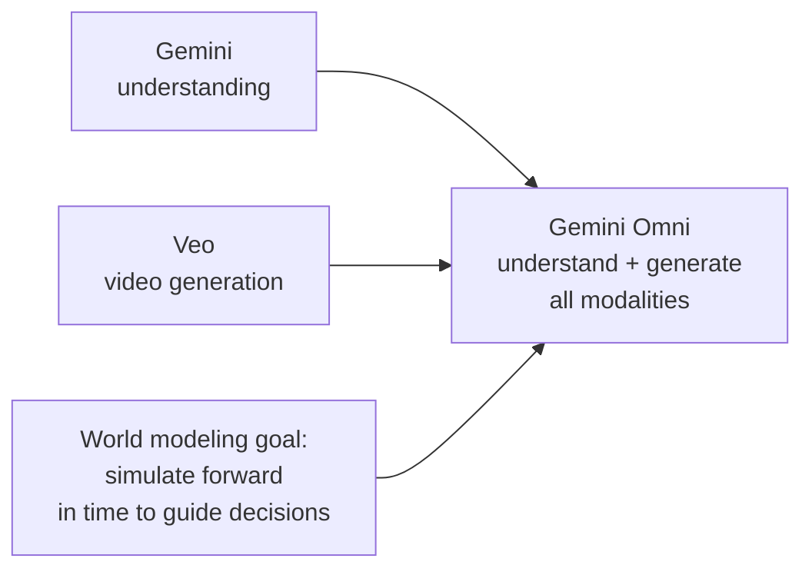

# Gemini co-leads on project origins and what's next

**Speaker(s):** Jeff Dean, Koray Kavukcuoglu, Noam Shazeer, Oriol Vinyals, Logan Kilpatrick - **Channel:** Google for Developers - **Date:** unknown
**Watch:** https://youtu.be/8hfpLa5wPGo?si=vDuNpCfEHs_gbMye - **Format:** Panel - **Level:** Intermediate
**Topics:** LLM Fundamentals - Research/Papers - AI Agents

## TL;DR

Four of Gemini's founding researchers sit down to discuss how the project started, why consolidating Google Brain and DeepMind into a single model effort was the right call, what makes Flash-outperforming-Pro a reliable pattern, and what they expect from AI by 2027. The conversation is unusually candid about what has been harder than expected (evaluation, continual learning) and what has been a genuine surprise (one-box general intelligence actually working).

## Contents

- [Origin of the Gemini project](#origin-of-the-gemini-project-merging-fragmented-teams)
- [Why product usage drives model improvement](#why-product-usage-drives-model-improvement)
- [Gemini 3.5 Flash: distillation packing Pro into Flash](#gemini-35-flash-distillation-packing-pro-capability-into-flash)
- [Surprising progress: one box, general intelligence](#surprising-progress-one-box-general-intelligence)
- [What has been harder than expected](#what-has-been-harder-than-expected-evaluation-and-continual-learning)
- [How the Gemini co-leads met each other](#how-the-gemini-co-leads-met-each-other)
- [Gemini Omni and the world modeling direction](#gemini-omni-and-the-world-modeling-direction)
- [Predictions for I/O 2027](#predictions-for-io-2027-self-improvement-and-long-running-agents)
- [One model or thousands of products in five years](#one-model-or-thousands-of-products-in-five-years)

## Origin of the Gemini project: merging fragmented teams

Before Gemini started, two separate organizations were building large models independently:

- **Google Brain**: Jeff Dean steering the **Pathways** project, **PaLM**, and **PaLM 2**
- **DeepMind** (London): Oriol Vinyals leading multimodal model efforts

Dean wrote an internal half-page memo arguing that fragmenting both talent and compute across these teams was wasteful and would slow progress. His position: if you are going to build an incredibly powerful model, everyone needs to work on one thing together. The merger of the two organizations into what became **Google DeepMind** enabled this. The project name "Gemini" comes from the twins, referencing this merger.

Kavukcuoglu provides the structural explanation: early AI research was exploratory enough that parallelism was fine. By 2022-2023, each large training run required so many researchers, so much infrastructure, and such coordinated effort that running multiple parallel projects was no longer sensible. A focused single operation was clearly the right answer at that scale.

The organizational challenge was real: London (DeepMind) and Mountain View (Brain) are eight hours apart. Navigating time zones and cultural differences between a more academic London team and a more engineering-heavy Mountain View team took deliberate effort.

## Why product usage drives model improvement

All four researchers agree that real-world usage at scale is irreplaceable for understanding model quality. Three distinct rationales:

**Dean (engineering perspective)**: Google Search established this pattern over decades. Aggregated usage statistics revealed what was not working in ways that internal testing missed. AI models should be no different.

**Shazeer (research perspective)**: Internal benchmark optimization without real users risks gaming the benchmarks, including through contamination. The true test is whether people find the model useful.

**Kavukcuoglu (systems perspective)**: The frontier of AI capability cannot be defined without being at the frontier of product usefulness simultaneously. The two co-define each other.

**Vinyals (model perspective)**: The bet was always that one powerful unified model would outperform the collection of separate specialized models already powering Google products. The exact product shape was unclear; the compute and intelligence bet was obvious.

## Gemini 3.5 Flash: distillation packing Pro capability into Flash

**Distillation** is the core technique enabling each Flash generation to outperform the previous Pro generation. The original idea, developed by Geoff Hinton and then demonstrated at scale by Dean and Vinyals at Google in 2012-2013:

- Train a large, highly capable "teacher" model
- Have the teacher provide soft probability labels (e.g., 90% car, 8% truck, 2% bus) rather than hard labels (car)
- Train a smaller "student" model on those soft labels
- The student learns from the teacher's internal representations, not just from raw training data

The result: the student model contains "distilled" knowledge from the teacher and performs significantly better than a student trained on the same raw data.

**Current state**: The basic technique from the original paper is still essentially the approach, with modest tweaks. Dean summarizes it as one really good teacher, one student. No longer requires the 50-model ensembles from the original research. Kavukcuoglu's analogy: squeeze the lemon, the juice (intelligence) comes out, you pour it into a glass (the smaller model).

Vinyals expresses continued amazement that the intelligence-per-parameter efficiency keeps improving: Flash next generation reliably outperforms Pro previous generation. He does not have a complete explanation for why this works as well as it does.

Gemini 3.5 specifically focuses on agentic and coding capabilities while maintaining the multimodal and reasoning capabilities from prior generations.

**Further reading:** Original knowledge distillation paper: Hinton, Vinyals, Dean (2015), "Distilling the Knowledge in a Neural Network"

**Related:** [Yossi Matias on the golden age of research](yossi-matias-research-golden-age-2026.md) - covers speculative decoding as another algorithmic efficiency breakthrough from Google Research

## Surprising progress: one box, general intelligence

Shazeer tells the most striking story of positive surprise. Early Google had a "one box" philosophy: a single Search input field that users assumed was backed by a unified general-purpose AI. In reality, behind the one box were dozens of separate specialized backends (sports scores backend, stock quotes backend, Did You Mean spell correction, and so on), each built independently.

The original vision was always to eventually build the actual general-purpose AI that the one-box frontend implied. Shazeer's reflection: "We finally built the backend for the frontend."

Today, Gemini is that backend: one model, one backend, one box. Users assumed it always existed. It is now real.

## What has been harder than expected: evaluation and continual learning

**Evaluation (Oriol Vinyals)**

Evaluating model capabilities without contamination and in a way that users agree with has been consistently underestimated. Challenges:
- Benchmarks get contaminated into training data, invalidating them as neutral measures
- Capabilities evaluated in isolation may not correspond to real user experience
- There is no single metric that captures what users mean by "better"

The field shifted from tables of benchmark numbers (academic era) to actual user feedback (product era), but user feedback is noisy, subjective, and expensive to collect at the right granularity.

**Continual learning and architecture flexibility (Jeff Dean)**

Dean expresses mild disappointment that models have not progressed further on:
- **Continual learning**: updating model knowledge through experience without full retraining
- **More organic architectures**: today's **MOE (Mixture of Experts)** models have experts that are all structurally identical. Dean had imagined architectures with more plasticity, where structure could vary more organically.

Kavukcuoglu notes that current large models are not dramatically larger in raw parameter count than models from 3-4 years ago, yet pack substantially more capability. This implies there is still significant untapped capacity that better training algorithms could extract.

Dean's estimate: LLMs require roughly **1,000 times more training data** than a capable human to reach comparable capability levels. Humans have heard about 1 billion words; models train on trillions. If algorithms could close that gap even partially, it would be transformative. (Vinyals offers a counterpoint: humans are not starting from scratch either, they benefit from evolutionary pre-training encoded in biology.)

## How the Gemini co-leads met each other

**Jeff Dean and Noam Shazeer (2000)**: Dean called Shazeer to convince him to accept a Google offer. Shazeer joined and became Dean's officemate for three and a half years. Shazeer's first project at Google was **Did You Mean**, the Search spell correction feature. He later discovered his assigned mentor was Dean, explaining why his mentor seemed to know everything and had written half the codebase.

**Jeff Dean and Oriol Vinyals (2012)**: Vinyals had an offer from Google and at least one other company. Dean called him, pitched the Google Brain team ("we're working on deep learning models"), and convinced him to join. Vinyals was finishing his PhD and had to write every word of his thesis himself, with no LLMs to help. He joined Google Brain and worked with Dean directly on a distillation project; Dean essentially acted as the coding agent for the early implementation (writing the C++ classes for distillation and KL divergence).

**Jeff Dean and Koray Kavukcuoglu (2014)**: First real interaction was during the **DeepMind acquisition due diligence** in London. After 13 consecutive 30-minute technical talks (Geoff Hinton laid on the floor due to a bad back), Dean asked to sit down with Kavukcuoglu and review the actual DeepMind codebase together. Dean called it their "first code review together." Kavukcuoglu, who reviewed essentially all DeepMind code at the time (company was ~55-60 people), walked Dean through the key ideas and implementations.

## Gemini Omni and the world modeling direction

**Gemini Omni** is the convergence of:
- Understanding models (Gemini: processes text, image, audio, video, and scientific data types like genomic sequences, chemical structure, LiDAR)
- Generation models (Veo: video; image generators)

Into a single model that understands all modalities and generates all modalities, including video.

Kavukcuoglu's definition of a true world model (distinct from just a generative model): the model must understand the dynamics, physics, and causality of the physical world well enough to simulate it forward in time, and to use those future simulations as the basis for decisions. This is why Gemini Omni is a different category: it combines understanding and generation in a way that approaches simulation capability.

Vinyals notes: the joint training approach, mixing text, video, audio, and other modalities in a single training run, is producing emergent capabilities (3D scene consistency, object permanence through a turn, temporal coherence) that previously required manual engineering. This seemed unlikely to work from first principles. It has proven out at scale.

Dean extends the multimodal vision beyond human-centric modalities to scientific data types: genomic sequences, chemical structures, robotic grasping data, LiDAR point clouds. Exposing the model to small amounts of these data types makes it significantly better at understanding them when encountered in larger quantities.

## Predictions for I/O 2027: self-improvement and long-running agents

**Kavukcuoglu**: Models will be meaningfully contributing to their own training by I/O 2027. Researchers will be delegating experiments to model-agent systems the way they currently delegate tasks to junior researchers. Dean extends this: the team will be able to point to specific Gemini capabilities that were generated by AI-directed self-improvement under human guidance.

**Vinyals**: Continual learning will see meaningful progress. A model that updates its effective knowledge base through experience and interactions, without requiring weight updates, becomes a real capability that users encounter in production.

**Kilpatrick's implicit prediction**: A model that runs autonomously and productively for 30 consecutive days is demonstrated. This requires the full stack: memory systems, continual learning, and faster inference hardware (so 30 days of productive work compresses into much less wall time). Dean adds the tool latency observation: most agent time today is spent waiting for external tools designed for human interaction cadences, not for model inference speed. Shazeer estimates: "29 and a half of those 30 days are spent waiting for external tools."

## One model or thousands of products in five years

**Kavukcuoglu**: One product (the model), seriously. Intelligence is the thing; product surfaces are just interfaces to it.

**Dean**: Many product forms (glasses, Search, Gemini app) with a smaller number of underlying model capabilities making all of them good. The glasses demonstrated at I/O are a distinct product from Search, both powered by the same model.

**Vinyals**: Uncertain. User intent segmentation (email vs. shopping vs. calendar) may reflect genuine human preferences for focused contexts rather than a technological limitation. Not ready to bet on full consolidation into a single product surface.

**Shazeer**: Longer-term, the physical world. Products that move atoms, not just bits. This is a far-future prediction. More near-term: the question is how humans want to consume information (text, visual, audio, glasses, eventually brain-computer interfaces), and the model powering all of them is the common substrate.

## Source

Full cleaned transcript: `DATA/videos/gemini-coleads-project-origins-2026.json`
Raw transcript: `RAW/videos/gemini-coleads-project-origins-2026.md`